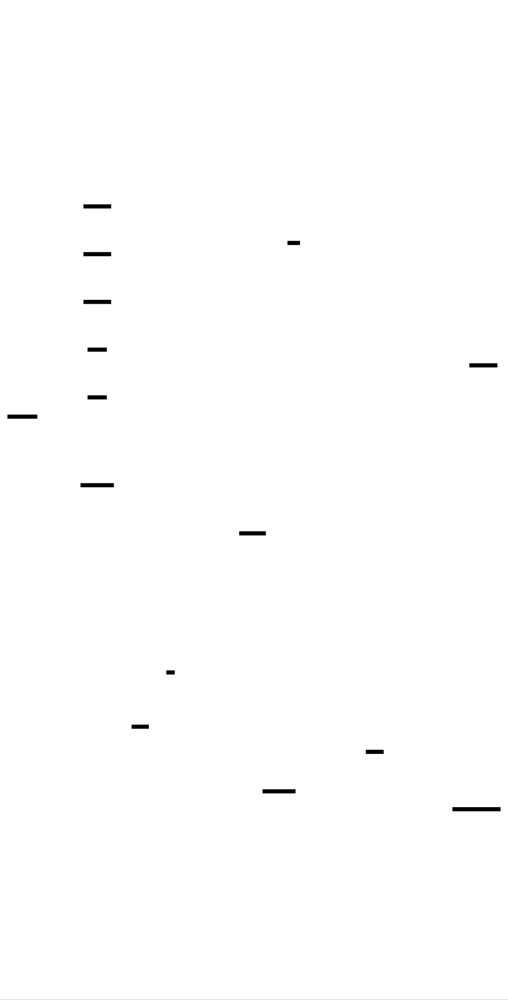
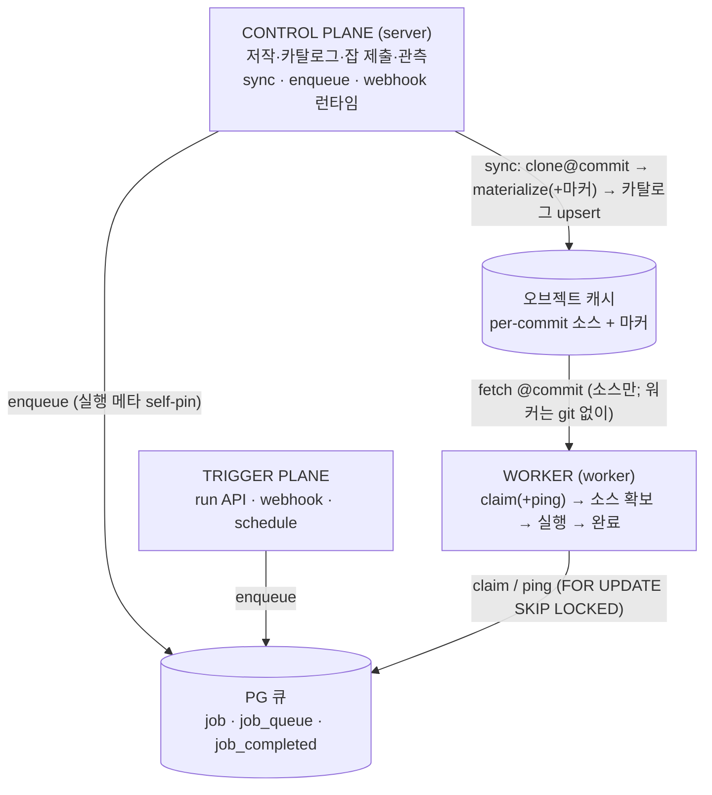

# 아키텍처 개요 — 3 평면 + PG 큐

windforce는 **세 평면(Control Plane · Trigger Plane · Worker)** 과 그것들을 잇는 **하나의 Postgres 큐**로 구성된다. 외부 메시지 브로커 없이, "일을 만드는 모든 것은 큐에 enqueue하고, 워커는 큐에서 consume한다"가 전체 설계의 한 줄 요약이다.

## 세 평면

| 평면 | 하는 일 |
|---|---|
| **Control Plane** (`server`) | 저작·카탈로그·잡 제출·관측의 중심. git source를 sync해 app/action 카탈로그를 만들고, 잡을 enqueue하며, 결과·로그·워커 상태를 보여 준다. webhook 런타임과 git export(콘솔 Deploy)도 여기. |
| **Trigger Plane** | 잡을 만드는 입구 — HTTP run API · webhook · schedule(서버 pull). 편집기 preview도 저작 편의로 여기에 속한다. 어떤 트리거든 결과는 **하나의 enqueue 경로**로 모인다. |
| **Worker** (`worker`) | 큐에서 잡을 claim해 격리 실행하는 단일 루프: `claim(+ping) → heartbeat → 소스 확보 → 실행 → 완료`. 워커는 git/자격증명을 갖지 않는(stateless) 실행기다. |

이 둘 사이에 **오브젝트 캐시**(per-commit 소스 원천)와 **PG 큐**가 연결 조직으로 놓인다.

## 소스 → 카탈로그 → 잡

windforce의 경계는 이 흐름을 따른다:

1. **소스**: 저자가 콘솔에서 코드를 쓰거나(플랫폼 관리형 git) 자기 git 저장소를 연결한다.
2. **카탈로그**: `server`가 git을 sync해 manifest 기반 app/action 카탈로그를 만든다(materialize 후 카탈로그 upsert).
3. **잡**: enqueue 시점에 현재 카탈로그의 **실행 메타(commit·entrypoint·스키마·timeout)를 잡에 복사(self-pin)** 한다. 이후 재sync로 카탈로그가 바뀌어도 잡은 자기 자신만으로 실행 가능하다.
4. **실행**: 워커가 잡을 claim해 오브젝트 캐시에서 그 commit의 소스를 받아 실행하고, 결과·로그를 남긴다.

이 경계 덕분에 "git이 가진 것은 *프로젝트 소스*일 뿐, app·action·job이 아니다"가 구조로 보장된다 — 멀티테넌트에서 누가 무엇을 실행·열람할 수 있는지가 명확해진다.

## 더 보기

- [큐 스파인과 정확성 불변식](queue-and-correctness.md) — 크래시·동시성에서도 잡이 정확한 이유
- [재현성과 내부 동작](reproducibility-and-internals.md) — self-pin·소스 분배의 원리
- [2계층 샌드박싱](sandboxing.md) — 비신뢰 코드를 안전하게 실행하는 격리
- 전체 정본 설계: [docs/foundation/architecture.md](https://github.com/imprun/windforce/blob/main/docs/foundation/architecture.md) · 기술 심층 리포트: [docs/README.md](https://github.com/imprun/windforce/blob/main/docs/README.md)
