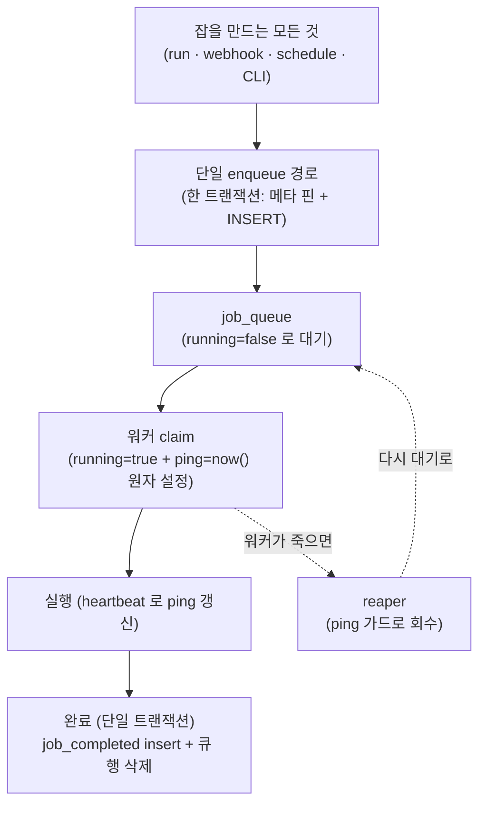

# 큐 스파인과 정확성 불변식

windforce는 모든 잡을 Postgres 큐 한 곳을 통해 만들고 워커가 거기서 꺼내 실행한다. 이 페이지는 워커가 도중에 죽거나 여러 워커가 같은 큐를 동시에 끌어가도 **잡이 유실되지 않고, 중복 실행이 사실상 일어나지 않으며, 취소가 되돌려지지 않는** 이유를 운영자 관점에서 설명한다. 즉 windforce가 "정확히 한 번에 가깝게, 유실 없이" 잡을 처리하는 메커니즘을 다룬다.

별도의 메시지 브로커는 없다. 큐·잡 정의·결과·상태가 모두 같은 Postgres 안에 있어 **한 트랜잭션으로 일관되게** 묶이는 것이 이 설계의 핵심이다.

## 한눈에 보는 보장

| 운영자가 신경 쓰는 것 | windforce가 보장하는 방식 |
|---|---|
| 워커가 실행 중 죽으면 잡이 사라지나 | 사라지지 않는다. 큐 행이 남아 있고 reaper가 되살린다 |
| 워커 둘이 같은 잡을 동시에 가져가나 | 가져가지 못한다. claim이 원자적이라 한 잡은 한 워커만 가져간다 |
| 같은 잡이 두 번 실행되나 | 정상 경로에서는 한 번. 워커가 죽어 재시도될 때만 다시 돈다(at-least-once) |
| 취소한 잡이 워커 재시작 뒤 되살아나나 | 되살아나지 않는다. 취소는 terminal이다 |
| 잡 완료 기록과 결과가 깨지거나 절반만 남나 | 완료는 단일 트랜잭션이라 전부 되거나 전혀 안 된다 |
| 아직 준비 안 된 소스를 워커가 실행하나 | 실행하지 않는다. 소스가 완전히 적재된 뒤에야 카탈로그에 노출된다 |

## 잡이 큐를 지나는 길

잡을 만드는 경로(콘솔 Run, webhook, schedule, CLI/시드)는 여러 갈래지만, 모두 **하나의 enqueue 경로**로 모인다. 워커는 그 큐만 바라본다.



## 단일 enqueue 경로 — 잡을 만드는 문은 하나

run·webhook·schedule·CLI 등 잡을 만드는 출처가 무엇이든, 모든 잡 생성은 **하나의 enqueue 경로**를 지난다. 이 경로가 한 트랜잭션 안에서 두 가지를 책임진다.

1. **실행 메타를 잡에 박제(self-pin)** — enqueue 시점의 카탈로그에서 `commit_sha`, `git_source_id`, `app_key`, `action_key`, `entrypoint`, `input_schema`, `output_schema`, `timeout`, 유효 tag를 잡 행에 복사한다.
2. **잡 행을 INSERT** — `job`과 `job_queue`를 같은 트랜잭션에서 만든다.

출처가 추가로 넘기는 것은 **provenance(`trigger_kind`)와 출처별 필드뿐**이다. `trigger_kind`(예: `api`·`webhook`·`schedule`·`manual`)는 "어디서 들어왔는가"를 나타내는 **출처 메타데이터**일 뿐, 별도의 쓰기 경로가 아니다. 워커의 consume이나 결과 폴링(`GET /{id}/result`)도 트리거가 아니다 — 그저 큐를 읽을 뿐이다.

운영자에게 이것이 주는 효과는 두 가지다.

- **새 트리거가 큐 규칙을 우회하지 못한다.** schedule이든 webhook이든 같은 enqueue 경로를 거치므로 우선순위·tag·메타 핀·단일 트랜잭션이라는 규칙이 모든 잡에 똑같이 적용된다.
- **잡은 자기 자신만으로 실행 가능하다.** 메타가 잡에 박제돼 있어, 잡이 큐에 들어간 뒤 소스를 다시 sync해 카탈로그가 바뀌어도 이미 큐에 있거나 실행 중인 잡은 **자기가 핀한 커밋·스키마·timeout으로** 돈다. 같은 액션을 호출해도 잡마다 어떤 커밋으로 돌았는지 기록이 남아 결과가 감사 가능하다.

> 잡 실행에 쓰이는 일회용 토큰(`WF_TOKEN`)은 enqueue가 아니라 **워커가 claim할 때** 발급된다. 잡이 큐에서 오래 대기(특히 schedule의 예약 지연)할 수 있어, enqueue 시점에 만료를 정하면 대기가 길어진 잡이 이미 만료된 토큰으로 실행을 시작할 수 있기 때문이다. 토큰은 저장하지 않는 짧은 수명의 서명 토큰이라 크래시로 새지 않는다.

## claim — 한 잡은 한 워커만

워커가 잡을 가져가는 동작(claim)은 **단일 원자적 쿼리**다. 여러 워커가 동시에 같은 큐를 끌어가도 한 잡은 정확히 한 워커만 가져간다. 두 성질이 이를 떠받친다.

- **`FOR UPDATE SKIP LOCKED`** — 한 워커가 집은 행은 다른 워커가 잠금 충돌로 기다리지 않고 **건너뛴다**. 그래서 워커 수가 늘어도 서로 경합하지 않고 각자 다음 후보로 넘어가, 다중 워커가 무경쟁으로 큐를 나눠 가진다.
- **`running=true`와 `ping=now()`를 같은 문장에서 설정** — claim하는 순간 잡을 "실행 중"으로 표시하고 **동시에 첫 heartbeat 시각을 찍는다**. 재pull을 막는 것은 잠금이 아니라 `running=true` 플래그이고, `ping`을 claim에서 바로 찍는 것이 크래시 복구의 핵심이다(아래 reaper 참조).

claim은 `running=false`이고 취소되지 않았으며(`canceled_by IS NULL`) 예약 시각이 지난(`scheduled_for<=now()`) 잡 중에서, 워커가 구독하는 tag(`tag = ANY(...)`)에 맞는 것을 우선순위·예약순으로 하나 고른다.

```sql
WITH peek AS (
  SELECT job_id FROM job_queue
  WHERE running=false AND canceled_by IS NULL
    AND scheduled_for<=now() AND tag = ANY($1)
  ORDER BY priority DESC NULLS LAST, scheduled_for
  FOR UPDATE SKIP LOCKED LIMIT 1),
q AS (
  UPDATE job_queue SET running=true, started_at=now(), worker=$2
  WHERE job_id = (SELECT job_id FROM peek) RETURNING job_id),
r AS (
  INSERT INTO job_runtime (job_id, ping) SELECT job_id, now() FROM q
  ON CONFLICT (job_id) DO UPDATE SET ping=now())
SELECT job_id FROM q;
```

운영상 함의: 어떤 워커도 같은 잡을 두 번 집지 못하므로 정상 운영에서 **중복 실행은 일어나지 않는다.** 잡이 다시 도는 경우는 워커가 실행 도중 죽어 reaper가 회수한 경우뿐이다(at-least-once).

## heartbeat — "나 아직 살아 실행 중" 신호

claim한 워커는 **claim 직후부터** 주기적으로 `job_runtime.ping`을 갱신한다. 이 ping이 reaper에게 "이 잡은 아직 살아 있는 워커가 실행 중"임을 알리는 신호다.

매 heartbeat는 ping을 쓰면서 동시에 그 잡이 **여전히 자기 소유인지**(`worker`가 자기 자신인지)를 같은 문장에서 확인한다. 만약 reaper가 잡을 회수했거나 다른 워커가 재claim해 소유가 바뀌었으면 행이 돌아오지 않고, 원래 워커는 실행을 멈춘다. 이것이 죽은 줄 알았다 되살아난 워커가 같은 잡을 계속 진행하는 일을 막는다.

## reaper — 죽은 잡을 되살리는 회수기

워커가 실행 도중 크래시하면 그 잡은 `running=true`로 남지만 더 이상 ping이 갱신되지 않는다. 서버의 백그라운드 **reaper**가 이런 좀비 잡을 주기적으로 찾아 처리한다.

reaper의 판단 기준은 다음 가드다.

```text
running=true AND (ping IS NULL OR ping < now() - ZOMBIE_TIMEOUT_S)
```

- **`ping IS NULL OR ping < …`가 핵심이다.** claim이 ping을 바로 찍어 두기 때문에, 첫 heartbeat를 보내기도 전에 워커가 죽어도 ping은 NULL이 아니라 claim 시각이다. 만약 ping을 claim에서 찍지 않았다면 NULL인 잡을 reaper가 영영 걸지 못해 그 잡은 영원히 좀비로 남는다. 이 한 줄이 "워커가 언제 죽어도 잡은 회수된다"를 보장한다.
- 좀비를 찾으면, **취소 표시(`canceled_by`)가 있으면 terminal `canceled`로 완료**한다(사용자·이유·시작 시각 보존). 워커가 죽었더라도 취소된 잡은 재실행되지 않는다 — **취소는 terminal이다.**
- 취소 표시가 없으면 잡을 **다시 대기 상태로 리셋**(`running=false`, `worker`/`ping` 초기화)해 다른 워커가 가져갈 수 있게 한다. 단 재시작 횟수에 상한(`RESTART_LIMIT`)이 있어, 계속 죽는 잡은 무한 재시도되지 않고 failure로 완료된다.

reaper 역시 `FOR UPDATE SKIP LOCKED`로 도므로 여러 서버 인스턴스가 동시에 돌아도 같은 좀비를 중복 처리하지 않는다.

운영상 함의: `ZOMBIE_TIMEOUT_S`는 "워커가 이만큼 ping을 안 보내면 죽은 것으로 간주"하는 창이다. 너무 짧으면 잠깐 느려진 멀쩡한 워커를 좀비로 오인할 수 있고, 너무 길면 죽은 잡의 회수가 늦어진다.

## 완료 — 전부 되거나 전혀 안 되거나

잡이 끝나면 워커는 **한 트랜잭션**으로 완료를 기록한다.

1. `DELETE job_queue WHERE job_id=$1 AND worker=$2` — **소유 게이트**. 이 DELETE가 0행이면(=reaper가 이미 회수해 소유가 사라졌으면) 완료를 건너뛴다. 이미 reaper가 처리한 잡을 이중으로 완료하지 않기 위함이다.
2. `job_completed`에 결과·상태(success/failure/canceled) upsert
3. `job_runtime` 삭제 + 로그 최종 flush

이 셋이 같은 트랜잭션이라 **절반만 남는 상태가 없다.** 결과가 기록됐으면 큐 행은 반드시 사라졌고, 큐 행이 남아 있으면 결과는 아직 없다.

## job_completed에 job_queue 외래키를 두지 않는 이유

`job_completed`(완료 기록)에는 `job_queue`(큐)를 가리키는 외래키(FK)가 **없다**. 언뜻 무결성을 약화하는 것처럼 보이지만, 위 완료 트랜잭션 때문에 의도된 선택이다.

완료 트랜잭션은 결과를 insert하면서 같은 트랜잭션에서 큐 행을 삭제한다. 만약 `job_completed → job_queue` FK를 두면 다음 둘 중 하나에 빠진다.

- **FK + cascade** — 큐 행을 지우는 순간 방금 쓴 **결과까지 cascade로 삭제**된다.
- **FK + no cascade** — 결과가 큐 행을 참조하므로 **큐 행을 지울 수 없어 완료가 차단**된다.

둘 다 잡 완료를 깨뜨린다. 그래서 windforce는 FK를 두지 않고, **완료가 단일 트랜잭션이라는 점으로** 무결성을 보장한다. `job_completed.job_id`는 잡의 UUID와 동일하므로 두 기록은 같은 id로 짝지어진다 — 큐 행이 사라진 뒤에도 완료 기록은 그 id로 온전히 조회된다.

> 이 구조 덕분에 보존 정책이 완료 잡(`job_completed`·`job`·`job_logs`)을 한 번에 정리할 수 있다. 큐·실행 중 잡은 FK로 얽혀 있지 않으니 보존 sweep가 **완료된 잡만** 안전하게 지운다.

## 취소 — 대기 잡과 실행 잡

취소(`POST /{id}/cancel`)는 잡 상태에 따라 갈린다.

- **큐에서 대기 중인 잡** — 즉시 terminal `canceled`로 완료하고 큐 행을 제거한다.
- **실행 중인 잡** — `canceled_by`에 취소 표시만 남기는 soft-cancel이다. 실행 중인 워커의 heartbeat 틱이 이 표시를 관측해 프로세스를 정리하고 잡을 `canceled`로 완료한다.

어느 경우든 취소는 terminal이다. 워커가 죽어 reaper가 나중에 그 잡을 줍더라도, 취소 표시가 있으면 재실행 없이 `canceled`로 마무리한다(앞의 reaper 절 참조).

워커가 실행 중인 잡을 멈출 때는 bun 프로세스 하나만이 아니라 그 프로세스가 띄운 **자식 프로세스까지 함께** 정리한다. 부모만 죽이면 자식이 고아로 남아 자원이 새기 때문이다(상세 결정: 아래 ADR-0011 링크).

## 소스가 먼저, 카탈로그가 나중 (marker-last)

정확성은 큐만의 문제가 아니다. 워커가 **아직 완전히 적재되지 않은 소스**를 실행하면 안 된다. windforce는 sync가 새 커밋을 처리할 때 순서를 고정한다.

```text
clone@C → 매니페스트·스키마 읽기 → 소스 트리 적재 + 마커를 "마지막에" 기록 → 그 다음 카탈로그 upsert
```

- 소스 트리를 다 적재한 **뒤 마지막에** 완료 마커(`.windforce_clone_complete`)를 쓴다. 마커가 없으면 워커는 그 커밋을 미완성으로 보고 fetch하지 않는다.
- **마커 적재가 실패하면 카탈로그 upsert를 하지 않는다.** 그래서 마커 없는(=불완전한) 커밋을 잡이 핀하는 일은 절대 없다 — 잡이 박제하는 커밋은 항상 완전히 적재된 커밋이다.
- 이 "마커가 마지막" 규칙이 워커와 sync 사이의 크로스-프로세스 직렬화를 대신한다. 워커는 같은 커밋 소스를 프로세스 안에서 한 번만 준비하면 되고, 별도의 분산 잠금은 필요 없다.

운영상 함의: 콘솔에서 새 커밋을 deploy하거나 외부에서 push해도, **sync가 materialize와 마커 기록을 끝내고 카탈로그를 갱신하기 전까지는** 새 액션이 실행되지 않는다. "커밋됨"과 "실행 가능"은 다르다.

## 더 보기

- [핵심 개념 — Workspace·App·Action·Job](../getting-started/concepts.md) — self-pin·sync·deploy의 기본 용어
- [잡 실행·결과·로그](../guide/jobs.md) — 운영자가 잡 상태·결과·취소를 다루는 API
- [재현성과 내부 동작](reproducibility-and-internals.md) — 소스 분배·캐시·실행 메타 박제의 상세
- [멀티테넌시·운영자 평면](../operating/multitenancy.md) — tag 라우팅과 워크스페이스 격리
- [관측 (Observability)](../operating/observability.md) — 큐 깊이·좀비·워커 liveness 모니터링
- 큐 스파인 설계 청사진: [docs/foundation/architecture.md](https://github.com/imprun/windforce/blob/main/docs/foundation/architecture.md)
- 기술 심층 리포트(큐 스파인 · 네 가지 원자적 연산 · 정확성 불변식): [docs/README.md](https://github.com/imprun/windforce/blob/main/docs/README.md)
- 결정 배경(왜 Postgres 큐인가): [ADR-0002](https://github.com/imprun/windforce/blob/main/docs/decisions/decision-ledger.md)
- 결정 배경(단일 enqueue 경로): [ADR-0006](https://github.com/imprun/windforce/blob/main/docs/decisions/decision-ledger.md)
- 결정 배경(잡 메타 self-pin): [ADR-0008](https://github.com/imprun/windforce/blob/main/docs/decisions/decision-ledger.md)
- 결정 배경(완료 기록에 큐 FK 없음): [ADR-0009](https://github.com/imprun/windforce/blob/main/docs/decisions/decision-ledger.md)
- 결정 배경(materialize 먼저·marker-last): [ADR-0010](https://github.com/imprun/windforce/blob/main/docs/decisions/decision-ledger.md)
- 결정 배경(프로세스그룹 kill): [ADR-0011](https://github.com/imprun/windforce/blob/main/docs/decisions/decision-ledger.md)
