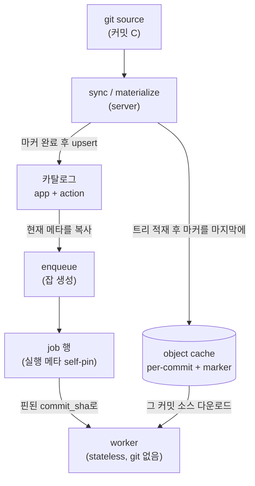
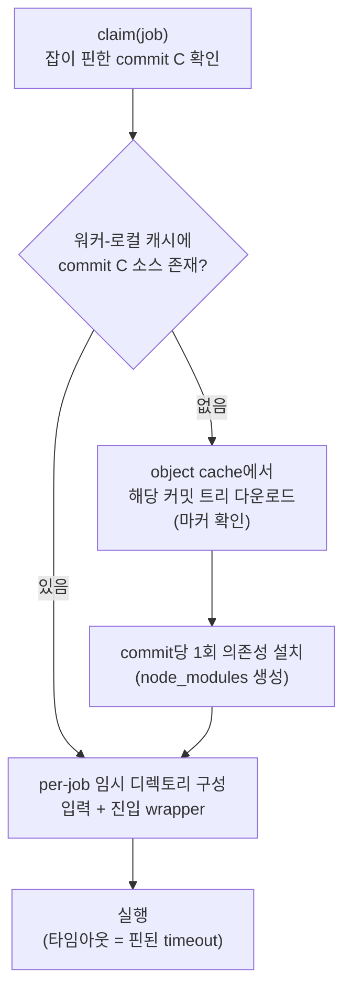

# 재현성과 내부 동작

이 페이지는 windforce가 "한 번 큐에 들어간 잡은 왜 코드를 다시 배포해도 항상 같은 방식으로 실행되는가"를 설명한다. 운영자가 알아야 할 세 가지 내부 동작 — 잡 self-pin(재현성), 소스 분배(워커가 코드를 받아오는 경로), 카탈로그 2단 구조 — 를 사용·운영 관점에서 다룬다.

## 한눈에 보기



## 잡 self-pin: 한 번 큐에 들어간 잡은 고정된다

windforce에서 잡을 큐에 넣을 때(enqueue), 그 시점의 카탈로그에서 **실행에 필요한 메타데이터를 잡 행 안으로 복사(denormalize)** 한다. 복사되는 값은 다음과 같다.

| 핀되는 값 | 의미 |
| --- | --- |
| `commit_sha` | 실행할 정확한 git 커밋 |
| `git_source_id` | 어느 git 소스에서 가져올지 |
| `app_key` | 소스 번들 식별자 |
| `action_key` | 그 번들 안에서 실행할 분기 |
| `entrypoint` | 진입 파일 |
| `input_schema` / `output_schema` | 입출력 계약 |
| `timeout` | 실행 시간 상한 |
| `tag` | 워커 라우팅 차원 |

이렇게 핀(pin)된 뒤로 잡은 **자기 자신만으로 실행 가능**하다. 카탈로그를 더 이상 참조하지 않는다.

### 운영상 의미

- **재배포해도 in-flight 잡은 안 바뀐다.** 누군가 같은 app을 새 커밋으로 다시 배포하거나, 외부에서 git push로 새 커밋이 동기화되어 카탈로그가 갱신되어도, 이미 큐에 들어가 있던 잡은 자기가 핀한 옛 커밋·옛 스키마·옛 타임아웃으로 실행된다. 실행 도중에 의미가 바뀌는 일이 없다.
- **재현·감사가 가능하다.** 어떤 잡이 무엇을 실행했는지는 그 잡 행에 박제된 `commit_sha`로 정확히 되짚을 수 있다. 카탈로그가 그 사이 몇 번 바뀌었는지와 무관하다.
- **태그도 핀된다.** 워커 라우팅에 쓰는 태그도 enqueue 시점에 잡에 고정된다. 배포 후 태그를 바꿔도 이미 큐에 있던 잡은 원래 태그를 유지한다. 큐에 대기 중인 잡을 새 라우팅으로 옮기려면 명시적으로 다시 큐에 넣어야(requeue) 한다.

> 따름정리: 잡이 *무엇을* 실행할지는 라우팅 태그가 아니라 잡에 self-pin된 `git_source_id` · `commit_sha` · `entrypoint`가 결정한다. 태그는 "어느 워커가 집어가는가"라는 라우팅 차원일 뿐이다.

## 소스 분배: 워커가 코드를 받아오는 경로

워커에는 **git도 자격증명도 없다**(stateless). 워커는 코드를 git에서 직접 clone하지 않는다. 대신 콘텐츠의 원천은 **object cache** 하나다.



### 동작 방식

1. **per-commit 캐시.** sync가 새 커밋을 발견하면 그 커밋의 전체 트리를 object cache에 커밋 단위로 적재한다(`{워크스페이스}/{git_source}/{커밋}/`). 같은 커밋은 한 번만 적재된다.
2. **marker-last(마커를 마지막에).** 트리를 모두 적재한 **뒤 마지막에** 완료 마커 파일을 쓴다. 마커가 없으면 워커는 그 커밋을 "아직 준비 안 됨"으로 취급한다. 그래서 워커가 부분적으로만 적재된 트리를 실행하는 일이 구조적으로 없다.
3. **워커는 소스만 받는다.** object cache에는 **소스 트리만** 올라간다. 의존성(`node_modules`)은 캐시에 올리지 않고, 워커가 코드를 받은 뒤 **커밋당 1회** 설치한다(커밋된 lockfile로 버전 결정성 확보). 한 커밋에 여러 잡이 동시에 몰려도 다운로드·설치는 한 번만 일어난다.
4. **잡별 격리.** 받아온 커밋 디렉토리는 읽기 전용으로 공유하고, 각 잡은 자기 임시 디렉토리(입력·결과)에서 실행되어 동시 실행이 서로 간섭하지 않는다.

### materialize → 카탈로그 순서

sync가 새 커밋을 처리하는 순서는 고정되어 있다.

```
clone@C → manifest + 스키마 읽기 → 트리 적재 + 마커(마지막에) → 그 다음 카탈로그 갱신
```

핵심은 **순서**다. 트리 적재(+마커)가 끝나기 전에는 카탈로그를 갱신하지 않는다. 적재가 실패하면 카탈로그 갱신을 아예 하지 않는다. 따라서 카탈로그가 가리키는(=잡이 핀하게 될) 커밋은 **항상 object cache에 완전히 준비되어 있다.** "카탈로그에는 떴는데 워커가 받을 소스가 없는" 상태가 생기지 않는다.

### 운영상 의미

- **워커는 무상태로 추가·교체 가능하다.** 워커에 git 설정이나 자격증명을 넣을 필요가 없다. 새 워커를 띄우면 필요한 커밋을 object cache에서 받아 캐시할 뿐이다.
- **git 자격증명의 신뢰 경계가 좁다.** git 접근과 자격증명은 server 측 sync 엔진에만 있다. 워커는 읽기(다운로드)만 한다.

## 카탈로그 2단: app과 action

windforce 카탈로그는 두 층으로 나뉜다. 이 구분이 "코드를 어디서 가져오는가"와 "그 안에서 무엇을 실행하는가"를 분리한다.

| 층 | 키 | 무엇을 담는가 |
| --- | --- | --- |
| **app** | `(workspace, app_key)` | 소스 단위. `git_source_id`, `commit_sha`, `entrypoint`, 기본 timeout/tag |
| **action** | `(workspace, app_key, action_key)` | 실행 분기 단위. `input_schema`, `output_schema`, 액션별 timeout/tag override |

- **app = 소스를 가져오는 단위.** 워커가 입력을 실행하기 전에 "어느 git 소스의 어느 커밋을 받아 어떤 진입 파일을 쓸지"를 결정하는 단위다. 하나의 app은 하나의 배포 번들(git 소스 트리)에 대응한다.
- **action = 그 번들 안의 실행 분기.** 같은 소스 번들 안에서 호출 가능한 여러 함수에 해당한다. 별도 소스나 별도 진입 파일이 아니라, 같은 진입점이 `ctx.action` 값으로 분기한다. action마다 입출력 스키마와 timeout/tag를 따로 가질 수 있다.

enqueue 시 windforce는 **app**에서 소스 관련 메타(`git_source_id` · `commit_sha` · `entrypoint`)를, **action**에서 계약 관련 메타(`input_schema` · `output_schema` · `timeout` · `tag`)를 각각 해석해 잡에 self-pin한다. 즉 앞서 설명한 self-pin은 이 2단 카탈로그를 읽어 채워진다.

### 카탈로그는 sync 시점에만 채워진다

app/action 카탈로그의 진입점·스키마는 **sync 시점에 소스 번들의 manifest와 동봉(companion) JSON 스키마 파일을 읽어** 적재된다. 런타임에 코드를 파싱하거나 타입을 추론하지 않는다. 스키마의 정본은 소스 트리 안의 스키마 파일이고, 카탈로그는 그것을 sync가 그대로 옮겨 담은 것이다.

배포 흐름과의 관계도 같은 원리다. control plane에서 "deploy"를 눌러 배포해도, deploy는 **git에만 쓴다**(커밋/푸시). 카탈로그를 갱신하는 것은 deploy API가 아니라, 그 커밋을 동기화하는 sync/materialize 경로다. 콘솔 배포(Model A)든 외부 git push(Model B)든 결국 같은 sync 경로로 수렴하므로, git이 실행 가능한 단일 진실원으로 유지된다.

## 정리

세 가지 동작은 하나의 목표 — **재현성** — 으로 모인다.

- **카탈로그 2단**이 "어디서(app) · 무엇을(action)"을 분리해 정확한 실행 메타를 정의하고,
- **self-pin**이 enqueue 시점에 그 메타를 잡에 박제해 이후 변경으로부터 격리하며,
- **소스 분배(marker-last object cache + stateless 워커)** 가 잡이 핀한 그 커밋의 소스를 항상 완전한 형태로 워커에 공급한다.

그래서 코드를 다시 배포해도, 워커를 추가·교체해도, 이미 실행 중이거나 큐에 들어간 잡은 자기가 핀한 커밋으로 한결같이 실행된다.

## 더 보기

- [기본 개념](../getting-started/concepts.md)
- 전체 설계·로드맵·정확성 불변식: [docs/foundation/architecture.md (GitHub)](https://github.com/imprun/windforce/blob/main/docs/foundation/architecture.md)
- 기술 심층 리포트: [docs/README.md (GitHub)](https://github.com/imprun/windforce/blob/main/docs/README.md)
- 결정의 "왜"(ADR): [self-pin](https://github.com/imprun/windforce/blob/main/docs/decisions/decision-ledger.md) · [ctx-first app/action 계약](https://github.com/imprun/windforce/blob/main/docs/decisions/decision-ledger.md) · [materialize → 카탈로그 순서](https://github.com/imprun/windforce/blob/main/docs/decisions/decision-ledger.md) · [git이 단일 진실원](https://github.com/imprun/windforce/blob/main/docs/decisions/decision-ledger.md)
