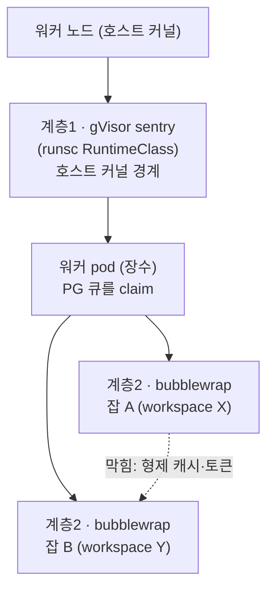

# 2계층 샌드박싱

windforce는 비신뢰 저자 코드를 실행하도록 설계됐다 — 콘솔에서 쓴 코드든, 외부 테넌트가 연결한 git 저장소든, 워커는 그 코드를 신뢰하지 않는다. 이 페이지는 운영자·보안 독자를 위해 그 비신뢰 코드가 어떤 격리 아래 도는지를 설명한다. 격리는 **두 계층**이다: 계층1 **gVisor**가 워커 pod와 호스트 커널 사이에 경계를 긋고, 계층2 **per-job bubblewrap**이 같은 워커 안에서 잡과 잡(=테넌트와 테넌트) 사이를 격리한다.

## 두 계층이 막는 것

한 계층이 모든 위협을 막지 않는다. 두 계층은 **서로 다른 경계**를 담당하며, 보강 관계지 대체 관계가 아니다.

| 계층 | 경계 | 무엇을 막나 | 메커니즘 |
|---|---|---|---|
| **계층1 gVisor** | 잡 ↔ **호스트 커널** | 허용된 syscall을 타고 들어오는 커널 0-day로 워커 노드를 탈출하는 것 | 워커 pod를 `runsc` RuntimeClass 아래 실행. 유저스페이스 커널(sentry)이 syscall을 가로채 호스트 커널에 직접 닿지 못하게 한다 |
| **계층2 bubblewrap** | 잡 ↔ **다른 잡(테넌트)** | 한 워커가 잇따라 실행하는 잡들이 서로의 캐시·토큰·자원을 보는 것 | 잡마다 mount/PID 네임스페이스 + clean env로 spawn. 형제 잡과 파일시스템·프로세스·환경변수를 공유하지 않는다 |

핵심: **gVisor만으로는 cross-tenant를 막지 못한다.** gVisor는 워커 pod 수준(장수 유지)이라 같은 sandbox 안에서 여러 잡이 돈다 — 호스트 탈출은 막아도 그 잡들 사이는 막지 않는다. 그래서 잡 간 격리는 계층2가 따로 담당한다.



## 계층2: per-job bubblewrap 기준선

워커는 잡마다 스크립트 런타임을 **bubblewrap 네임스페이스** 안에서 spawn한다. 이 기준선이 막는 것은 cross-tenant 누수다.

- **mount 네임스페이스 + 사설 파일시스템 뷰** — 잡은 *자기 잡 임시 디렉터리*(쓰기)와 *그 커밋의 소스·`node_modules`*(읽기 전용)만 본다. 다른 워크스페이스의 캐시된 소스(`…/src/<남의-ws>/…`)는 마운트 뷰에 아예 없다 → 타 테넌트 캐시를 읽을 수 없다.
- **PID 네임스페이스** — 형제 잡의 프로세스가 보이지 않는다. 잡 토큰은 디스크가 아니라 환경변수에 있는데(아래 시크릿 모델), 형제 잡의 `/proc/<pid>/environ`을 읽어 그 토큰을 훔치는 경로가 닫힌다 → cross-tenant 토큰 탈취 차단. 부수효과로 네임스페이스 init(잡 트리의 pid 1) 하나를 죽이면 트리 전체가 회수돼, 취소·타임아웃 시 자식까지 정리하는 프로세스그룹 kill 의미가 보존된다.
- **clean env** — 잡에 넘기는 환경변수는 큐레이션된다. `PATH`·`HOME`·locale + 잡 실행에 필요한 `WF_*` 변수만 전달하고, 워커 호스트의 시크릿(`DATABASE_URL`·`SECRET_KEY`·`S3_*`)은 전부 제거된다. 스크립트가 `process.env`를 읽어도 워커 호스트 자격증명에 닿지 못한다.

### 시크릿 모델과의 정합

워크스페이스 시크릿 값은 **워커 디스크에 없다** — 잡은 단명 잡 토큰으로 control-plane API에서 필요할 때 가져온다(자세히는 [멀티테넌시·운영자 평면](../operating/multitenancy.md)의 envelope 암호화). 따라서 샌드박스가 지켜야 할 대상은 *온디스크 시크릿 파일*이 아니라 **환경변수·프로세스 메모리에 있는 잡 토큰**(PID 네임스페이스가 보호)과 **네트워크 피벗**(아래 egress)이다. 잡 토큰은 워크스페이스 스코프·단명이라, 격리가 그 토큰의 횡적 도용만 막으면 cross-tenant가 닫힌다.

!!! note "현재 라이브 vs 단계적(staged)"
    위 세 가지 — mount 네임스페이스·PID 네임스페이스·clean env — 가 현재 라이브 기준선이다. 자원 캡(cgroup v2 `cpu/memory/pids`)과 per-job egress allowlist의 풀버전은 **단계적 후속**이다. 그동안의 자원 보호는 워크스페이스 quota(앞단 가드)로, egress 통제는 pod 수준 NetworkPolicy로 보완한다(아래 "심층 방어").

## 계층1: gVisor 호스트-커널 경계

비신뢰 코드가 계층2 안에 있어도, 그 코드는 여전히 호스트 커널의 syscall을 (제한적으로) 호출한다. 허용된 syscall을 타고 들어오는 커널 0-day는 계층2를 탈출할 수 있다. 계층1 gVisor가 이 잔여 위험을 닫는다.

- 워커 Deployment를 K8s **RuntimeClass `gvisor`**(handler `runsc`, platform `systrap`) 아래 실행한다. gVisor의 sentry가 유저스페이스 커널로서 잡의 syscall을 가로채므로, 잡(과 계층2)은 호스트 커널에 직접 닿지 않는다.
- platform이 `systrap`(seccomp + 시그널 트랩)이라 **노드 KVM/nested virtualization이 필요 없다** — arm64 오버레이 노드에서도 돈다.

### gVisor가 계층2를 비루트로 가능하게 한다

bubblewrap 기준선은 중첩 user 네임스페이스·mount·`/proc`를 필요로 하는데, 일부 클러스터의 컨테이너 런타임은 pod user 네임스페이스를 지원하지 않아 **privileged 권한 없이는 기준선이 성립하지 않는다**. gVisor가 이 벽을 우회한다: sentry가 **자체 user 네임스페이스·`/proc`·커널을 공급**하므로, bubblewrap의 중첩 네임스페이스가 호스트 권한(privileged·AppArmor unconfined) 없이 sentry 안에서 성립한다. 결과로 워커 pod는 **비루트(uid 65532)를 유지한 채** 계층2를 돌린다. 두 계층이 서로를 가능하게 하는 셈이다.

### 성능 트레이드오프

gVisor의 syscall 가로채기에는 비용이 있다.

- **연산·외부 네트워크 위주 잡**: 거의 영향 없음(CPU 오버헤드 무시 가능).
- **로컬 파일시스템 syscall이 많은 잡**: 로컬 fs에 약 2배 오버헤드. tight한 파일 루프가 많은 워크로드는 잡 특성별로 수용 여부를 판단한다.

## 호스트-네트워크 passthrough (네트워크 격리는 K8s가 담당)

gVisor의 기본 네트워크 모드는 sentry 안에 자체 네트워크 스택을 띄워 네트워크까지 격리한다. 그런데 일부 CNI(Cilium 등)에서는 이 격리된 스택이 클러스터 서비스 VIP(ClusterIP)에 도달하지 못해 — 워커가 Postgres·DNS 같은 ClusterIP 서비스를 이름으로 찾지 못하고 crashloop에 빠진다.

그래서 windforce 워커는 gVisor를 **host-network passthrough**(`runsc --network=host`)로 돌린다. 네트워크 syscall이 sentry 자체 스택 대신 **pod의 네트워크 네임스페이스(CNI/Cilium)**를 그대로 거치므로 ClusterIP·DNS가 정상 동작한다. 트레이드오프는 명확하게 나뉜다.

- **포기**: gVisor *네트워크* 스택의 격리. 네트워크 syscall은 이제 호스트 커널 소켓으로 패스스루된다.
- **보존(핵심)**: sentry는 **네트워크가 아닌 syscall(파일시스템·프로세스·메모리 등 대다수)을 계속 샌드박스한다** — gVisor의 주된 가치인 **호스트-커널 경계는 그대로 유지**된다.
- **이동**: 네트워크 격리 책임은 이제 K8s가 진다 — pod 네트워크 네임스페이스 + NetworkPolicy + CNI. 비신뢰 잡의 egress 통제는 NetworkPolicy로 명시 설계한다.

!!! warning "적용은 pod sandbox 재생성 시"
    네트워크 모드는 pod sandbox 생성 시점에 고정된다 — 컨테이너 재시작만으로는 바뀌지 않는다. 노드 런타임 설정을 바꾼 뒤에는 **워커 pod를 삭제**해 fresh sandbox가 뜨게 해야 적용된다.

## per-job egress 아이덴티티 (선택, 기본 off)

일부 잡은 *특정 아웃바운드 IP·아이덴티티*로 나가야 한다(외부 API allowlist, geo, per-IP rate limit). windforce는 이를 워커 pod 안의 **gost 사이드카**(in-pod 프록시)로 제공한다 — 워커 그룹별 `egressProxy.enabled`로 게이트되며 **기본 off**다(켜기 전엔 사이드카가 없다).

켜진 경우의 동작과 보안 성질:

- 워커가 잡마다 `WF_PROXY_URL=http://job-<id>@127.0.0.1:<port>`(+ `HTTP(S)_PROXY`)를 큐레이션 env로 주입한다. 협조적 잡은 이 프록시로 보내고, 프록시가 통제된 아이덴티티로 대신 egress한다.
- **자격증명 격리(불변식)**: 상류 provider 자격증명은 **사이드카 컨테이너에만** 산다. 잡은 `127.0.0.1` 프록시 URL만 받고 상류 자격증명을 절대 보지 않는다. 잡이 사이드카의 `/proc`를 못 읽도록 프로세스 네임스페이스 공유는 끈 채로 둔다 — **이 설정은 절대 켜지 말 것.**
- **아이덴티티지 통제가 아니다**: 잡이 프록시를 우회해 직접 egress할 수 있다 — 그건 *잡의 손해*(지정 IP를 못 씀)지 보안 위반이 아니다. 비신뢰 잡이 *우회·유출하지 못하게* 강제하는 통제가 필요하면, 별도 pod + deny-by-default egress NetworkPolicy 경로로 격상한다.

## 신뢰 경계 한눈에

| 주체 | 신뢰 등급 | 닿을 수 있는 것 |
|---|---|---|
| 잡(저자 코드) | **비신뢰** | 자기 잡 디렉터리(쓰기) + 그 커밋 소스(읽기 전용) + 자기 워크스페이스 잡 토큰. 그 외 — 타 워크스페이스 캐시, 형제 잡 토큰, 워커 호스트 시크릿, 호스트 커널 — 은 차단 |
| 워커 호스트 / 사이드카 | 잡보다 높음 | 호스트 시크릿·상류 자격증명은 잡 경계 밖에 둔다(clean env, 사이드카 격리) |
| 인스턴스 운영자 | 최상위 | KEK로 모든 테넌트 DEK를 unwrap 가능 — 운영자는 신뢰 경계 안에 있다(테넌트별 키 BYOK는 현재 범위 밖) |

이 보장은 **탈출 스위트**로 입증된다 — 비신뢰 스크립트의 각 시도(타 워크스페이스 캐시 읽기, 형제 잡 `/proc` 토큰 탈취, 호스트 env 시크릿 읽기, 자기 디렉터리 밖 쓰기)가 *실패*함을 단언하는 테스트가 sandbox-capable 노드에서 회귀 게이트로 돈다.

### 심층 방어 (샌드박스와 별개로 항상 적용)

2계층 샌드박스를 켜지 않은 상태에서도 다음은 항상 적용된다.

- **하드닝 기본값** — 워커 pod는 non-root(uid 65532) + 모든 capability drop + 쓰기 경로는 스크래치 `/data`로 제한.
- **잡 env 큐레이션** — 위 clean env. 워커 호스트 시크릿(`DATABASE_URL`·`SECRET_KEY`·`S3_*`)이 `process.env`로 새지 않는다.
- **git credential 분리** — git 자격증명은 server/sync pod에만 주입한다. 워커는 object cache에서 커밋별 소스만 받는다.
- **worker NetworkPolicy** — 워커 전면 ingress 차단. egress 정책(`networkPolicy.workerEgress.enabled`, **기본 on**)이 링크-로컬 `169.254.0.0/16`(클라우드 메타데이터 SSRF)을 기본 차단하고, `extraBlockedCidrs`로 내부 대역을 추가 차단할 수 있다(DNS·control-plane·외부 egress는 유지).

## 왜 Linux 전용인가

2계층 샌드박스의 두 메커니즘 모두 **Linux 커널 기능**에 의존한다.

- 계층2 bubblewrap = Linux 네임스페이스(`--unshare-user/pid/ipc/uts/cgroup/net`)·seccomp·cgroup.
- 계층1 gVisor(`runsc`) = Linux 전용 런타임.

따라서 **프로덕션 2계층 샌드박스는 실제 Linux 커널이 있는 환경(클러스터·Docker·WSL2)에서만** 돈다. 비-Linux 호스트에서 잡 *실행* 자체는 직접 실행(direct-exec) 폴백으로 동작하지만, 그건 "샌드박스를 끈 워커"다. 그래서 샌드박스는 **opt-in**으로 게이트된다(아래).

## 운영자: 켜는 법

두 계층은 따로 게이트되며 순서가 있다.

### 계층2(bubblewrap) — `SANDBOX_ENABLED`

워커 그룹의 env에 `SANDBOX_ENABLED=true`를 넣으면 그 그룹의 워커가 잡을 bubblewrap 기준선 아래 실행한다(기본 off = direct-exec). 워커 이미지에 bubblewrap이 포함돼 있고 클러스터가 unprivileged user 네임스페이스를 허용하는 것이 전제다 — 계층1 gVisor가 그 전제를 sentry 차원에서 공급한다.

### 계층1(gVisor) — RuntimeClass

gVisor 채택은 **노드 프로비저닝**과 **앱 배선** 두 단계다. 순서를 지키지 않으면(앱만 켜고 노드가 준비 안 되면) 워커 pod가 스케줄에 실패한다.

**1) 노드 프로비저닝** — 워커를 돌릴 containerd 노드에 `runsc` 런타임을 설치한다. 노드 라벨로 게이트되는 인스톨러 DaemonSet으로 자동화돼 있어, 노드에 라벨을 달면 그 노드에만 적용된다.

```bash
kubectl label node <node-name> windforce.io/gvisor-runtime=enabled
```

**2) 앱 배선(Helm)** — RuntimeClass를 만들고 워커가 그것을 쓰도록 지정한다. 전역 또는 워커 그룹별로 지정할 수 있어, 고-비신뢰 태그 그룹부터 단계적으로 롤아웃할 수 있다.

```bash
helm upgrade --install windforce deploy/helm/windforce \
  --set gvisor.runtimeClass.create=true \
  --set workers[0].runtimeClassName=gvisor
```

확인: 켜진 워커 pod에서 `uname -a`가 `gVisor`를 보이면 sentry 안에서 도는 것이다.

!!! note "런타임 전제"
    gVisor는 컨테이너 런타임이 **containerd**인 노드에서 동작한다(Docker 런타임 노드는 containerd 이관 또는 별도 처리 필요). `runsc`와 스크립트 런타임(Bun 등)의 syscall 호환은 버전에 결합돼 있어, 업그레이드 시 탈출 스위트를 sandbox-capable 노드에서 회귀 게이트로 돌린다.

자세한 securityContext·RuntimeClass 배선과 Helm 값은 [Kubernetes 배포](../operating/deployment.md)의 "securityContext와 샌드박스 RuntimeClass" 절을 참고한다.

## 더 보기

- [Kubernetes 배포](../operating/deployment.md) — securityContext·RuntimeClass 배선과 Helm 절차
- [멀티테넌시·운영자 평면](../operating/multitenancy.md) — 워크스페이스 격리와 envelope 암호화(시크릿이 디스크에 없는 이유)
- [아키텍처 개요](overview.md) — 3 평면 + PG 큐 전체 그림
- 기술 심층 리포트(다언어 런타임과 2계층 샌드박싱 · 실측으로 닫은 게이트 · per-job egress): [docs/README.md](https://github.com/imprun/windforce/blob/main/docs/README.md)
- 엔지니어링 원문(결정의 "왜"와 전체 계약):
  - [Kubernetes 운영 모델 (신뢰 경계·gVisor 채택 절차)](https://github.com/imprun/windforce/blob/main/docs/operations/operator-runbooks.md)
  - [ADR-0031 비신뢰 코드 샌드박싱 (계층2 기준선)](https://github.com/imprun/windforce/blob/main/docs/decisions/decision-ledger.md) · [ADR-0032 gVisor 채택 (계층1 RuntimeClass)](https://github.com/imprun/windforce/blob/main/docs/decisions/decision-ledger.md)
  - [ADR-0036 per-job egress 아이덴티티 (gost 사이드카)](https://github.com/imprun/windforce/blob/main/docs/decisions/decision-ledger.md) · [ADR-0037 gVisor host-network passthrough](https://github.com/imprun/windforce/blob/main/docs/decisions/decision-ledger.md)
