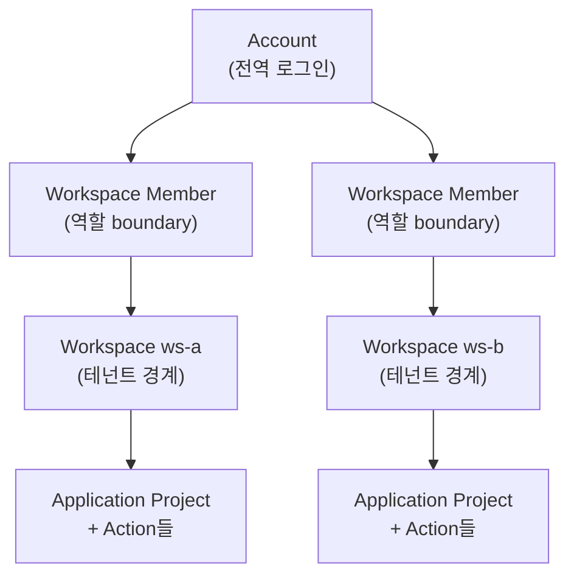
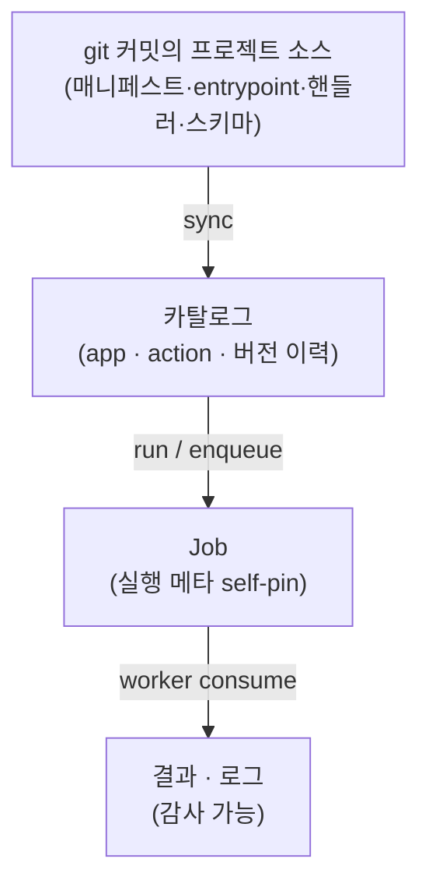
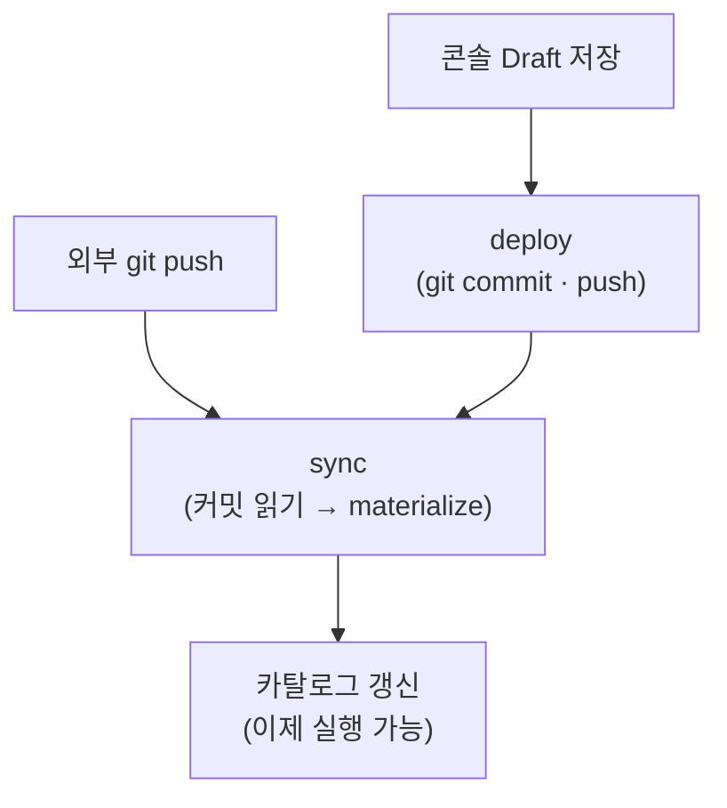

# 핵심 개념

windforce를 쓰거나 운영할 때 반복해서 만나는 용어를 한곳에 모았다. 함수를 만들고 호출하기 전에 이 페이지의 여섯 개념 — **Workspace · Account · Application Project · Action · Git Source · Job** — 과 "소스가 어떻게 실행 가능한 카탈로그가 되는가"만 잡아 두면, 나머지 문서가 같은 단어로 읽힌다.

## 한눈에 보는 용어표

| 용어 | API/DB 식별자 | 무엇인가 | 헷갈리지 말 것 |
|---|---|---|---|
| **Workspace** | `workspace`, 라우트 `{ws}` | 테넌트 경계. 한 워크스페이스 안에서 프로젝트·잡·시크릿·상태·리소스·토큰·멤버십이 격리된다. | 로그인 계정이 아니다. |
| **Account** | `account` | 전역 로그인 신원. UI 세션은 계정으로 인증한다. | 그 자체로 워크스페이스 권한은 아니다. |
| **Workspace Member** | `workspace_member` | 한 계정이 한 워크스페이스 안에서 갖는 멤버십과 역할. 워크스페이스 라우트는 이 멤버십으로 권한을 판단한다. | 전역 계정 행이나 잡 토큰이 아니다. |
| **Application Project**(app) | `app`, `app_key` | 사용자가 만드는 함수 프로젝트. 소스·배포·카탈로그·기본 런타임 메타의 단위. | git 저장소·UI 페이지·단일 함수가 아니다. |
| **Action** | `action`, `action_key` | Application Project 안의 호출 가능한 함수. 실행 주소의 한 segment이자 `ctx.action` 디스패치 키. | 별도 소스 번들이나 별도 entrypoint가 아니다. |
| **Git Source** | `git_source`, `git_source_id` | sync가 사용하는 저장소·브랜치·subpath·자격증명 참조. | Application Project가 아니다. |
| **Job** | `job`, `job_queue`, `job_completed` | 영속화된 실행 기록. 실행 메타를 자기 자신에 고정(self-pin)한다. | 트리거 종류가 아니다. |

## 워크스페이스와 계정

**Account**는 전역 로그인 신원이고, **Workspace**는 그 계정이 실제로 일하는 격리된 공간이다. 한 계정이 여러 워크스페이스에 속할 수 있고, 각 소속은 **Workspace Member** 행으로 표현된다 — 권한(역할)은 계정이 아니라 이 멤버십에 붙는다.

워크스페이스가 테넌트 경계이므로, 한 워크스페이스의 프로젝트·잡·시크릿(Variable)·구조화 값(Resource)·상태(State)·API 토큰은 다른 워크스페이스에서 보이지 않는다. URL의 `{ws}` segment가 어느 테넌트인지 고정하고, 워크스페이스 라우트는 호출자의 멤버십으로 접근을 허가한다.



## 프로젝트와 액션

**Application Project**(줄여서 app)는 함수 프로젝트 하나다. 소스 파일·배포·카탈로그·기본 런타임 메타가 모두 이 단위에 묶인다. 프로젝트 안에는 호출 가능한 함수인 **Action**이 하나 이상 들어간다.

- 한 프로젝트는 워커가 로드하는 entrypoint TypeScript 모듈을 하나 갖는다. 이 모듈이 `main(ctx)`를 직접 내보내거나 `createApp(...)`을 통해 내보낸다.
- 여러 Action이 **파일이 따로일 필요는 없다** — Action은 그 프로젝트 안에서 호출 주소로 선택되는 디스패치 키이지, 액션마다 별도 entrypoint나 별도 저장소가 아니다.
- 어떤 Action이 있고 스키마 경로·런타임 오버라이드가 무엇인지는 소스 루트의 매니페스트 `windforce.json`이 선언한다.

> 용어 주의: "git에 app/Action이 있다"고 말하지 않는다. git에는 **프로젝트 소스**가 있고, app·Action은 sync가 그 소스로부터 만들어 내는 카탈로그 개념이다.

## 실행 주소: 하나의 URL

Action을 실행하는 공개 주소는 하나뿐이다.

```text
POST /api/w/{workspace}/jobs/run/{app}/{action}
```

- `{workspace}` — 테넌트(워크스페이스).
- `{app}`(= `app_key`) — Application Project 카탈로그 행을 고른다.
- `{action}`(= `action_key`) — 그 프로젝트 안의 호출할 Action 하나를 고른다.

이 호출이 곧 **Run**(enqueue 행위)이다. enqueue는 두 카탈로그 행의 실행 메타를 잡에 복사하므로, 잡이 큐에 들어간 **뒤** sync로 카탈로그가 바뀌어도 이미 큐에 있는 잡은 영향을 받지 않는다.

## 소스 → 카탈로그 → 잡 경계

windforce는 세 영역을 명확히 가른다. git에는 소스만 있고, 실행 가능한 형태(카탈로그)는 sync가 만들며, 실제 실행 기록은 잡이다.



- **소스**: 한 git 커밋과 subpath에 있는 파일들(매니페스트, entrypoint, 핸들러, 공통 모듈, 스키마, 패키지 파일). 카탈로그 자체는 아니다.
- **카탈로그**: sync가 소스를 읽어 만든 DB read model(`app`·`action`과 버전 이력). 손으로 고치는 진실원이 아니다.
- **잡**: 실행 기록. enqueue 시점에 카탈로그 메타를 복사해 self-pin한다(아래).

## 잡의 self-pin

**Job**은 큐에 들어갈 때 실행에 필요한 메타 — app/action, commit, entrypoint, 스키마, timeout, tag, 입력, 트리거 출처 — 를 **자기 자신에 고정한다**. 이 self-pin 덕분에:

- 잡이 큐에 들어간 뒤 소스가 다시 sync돼 카탈로그가 바뀌어도, **진행 중이거나 대기 중인 잡은 자기 핀 값으로 실행**된다.
- 같은 Action을 호출해도 잡마다 어떤 커밋·스키마로 돌았는지 기록이 남아 결과·로그가 감사 가능하다.

`trigger_kind`(API·webhook·schedule·manual 등)는 어디서 enqueue됐는지를 나타내는 **출처 메타데이터**일 뿐, 별도의 실행 경로가 아니다 — 모든 잡 생성은 하나의 enqueue 경로를 지난다.

## sync vs deploy

비슷해 보이지만 층이 다르다. **deploy는 git에 쓰는 행위**고, **sync는 git 커밋을 카탈로그에 반영하는 행위**다. 카탈로그와 버전 이력은 언제나 sync가 갱신한다 — deploy가 아니다.

| | **Sync(소스 반영)** | **Deploy(git write)** |
|---|---|---|
| 무엇을 하나 | 한 git 커밋을 읽어 materialize하고 **카탈로그를 갱신** | 콘솔/API의 Draft를 **git에 commit·push**해 target 커밋을 만든다 |
| 주소 | `POST /api/w/{ws}/git_sources/{id}/sync` | `POST /api/w/{ws}/apps/{app}/deploy` |
| 카탈로그를 직접 쓰나 | **그렇다** (sync가 카탈로그의 주인) | **아니다** — deploy는 커밋만 만들고, 그 커밋을 sync가 반영한다 |
| 실행 가능해지는 시점 | materialize 성공 + 카탈로그 upsert 후 | deploy로 커밋만 된 상태는 아직 실행 불가. **sync까지 끝나야** 새 Action이 돈다 |

두 가지 인입 흐름이 결국 같은 sync 경로로 수렴한다.

- **외부 GitOps 흐름**: 외부에서 git 저장소에 push → sync가 새 커밋을 인제스트한다.
- **콘솔 deploy 흐름**: 콘솔/API가 Draft를 저장 → deploy가 그것을 git으로 export → 같은 sync가 target 커밋을 인제스트한다.



> 핵심: 콘솔에서 **Deploy**를 눌러 git에 커밋이 생겨도, 그 커밋이 sync·materialize로 카탈로그에 반영되기 전에는 새 Action이 실행되지 않는다. "커밋됨"과 "배포 완료(실행 가능)"는 다르다.

## 더 보기

- [빠른 시작](quickstart.md) — 콘솔에서 첫 액션을 만들고 실행한다.
- [사용자 가이드: 앱과 액션](../guide/apps-and-actions.md) — 앱·액션을 만들고 트리거로 호출한다.
- 용어 정본(영문 식별자 포함): [docs/foundation/concepts.md](https://github.com/imprun/windforce/blob/main/docs/foundation/concepts.md)
- deploy·sync 흐름 심층: [docs/runtime/source-catalog-deploy.md](https://github.com/imprun/windforce/blob/main/docs/runtime/source-catalog-deploy.md)
- "git이 실행 진실원"인 이유(결정 기록): [ADR-0015](https://github.com/imprun/windforce/blob/main/docs/decisions/decision-ledger.md)
