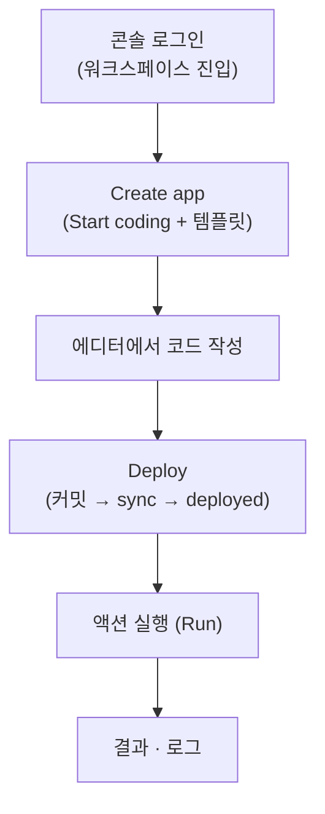

# 빠른 시작

windforce 콘솔에서 **첫 액션을 5분 안에 만들고 실행하는** 가장 짧은 경로다. 로컬 설치도, git 저장소 준비도 필요 없다 — 브라우저에서 앱을 만들고, 템플릿으로 코드를 시드하고, **Deploy**를 눌러 실행한다. 플랫폼이 git 저장소·커밋·배포를 뒤에서 대신 처리한다.

> **직접 띄워서 평가하려면?** 초대받은 인스턴스가 없으면 [로컬 평가 (Docker Compose)](self-hosting.md)로 로컬 스택을 올린 뒤(약 1분) 같은 콘솔 흐름을 그대로 따라온다.

## 사전 준비

windforce 콘솔에 접속한다 — 초대받은 워크스페이스에 로그인하거나, [로컬 평가(Docker Compose)](self-hosting.md)로 띄운 로컬 인스턴스(`http://localhost:8080`). CLI·git·로컬 빌드는 필요 없다.

windforce를 만나는 경로는 셋이고, **콘솔 저작 경험은 모두 같다** — 다른 건 운영 모델뿐이다:

| 경로 | 누구 | 성격 |
|---|---|---|
| **Hosted 콘솔** | 앱 개발자 | 로그인만 — 운영 인프라를 몰라도 된다 |
| **Docker Compose 로컬 평가** | 로컬 평가·기능 테스트 | 콘솔 경험을 로컬에서 확인. **production 운영 모델은 아니다** |
| **Kubernetes self-host** | 운영자·플랫폼 팀 | 실제 워커 그룹·격리·스케일의 기준([배포](../operating/deployment.md)) |

이 빠른 시작은 어느 경로든 **콘솔에 로그인한 상태**에서 5분 안에 첫 앱을 실행하는 데 집중한다.

## 1. 로그인


콘솔에 로그인하면 멤버로 속한 워크스페이스로 들어간다. 워크스페이스는 테넌트 경계다 — 그 안의 앱·잡·시크릿·토큰이 격리된다(자세히는 [핵심 개념](concepts.md)).

## 2. 앱 만들기 — "Start coding"


**Apps → Create app**으로 들어가 다섯 가지를 정한다.


| 항목 | 고르는 것 |
|---|---|
| **App name** | 앱 식별자(`app_key`). 예: `greet` |
| **Language** | TypeScript / Python / Go |
| **Template** | Blank / HTTP webhook / Scheduled job — 선택 언어의 스타터 코드를 시드 |
| **Worker group** | 잡이 실행될 워커 라우팅 태그(언어로 거르지 않음) |
| **First trigger** | 템플릿에 맞춘 첫 트리거(webhook이면 URL·토큰 발급) |

이 빠른 시작은 `greet` · TypeScript · **HTTP webhook** 템플릿으로 진행한다. **"Start coding"**을 누르면 플랫폼이 전용 git 저장소를 자동 생성하고, 스타터 `main.ts` + `windforce.json`을 첫 커밋으로 시드한 뒤 초기 sync까지 끝낸다 — 그 순간 앱이 유효하고 바로 에디터로 들어간다.

> 이미 git에 코드가 있다면 생성 화면의 **"Connect a git repo"** 탭으로 자기 저장소를 연결한다. 그 경우 콘솔 편집은 read-only이고 변경은 본인 git push로만 일어난다. 두 경로의 차이는 [앱·액션 만들기](../guide/apps-and-actions.md)에서 다룬다.

## 3. 코드 확인 → Deploy


에디터에 스타터 코드가 이미 들어 있다. `main(ctx)`가 `ctx.input`을 받아 결과를 `return`하는 형태다.

```ts
import type { WindforceContext } from "windforce-client"

export async function main(ctx: WindforceContext) {
  const input = (ctx.input ?? {}) as { name?: string }
  ctx.logger.info(`hello ${input.name ?? "world"}`)   // 로그 채널
  return { message: `hi ${input.name ?? "world"}` }    // JSON 직렬화 가능한 결과
}
```

원하는 대로 고친 뒤 **Deploy**를 누른다.


Deploy는 편집 내용을 git에 커밋하고, 그 커밋을 sync해 카탈로그를 갱신한다. 진행 상태(`pending` → `committed` → `syncing` → `deployed`)가 끝나 **deployed**가 되면 새 코드가 실행 가능해진다. 커밋만으로는 실행되지 않는다 — sync까지 끝나야 한다([sync vs deploy](concepts.md#sync-vs-deploy)).


## 4. 실행 → 결과·로그


콘솔에서 액션을 실행한다 — 입력 JSON을 넣고 Run하면 잡이 큐에 들어가고, 워커가 실행한 뒤 결과·로그가 남는다.


실행은 **비동기**다 — Run은 잡을 큐에 넣고 `job_id`를 돌려주며, 완료되면 `result`에 액션이 `return`한 값(`{"message":"hi world"}`)이 담긴다. 잡 목록·결과·로그를 콘솔에서 추적한다. 프로덕션 배포에서는 워커가 2계층 샌드박스(gVisor + bubblewrap)로 격리 실행한다([샌드박싱](../architecture/sandboxing.md)).

API로 직접 호출하려면 공개 실행 주소는 하나다: `POST /api/w/{workspace}/jobs/run/{app}/{action}`. 자세히는 [잡 실행·결과·로그](../guide/jobs.md).

## 전체 흐름



## 더 보기

- [핵심 개념](concepts.md) — Workspace · App · Action · Job, sync와 카탈로그의 관계.
- [앱·액션 만들기](../guide/apps-and-actions.md) — managed("Start coding")와 external(git 연결), Draft → Deploy → sync.
- [액션 코드 작성](../guide/writing-actions.md) · [트리거 (run·webhook·schedule)](../guide/triggers.md) · [변수·시크릿](../guide/variables.md)
- [로컬 평가 (Docker Compose)](self-hosting.md) — 로컬 스택으로 직접 띄워 windforce를 평가한다(운영 self-host는 Kubernetes — [배포](../operating/deployment.md)).
- [스크립트 개발자 계약](https://github.com/imprun/windforce/blob/main/docs/contracts/author-contract.md) — `main(ctx)`·입력·결과·에러·상태·시크릿·멀티파일·manifest의 전체 계약(TypeScript·Python·Go).
