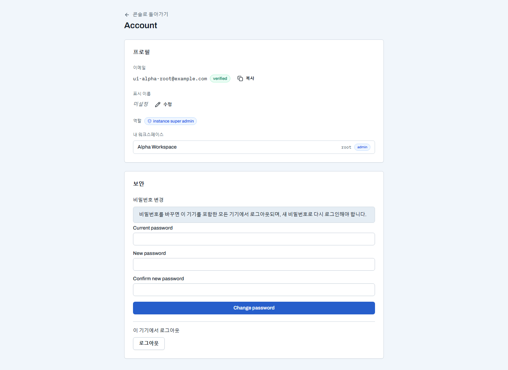

# Account — 개인 설정

**Account**(`/account`)는 워크스페이스를 가로지르는 개인 설정 페이지다. 하단 계정 메뉴의 **Account settings**로 들어간다.

- **프로필**: 이메일과 인증 상태, 표시 이름 편집, 역할, 내가 속한 워크스페이스 목록을 보여 준다. 이메일이 아직 미인증이면 여기서 **인증 메일을 재발송**한다.
- **보안**: 비밀번호를 변경한다 — 바꾸면 이 기기를 포함한 **모든 기기에서 로그아웃**되며(제출 전 경고가 표시된다), 새 비밀번호로 다시 로그인한다. 이 기기에서만 로그아웃도 여기서 한다.
- 계정은 워크스페이스에 속하지 않는 개인 표면이라, 워크스페이스 설정([Settings](settings.md))과 분리돼 있다.
