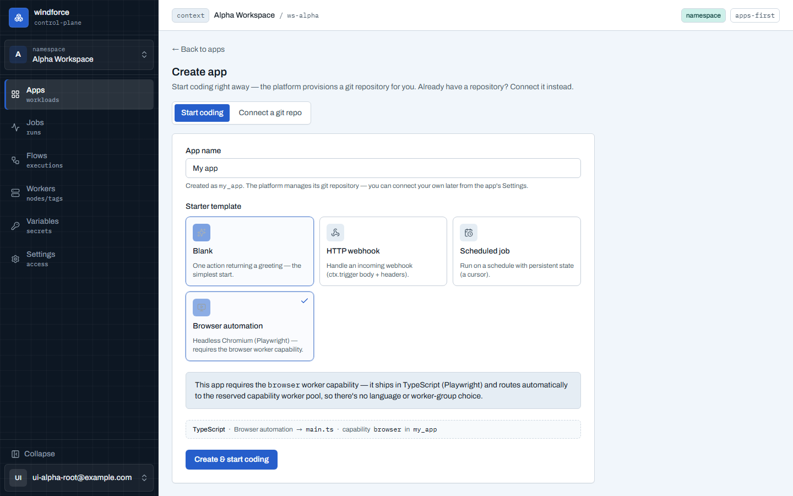
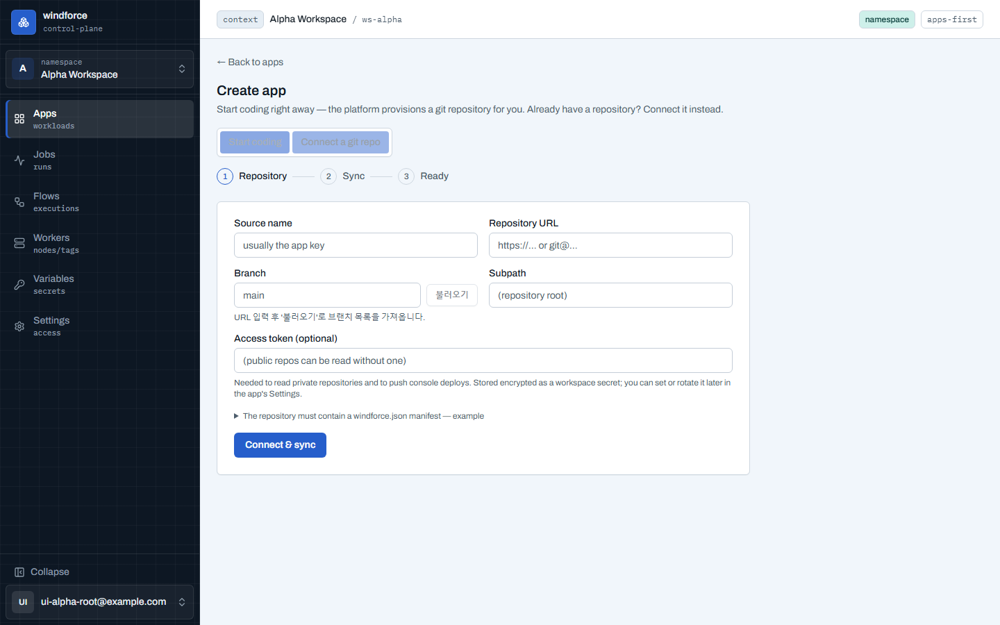
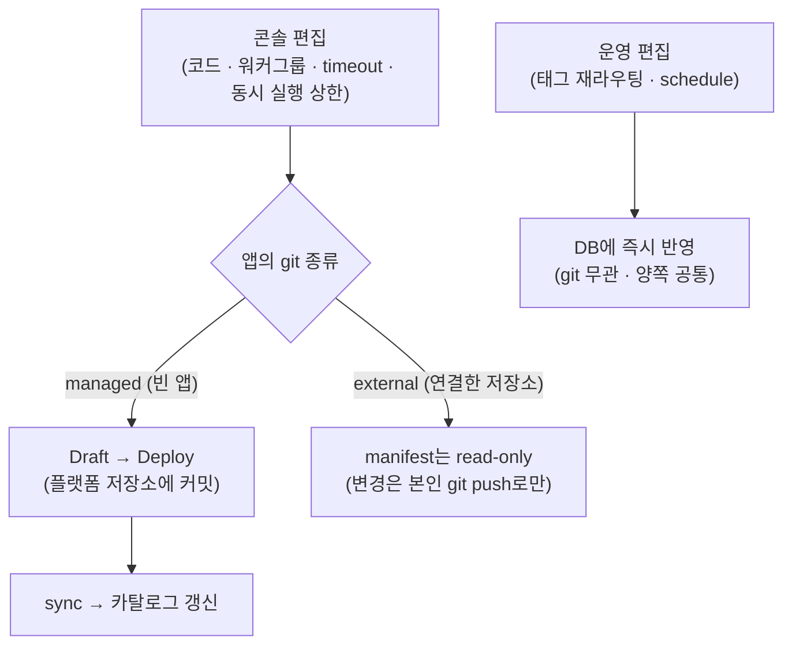
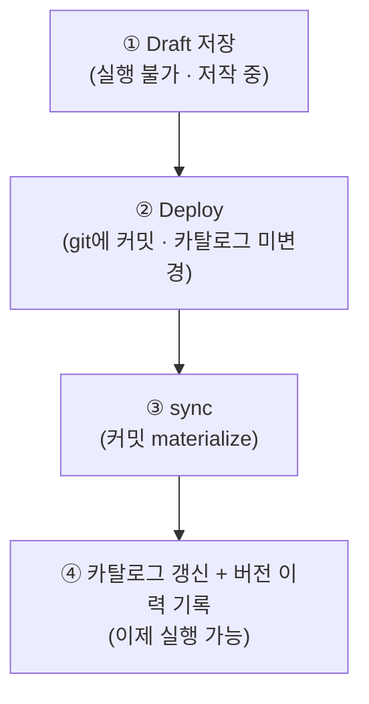

# 앱·액션 만들기

이 페이지는 windforce에서 **앱(App)을 만들고 그 안에 액션(Action)을 정의해 실행 가능하게 만드는 두 가지 경로**를 설명한다. 콘솔에서 빈 앱을 만들어 바로 코딩하는 길과, 이미 가진 git 저장소를 연결하는 길이다. 두 경로의 차이, 앱을 정의하는 `windforce.json` manifest, 그리고 편집 내용이 실제로 실행에 반영되는 Draft → Deploy → sync 흐름을 다룬다.

## 앱과 액션, 그리고 git

windforce에서 **앱은 하나의 git 저장소 번들**이다. 앱 루트에 manifest(`windforce.json`) 하나, 조립 entrypoint 하나, 액션별 핸들러 파일들, 그리고 입력/출력 스키마 JSON이 함께 담긴다. 액션은 그 앱 안에서 호출 가능한 단위 함수다.

핵심 규칙은 하나다: **실행 가능한 앱은 항상 git 커밋에서 만들어진다.** 코드가 카탈로그(실행 가능한 액션 목록)에 올라가려면 반드시 커밋이 되고 그 커밋이 sync되어야 한다. 이 규칙은 콘솔에서 만들든 외부 저장소를 연결하든 동일하다. 두 경로의 차이는 *누가 git 저장소를 소유하느냐*뿐이다.

| 경로 | git 저장소 소유 | manifest·코드 편집 | UI에서 git 노출 |
|---|---|---|---|
| **빈 앱 (managed)** | 플랫폼이 자동 생성·소유 | 콘솔에서 편집 → Deploy가 git에 write-through | 숨김 (repo URL·branch·자격증명 안 보임) |
| **내 저장소 연결 (external)** | 사용자 본인 | manifest는 read-only, 변경은 본인 git push로만 | 사용자가 직접 관리 |

## 경로 1 — 콘솔에서 빈 앱 만들기 ("Start coding")

git 저장소를 미리 준비할 필요 없이, 앱 이름만 정하면 바로 코딩을 시작하는 경로다. 플랫폼이 뒤에서 전용 git 저장소를 자동으로 만들어 주기 때문에, 사용자는 repo URL이나 자격증명을 입력하지 않는다.


생성 화면은 다섯 가지를 정한다.

| 항목 | 무엇을 정하나 |
|---|---|
| **App name** | 앱 식별자(`app_key`). 소문자로 시작하는 `[a-z][a-z0-9_]` 형식 |
| **Language** | TypeScript / Python / Go 중 하나. 런타임은 언어가 결정하므로 별도 선택이 없다 |
| **Template** | Blank / HTTP webhook / Scheduled job — 선택한 언어의 스타터 코드를 시드한다 |
| **Worker group** | 잡이 실행될 워커를 고르는 **라우팅 태그**. 언어로 필터하지 않는다(모든 워커가 모든 언어 실행) |
| **First trigger** | 템플릿에 맞춘 첫 트리거(webhook이면 URL·토큰 발급, scheduled면 cron·timezone) |

"Start coding"을 누르면 플랫폼이 전용 저장소를 만들고, 선택한 언어·템플릿·태그를 담은 `main.{ts,py,go}` + `windforce.json`을 첫 커밋으로 시드한 뒤 초기 sync까지 끝낸다. 그 순간부터 앱은 유효하고 바로 에디터로 들어가 편집할 수 있다.

> **언어는 생성 시 고정된다.** 언어를 바꾸는 것은 entrypoint를 다시 쓰는 것과 같으므로, 나중에 편집 화면에서는 바꿀 수 없다. 다른 언어가 필요하면 새 앱을 만든다.

### 워커 그룹은 성능 축이지 언어 축이 아니다

워커 그룹 선택은 "어느 워커에서 도는가"를 정하는 **라우팅 태그**다. 한 워커가 TypeScript·Python·Go 잡을 모두 실행하므로, 워커 그룹을 언어로 거르지 않는다. 워커 그룹의 성격(general/cpu/mem/browser 등)은 리소스와 가용성을 나타내는 축이다. 전용 워크스페이스를 쓰는 경우, 모든 잡이 전용 태그로 강제되어 이 선택은 고정·비활성 상태로 표시된다.

### 브라우저 자동화 앱 (capability)

템플릿에서 **Browser automation**을 고르면 headless Chromium(Playwright) 샘플과 함께 `capabilities: ["browser"]`를 선언한 매니페스트가 시드된다. capability를 선언한 앱은 라우팅 태그 대신 capability로 라우팅되므로, 콘솔이 언어·워커 그룹 선택을 숨기고 "이 앱은 browser capability를 요구한다"는 안내로 대체한다 — capability와 태그는 상호배타다.

browser capability 잡은 예약 `browser` 태그로 자동 라우팅되어 브라우저 이미지(Chromium 포함) 워커 그룹에서 실행된다. 그런 워커 그룹이 아직 없으면 운영자가 Fleet의 capability coverage에서 browser 풀을 preset으로 만들 수 있고, 그 전까지 잡은 큐에서 대기한다.



## 경로 2 — 내 git 저장소 연결하기 (external)

이미 코드를 git에 관리하고 있다면, 그 저장소를 그대로 연결한다. 이 경우 언어·템플릿·기본 태그는 저장소 안의 `windforce.json`에서 읽어오므로, 생성 화면이 그 항목들을 묻지 않는다.



연결한 앱(external)에서 manifest 필드(태그·timeout·동시 실행 상한·언어)는 콘솔에서 **read-only**로 표시된다. 이 값들을 바꾸려면 본인의 git 저장소에 직접 push해야 하며, push된 커밋을 sync가 인제스트해 카탈로그를 갱신한다. 콘솔은 정본이 아니라 사용자 git이 정본이다.

## managed vs external — 편집이 영속되는 방식

두 경로의 가장 중요한 차이는 **콘솔에서의 편집이 어떻게 저장되느냐**다.



- **managed 앱**: manifest 필드와 코드 편집은 Deploy가 git에 **write-through**한다. 사용자는 git이나 manifest를 직접 만지지 않고, 구조화된 폼이 `windforce.json` 손편집을 대신한다. 같은 Draft → Deploy 경로를 그대로 쓴다.
- **external 앱**: manifest 필드는 read-only이고, 실제 변경은 사용자의 git push로만 일어난다.
- **운영 편집은 양쪽 공통**: 태그 재라우팅(운영 override)이나 schedule(cron) 같은 운영 설정은 git과 무관하게 DB에 즉시 반영된다. Deploy가 필요 없다.

## `windforce.json` manifest

앱 루트의 `windforce.json` 하나가 앱 전체를 정의한다. app-level 기본값(entrypoint·언어·timeout·태그), 액션별 스키마/override, 선택적으로 flow를 선언한다. **앱당 manifest 1개 = git 저장소 1개**다.

```jsonc
// windforce.json — 앱당 1개
{
  "app": "daouoffice",
  "entrypoint": "main.ts",          // app-level 조립 entrypoint 하나
  "scriptLang": "typescript",        // 생략 시 typescript ("python" / "go")
  "timeout": 300,                    // 앱 기본 timeout(초)
  "tag": "default",                  // 앱 기본 라우팅 태그(워커 그룹)
  "maxConcurrent": 4,                // (선택) 동시 실행 잡 상한
  "actions": {                       // 액션별 스키마/override
    "approval.sync": {
      "inputSchema":  "schemas/approval.sync.input.json",
      "outputSchema": "schemas/approval.sync.output.json",
      "timeout": 600                 // (선택) 액션 단위 override
    },
    "approval.create": { "inputSchema": "schemas/approval.create.input.json" }
  },
  "flows": {                          // (선택) 앱 안 action을 순서대로 묶는 workflow
    "review": {
      "steps": [
        { "key": "sync", "action": "approval.sync" },
        { "key": "review", "kind": "approval" },
        { "key": "create", "action": "approval.create" }
      ]
    }
  }
}
```

앱의 파일 레이아웃은 다음과 같다.

```
daouoffice/                  # 앱 루트 = git 저장소 1개
├─ windforce.json            # manifest (앱당 1개)
├─ package.json + bun.lock   # 의존성 (선언 시 lockfile 필수)
├─ main.ts                   # entrypoint = 조립 (import + createApp)
├─ actions/approval/         # 액션 핸들러 (액션마다 자체 파일)
│  ├─ sync.ts
│  └─ create.ts
├─ lib/daou.ts               # 공통 모듈 (여러 액션이 공유)
└─ schemas/                  # 액션별 입력/출력 JSON 스키마
   ├─ approval.sync.input.json
   └─ approval.sync.output.json
```

알아둘 점:

- **entrypoint는 앱당 1개**다(조립 파일). 액션 핸들러는 액션마다 별도 파일에 두고 entrypoint에서 import한다. 실행 시 `ctx.action`으로 어느 액션인지 분기한다.
- **스키마는 액션별 companion JSON 파일**이다. 코드에서 export하는 게 아니라 별도 `.json` 파일로 둔다. 입력 스키마는 권장, 출력 스키마는 선택이며, 없으면 빈 스키마(`{}`)로 취급한다.
- **flow는 앱 안 action을 순서대로 묶는다.** flow 전용 visual builder가 아니라 manifest의 `flows` 선언이 정본이다. 실행·승인·관찰은 콘솔의 [Flow 실행·승인](flows.md)에서 한다.
- Python 앱은 `entrypoint: main.py` + `scriptLang: "python"` + `requirements.txt`, Go 앱은 `entrypoint: main.go` + `scriptLang: "go"` + `go.mod`/`go.sum`을 둔다.

## Draft → Deploy → sync 흐름

managed 앱에서 콘솔의 편집이 실행에 반영되는 과정은 세 단계다.


1. **Draft(초안 저장)** — 편집 중인 앱 번들(manifest + entrypoint + 액션 파일 + 공통 모듈 + 스키마)을 초안으로 보관한다. **초안은 아직 실행되지 않는다.** 카탈로그·잡과 무관한 저작 중 상태일 뿐이다.
2. **Deploy(배포)** — 초안을 git 저장소에 커밋한다. Deploy는 git에 커밋을 만들 뿐, 카탈로그를 직접 건드리지 않는다.
3. **sync(materialize → 카탈로그)** — Deploy가 만든 바로 그 커밋을 sync가 인제스트한다. 소스 트리를 materialize한 뒤 app/action 카탈로그를 갱신하고 버전 이력을 기록한다. 이 단계가 끝나야 새 액션이 실제로 실행 가능해진다.




운영 시 알아둘 점:

- **Deploy는 비동기다.** 커밋 → sync → materialize 라운드트립이라 즉시 완료되지 않는다. 진행 상태(`pending` → `committed` → `syncing` → `deployed`)를 조회해 완료를 확인한다.
- **"배포됨(deployed)"은 커밋만 된 상태가 아니다.** git 커밋이 만들어지고(`committed`), 그 커밋이 materialize되고, 카탈로그가 그 커밋으로 갱신된 상태가 `deployed`다. 커밋만으로는 새 액션이 실행되지 않는다.
- **manifest나 스키마가 잘못되면 카탈로그는 바뀌지 않는다.** 유효하지 않은 manifest/스키마는 materialize 단계에서 걸려 `failed`가 되고, 카탈로그는 이전 상태 그대로 남는다.
- **충돌 보호** — Deploy는 저작 기준 커밋을 함께 보낸다. 그 사이 저장소에 외부 push가 있었으면(기준이 낡았으면) 충돌로 거부된다. 덮어쓰기 사고를 막기 위한 보호다.
- **진행 중인 잡은 영향받지 않는다.** 이미 실행 큐에 들어간 잡은 자신이 고정해 둔 커밋·entrypoint·스키마로 실행되므로, Deploy로 카탈로그가 바뀌어도 흔들리지 않는다.

managed든 external이든 sync로 수렴하는 경로는 같다. 콘솔 Deploy로 만든 버전이든 외부 push로 만든 버전이든 똑같이 버전 이력에 남고, 이력은 그 버전이 어느 출처에서 왔는지(콘솔 배포 / 외부 sync)만 구분한다. 앱의 **History**에서 커밋별 버전과 메시지를 확인할 수 있다.

## 더 보기

- [핵심 개념 (Workspace · App · Action · Job)](../getting-started/concepts.md)
- [빠른 시작](../getting-started/quickstart.md)
- 배포 흐름 상세(Draft/Deploy API·상태 머신·데이터 모델): [source-catalog-deploy.md](https://github.com/imprun/windforce/blob/main/docs/runtime/source-catalog-deploy.md)
- 스크립트 생애주기(저작 → sync → 실행): [source-catalog-deploy.md](https://github.com/imprun/windforce/blob/main/docs/runtime/source-catalog-deploy.md)
- 앱 저작 콘솔 계약(생성·편집 화면·트리거 탭): [author-contract.md](https://github.com/imprun/windforce/blob/main/docs/contracts/author-contract.md)
- 결정의 배경: [git이 실행 가능한 단일 진실원 (ADR-0015)](https://github.com/imprun/windforce/blob/main/docs/decisions/decision-ledger.md) · [플랫폼 관리형 git source (ADR-0042)](https://github.com/imprun/windforce/blob/main/docs/decisions/decision-ledger.md)
