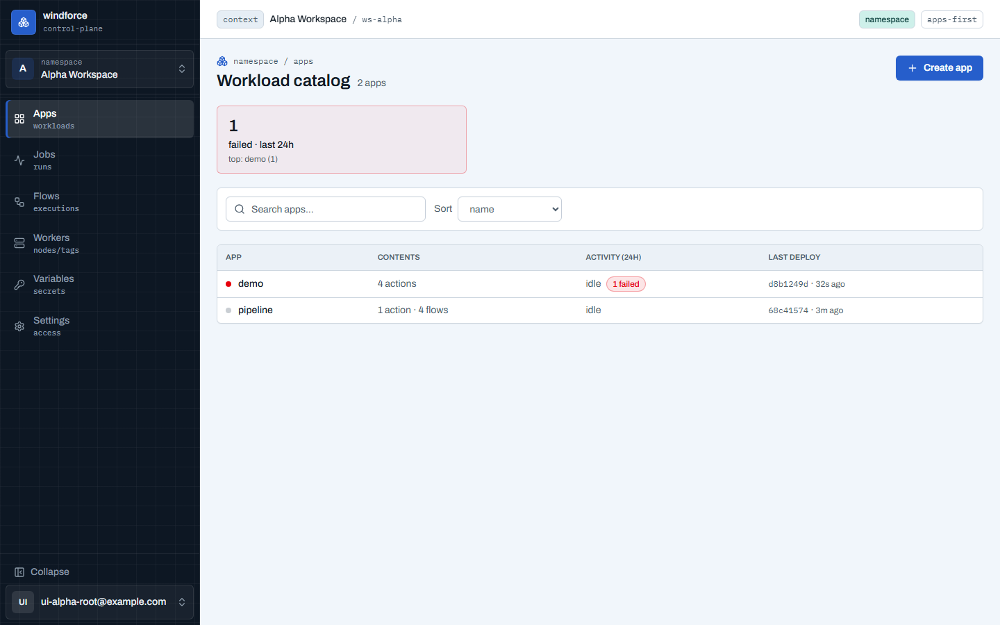
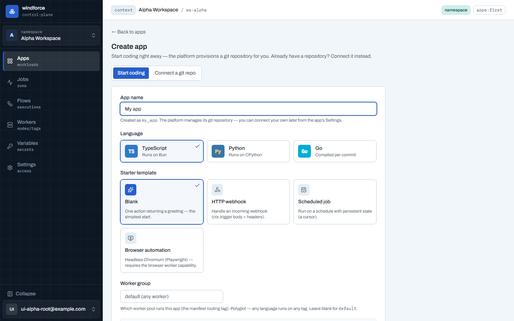
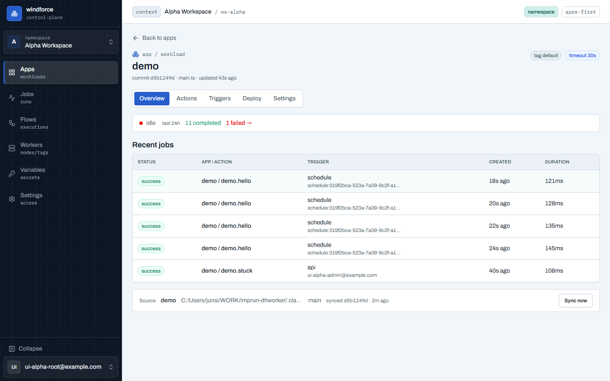
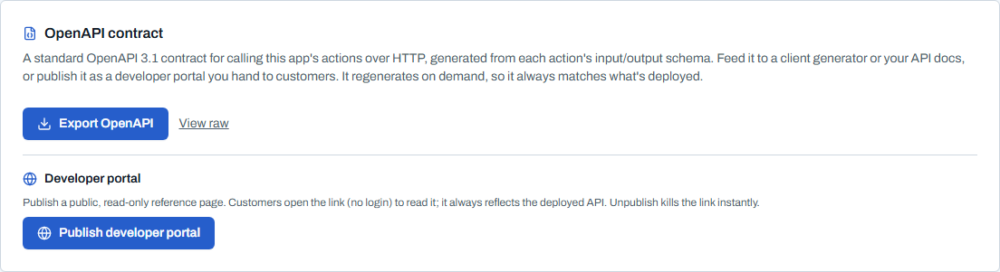
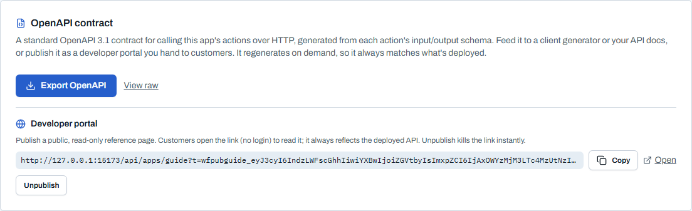

# Apps — 워크로드 카탈로그

Apps 화면은 로그인 후의 기본 랜딩이며, 워크스페이스의 모든 앱을 카탈로그로 보여준다. 앱 하나는 하나의 git source와 1:1로 연결된다 — 소스의 `windforce.json` manifest가 앱 하나를 선언하고, 앱은 그 소스를 sync한 결과물이다.

## 카탈로그

- **주의 신호 밴드**: 화면 상단에 지금 주의할 일만 카드로 뜬다 — 최근 24시간 실패, 미서빙 태그에 쌓인 queued, 현재 running. 카드를 클릭하면 해당 필터가 걸린 Jobs/Workers로 바로 이동한다. 신호가 없으면 밴드가 보이지 않아, 조용한 워크스페이스는 제목과 카탈로그만 남는다.
- **카탈로그 — 행이 앱의 명함**: 각 행은 상태 점(파랑 펄스=실행 중 · 빨강=최근 실패 · 회색=idle), **내용 요약**(`4 actions · 1 schedule · 2 flows` — 앱에 무엇이 들었는지), 24시간 활동(running/queued 또는 idle, 실패 수 배지), 마지막 배포(커밋 · 상대 시각)를 보여준다. 내용 카운트는 단일 요청(`GET /apps?view=summary`)으로 오고, flow 수는 현재 배포 커밋 기준이다. 검색과 정렬(이름·최근 갱신·실패 우선)로 좁히고, 앱을 클릭하면 상세로 간다.
- **Pending sources**: 초기 sync가 실패해 아직 앱이 되지 못한 소스만 여기 보인다 — 저장소나 manifest를 고친 뒤 **Retry sync**, 또는 **Remove**.

## 앱 생성 — 두 갈래

우상단 **Create app**은 생성 페이지로 이동한다. 두 경로가 탭으로 갈린다.

- **Start coding(기본)** — git을 직접 만들거나 연결하지 않고 **앱 이름**과 **스타터 템플릿**만 고르면, 플랫폼이 뒤에서 관리형 git 저장소를 자동 생성하고 곧장 편집기로 들어간다. 템플릿은 **Blank**(`hello` 액션 하나), **HTTP webhook**(요청 body·headers를 받는 핸들러), **Scheduled job**(상태를 커서로 쓰는 주기 잡) 중에서 고른다. 입력한 이름은 app_key로 변환돼 미리 표시된다(소문자/숫자/`_`, 첫 글자는 영문). 이후 편집·배포는 일반 앱과 같다. git은 플랫폼이 관리하므로 설정·상세에서 보이지 않고 "platform-managed"로 표시된다.
- **Connect a git repo(고급)** — 이미 manifest가 있는 저장소를 연결하는 3단계 위저드다.
  1. **Repository** — 저장소 URL(+branch/subpath)을 입력한다. **Connect & sync**는 먼저 원격을 점검해 도달성·브랜치 존재를 검증하므로 오타는 소스가 만들어지기 전에 잡힌다. **Access token**(선택)은 프라이빗 저장소 읽기나 콘솔에서의 push에 필요하며 워크스페이스 시크릿으로 암호화 저장된다. 공개 read-only 저장소면 비워 둔다.
  2. **Sync** — 연결과 초기 sync가 진행된다. 실패하면 원인과 함께 **Retry sync** 또는 **Keep as pending & exit**를 고른다.
  3. **Ready** — 발견된 actions와 sync 커밋 요약을 확인하고 **Open app**으로 들어간다.

## App 상세

앱의 모든 기능은 상세 화면의 탭(Overview · Docs · Actions · Triggers · Deploy · Settings)에 모여 있다.

- **Overview — health-first**: 헤더가 배포 메타를 다 품고(제목 아래 `commit · entrypoint · updated` 메타 줄 + tag(override 배지)·timeout·concurrency 배지), 탭 본문은 이 앱의 건강부터 시작한다 — **활동 스트립**(지금 running/queued, 최근 24시간 completed/failed — 실패 수를 누르면 이 앱의 실패만 필터된 Jobs로 이동), 최근 잡 5건, 그리고 이 앱이 인제스트되는 **Source 한 줄**(이름·repo·브랜치·synced 커밋, Sync now).
- **Docs**: 앱의 `README.md`를 소개·사용법 문서로 렌더한다 — 에디터를 열지 않고도 "이 앱이 무엇이고 어떻게 쓰는지"를 상세 화면에서 바로 본다(마크다운·표·Mermaid 다이어그램 지원). 탭을 열 때만 소스를 불러오므로 Overview 로딩은 그대로 가볍다. `README.md`가 없으면 에디터에서 추가하도록 안내한다. `README.md`(번들 루트)를 앱의 기본 문서로 두면 된다.
- **Actions**: action별 tag와 timeout을 보여준다. **Run**을 누르면 action에 input schema가 있을 때 필드 폼이 자동 생성된다(필수 표시·기본값·설명 힌트, 제출 전 타입 검증) — 스크립트를 몰라도 실행할 수 있다. 스키마가 없거나 복잡하면 JSON 입력으로 폴백되고, 폼↔JSON을 토글해도 입력값은 보존된다. **Webhook** 버튼은 외부 시스템이 이 action을 호출할 엔드포인트와 자격을 발급·회수한다(admin).
- **Triggers**: action을 호출하는 모든 방법을 한곳에 모은다. 맨 위에 **OpenAPI 계약 내보내기**(아래) 카드가 있고, 그 아래로 항상 존재하는 **API / Webhook / Manual** 엔드포인트와, 콘솔이 명시적으로 만드는 **Schedules**(cron 주기 자동 실행)를 관리한다. 스케줄은 표준 5필드 cron 또는 `@hourly`·`@daily`·`@every 30m` 같은 디스크립터에 timezone과 input을 곁들여 만들고, 인라인으로 편집하거나 Pause/Resume한다. 자세한 트리거 종류는 [트리거 가이드](triggers.md)에서 다룬다.
- **Settings**(admin 전용): **Source**(소스 설정·Access token), **Runtime**(timeout·max concurrent 슬라이더와 라우팅 override), **Danger zone**(앱 삭제) 서브탭으로 나뉜다.

### API 계약 내보내기 (OpenAPI)

Triggers 탭 맨 위 카드에서 이 앱을 **OpenAPI 3.1 계약**으로 내보낸다 — 앱을 "외부에서 호출 가능한 제품"으로 만드는 표준 아티팩트다.

- **자동 생성**: 손으로 쓰는 스펙 파일이 없다. 각 action의 **input/output 스키마**(저자가 이미 쓴 페이로드 타입)와 windforce의 고정 **호출 메커닉**(비동기 run→poll, webhook)을 합쳐 요청 시점에 만든다. 저장하지 않고 그때그때 생성하므로 **배포된 상태와 항상 일치**한다.
- **담기는 것**: action마다 동기 실행(`.../run/<app>/<action>/wait`, 입력→결과), 비동기 실행(`.../run/...` → `job_id`), 그리고 결과 폴링(`.../jobs/{id}/result`). Webhook 엔드포인트는 raw 페이로드 인테이크로 별도 표기된다(ADR-0028 — 본문이 타입드 입력이 아니라 `ctx.trigger.raw`로 전달되어 action이 직접 파싱·서명검증). 인증은 **API 토큰**(Settings → API tokens)이다.
- **예외도 담긴다**: enqueue 시점 에러(400·401·403·404·422)는 4xx 응답으로, 균일한 `{"error":"..."}` 봉투와 함께 그려진다. 비동기 특성상 **action 자체의 실패는 HTTP 에러가 아니라** 200 응답의 `status: "failed"`로 나오므로, result의 `status` enum(`completed`/`failed`/`canceled`)에 그 계약이 문서화된다.
- **쓰는 곳**: 내려받은 스펙을 `openapi-generator` 같은 클라이언트 생성기, API 문서, Postman·Insomnia 같은 도구에 넣는다. 소비자를 이 콘솔에 로그인시키는 게 아니라, **운영자가 스펙을 자기 제품 세계로 가져가** 통합한다.
- **품질은 스키마를 따른다**: 스키마가 풍부하면 계약도 타입드가 되고, 스키마가 없는 action은 제외되지 않고 permissive(`any`) 본문으로 나간다. 좋은 스키마를 쓰면 좋은 API 계약이 공짜로 따라온다.

### 개발자 포털 (공개 링크)

같은 카드의 **Developer portal** 섹션에서 이 앱의 API 레퍼런스를 **공개 read-only 페이지로 게시**한다 — 운영자가 자기 고객에게 건네는 링크다.

- **게시 → 링크**: **Publish developer portal**을 누르면 서명된 공개 URL이 생성된다. **Copy**로 복사해 고객에게 전달한다. 앱당 활성 링크는 하나라 URL이 안정적이고, 재게시해도 그대로다.
- **고객이 보는 것**: 링크를 **로그인 없이** 열면 렌더된 API 레퍼런스(메서드·경로·요청/응답 스키마·에러)가 보인다 — 항상 배포된 상태를 반영한다. 같은 링크에 `?format=json`을 붙이면 원본 OpenAPI가 나와 도구가 그대로 소비한다.
- **콘솔은 저자 전용**: 고객은 이 콘솔에 로그인하지 않는다. 포털은 문서를 *보여주는* 것까지고, 소비자 로그인·API 키·라이브 try-it은 범위 밖이다.
- **게시하면 이 앱의 모든 액션이 공개된다**: 배포된 모든 action의 계약(존재·입출력 스키마)이 링크 보유자에게 노출된다 — action별 "비공개" 토글은 없다. 내부 전용(flow 스텝용) action을 문서에 노출하고 싶지 않으면 **별도 앱으로 분리**한다. (실행 자체는 여전히 API 토큰이 필요하다 — 노출되는 건 계약이지 실행 권한이 아니다.)
- **즉시 비게시**: **Unpublish**를 누르면 공개 링크가 그 즉시 죽는다(durable 링크가 정본이라 SECRET 로테이션 불필요).

> 콘솔 편집기에서의 코드 저작·배포(draft→deploy, Run preview, Flow 빌더)는 [콘솔 편집기](editor.md)에서 다룬다.
