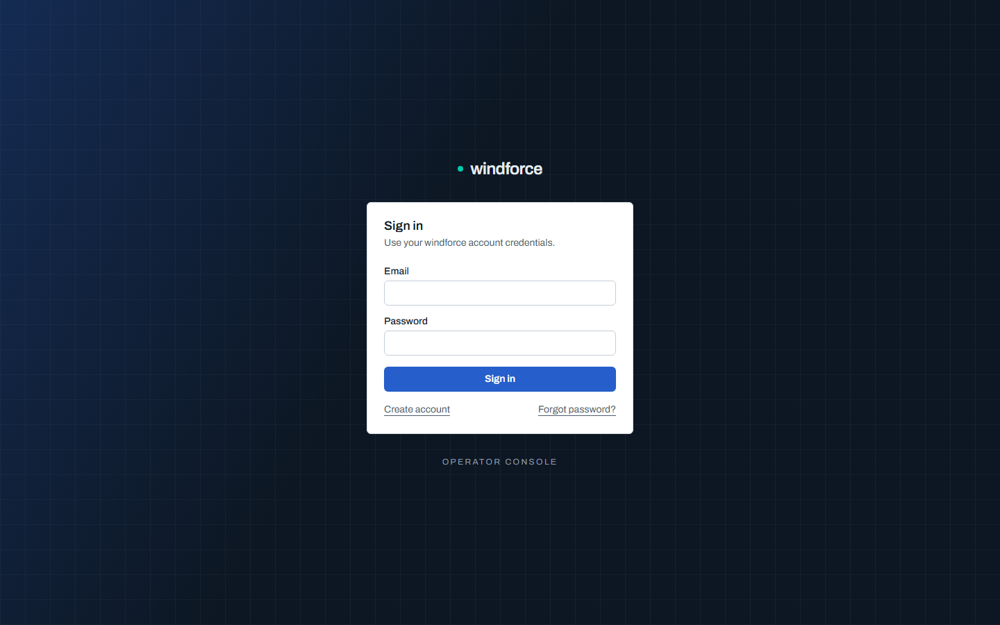

# 콘솔 둘러보기

windforce 콘솔은 브라우저에서 앱을 만들고, 코드를 배포하고, 잡·flow 실행을 관찰하고, 워크스페이스를 운영하는 화면이다 — dev-operator의 조종석이다. 이 페이지는 로그인·가입과 워크스페이스 셸(공통 뼈대)을 안내하고, 각 화면의 자세한 사용법은 아래 **화면별 가이드**로 연결한다.

## 로그인과 가입

- `/login`에서 이메일과 비밀번호로 로그인한다. 실패하면 서버가 보낸 에러 메시지가 그대로 화면에 표시된다.
- **Create account**로 가입하면 즉시 로그인된다. 셀프서비스 가입은 이메일 검증이 필요하다 — 온보딩 화면에 "이메일을 확인하세요" 안내와 **재발송** 버튼이 뜨고, 확인 메일의 링크를 열기 전까지 워크스페이스 생성이 잠긴다. 초대로 가입한 경우엔 초대 자체가 주소를 증명하므로 검증이 필요 없다.
- 검증이 끝나면 온보딩 화면에서 **자기 워크스페이스를 직접 생성**한다. 워크스페이스 id는 URL에 쓰이므로 소문자/숫자/하이픈만 허용되고 이후 변경할 수 없다. 생성하는 즉시 그 워크스페이스의 admin이 되어 첫 앱 연결 화면으로 이동한다.
- 로그인하면 기본 워크스페이스의 **Apps** 화면으로 이동한다. 아직 앱이 없으면 "Connect your first app" 안내가 위저드로 이끈다.

### 비밀번호 재설정

- 로그인 화면의 **Forgot password**에 이메일을 제출하면 계정 존재 여부와 무관하게 항상 "요청 접수" 안내가 표시된다. 계정이 있으면 재설정 링크가 메일로 발송된다(서버에 SMTP 구성이 필요).
- 메일의 링크는 **30분 유효·1회용**이다. 새 비밀번호(8자 이상)를 확인 입력과 함께 제출한다.
- 성공하면 기존 로그인 세션이 모두 로그아웃되고, 새 비밀번호로 다시 로그인한다.

### 초대 받기

- 워크스페이스 admin이 보낸 초대 메일의 링크로 들어오면 초대 전용 화면이 뜬다 — 어느 워크스페이스에 어떤 역할로 초대됐는지 보여준다.
- 계정이 없으면 그 자리에서 가입한다(이메일은 초대된 주소로 고정). 이미 계정이 있으면 로그인 탭에서 로그인한다.
- **Accept invitation**을 누르면 즉시 멤버가 되어 그 워크스페이스로 이동한다. 초대는 **7일 유효·1회용**이며, 초대된 주소로 로그인한 계정만 수락할 수 있다.

## 워크스페이스 셸

로그인 후 모든 화면은 좌측 사이드바가 고정된 셸 안에서 열린다.

- 좌측 사이드바는 항상 화면에 고정되고 본문만 스크롤된다. 하단 **Collapse**로 아이콘만 남게 접을 수 있으며, 접힘 상태는 브라우저에 기억된다.
- 상단 **워크스페이스 스위처**를 클릭하면 내가 속한 모든 워크스페이스 목록이 열린다. 클릭으로 전환하고, **Create workspace**로 셸 안에서 바로 새 워크스페이스를 만든다.
- 메뉴는 **Apps / Jobs / Flows / Workers / Variables / Settings**다. 하단 계정 영역을 클릭하면 **Account settings**([계정 페이지](account.md)로 이동)와 **Sign out**이 열린다. admin 권한 여부에 따라 Settings의 관리 기능과 앱의 배포 기능 노출이 달라진다.
- 멤버가 아닌 워크스페이스 URL로 들어가면 접근 불가 화면이 표시된다(리다이렉트 없이 URL을 점검할 수 있다).

## 화면별 가이드

각 화면의 자세한 사용법은 전용 페이지에서 다룬다.

| 화면 | 무엇을 하나 |
|---|---|
| [Apps](apps.md) | 워크로드 카탈로그·앱 생성·앱 상세(Overview/Docs/Actions/Triggers/Deploy/Settings) |
| [콘솔 편집기](editor.md) | draft→deploy, Run preview, diff, `ctx.` intellisense, 시각적 Flow 빌더 |
| [Jobs](jobs.md) | 잡 실행 목록·상세·결과·로그·취소·보존 |
| [Flows](flows.md) | flow run 관찰·승인 인박스·콕핏·Run flow·공개 링크 |
| [Workers](workers.md) | 태그 커버리지(수요×공급)·미서빙 진단 |
| [Variables](variables.md) | 값·시크릿과 스코프(공유/앱 전용) |
| [Settings](settings.md) | 워크스페이스·멤버·API 토큰·사용량 |
| [Account](account.md) | 개인 프로필·인증·비밀번호 |

## 더 보기

- [멀티테넌시·운영자 평면](../operating/multitenancy.md) — 운영자(`super_admin`)용 fleet·테넌트·감사 화면(`/admin`)과 Workers 가시성.
- [Control Plane UI Alpha 게이트 계약](https://github.com/imprun/windforce/blob/main/docs/contracts/console-contract.md) — 각 화면이 의존하는 API와 검증 범위.
