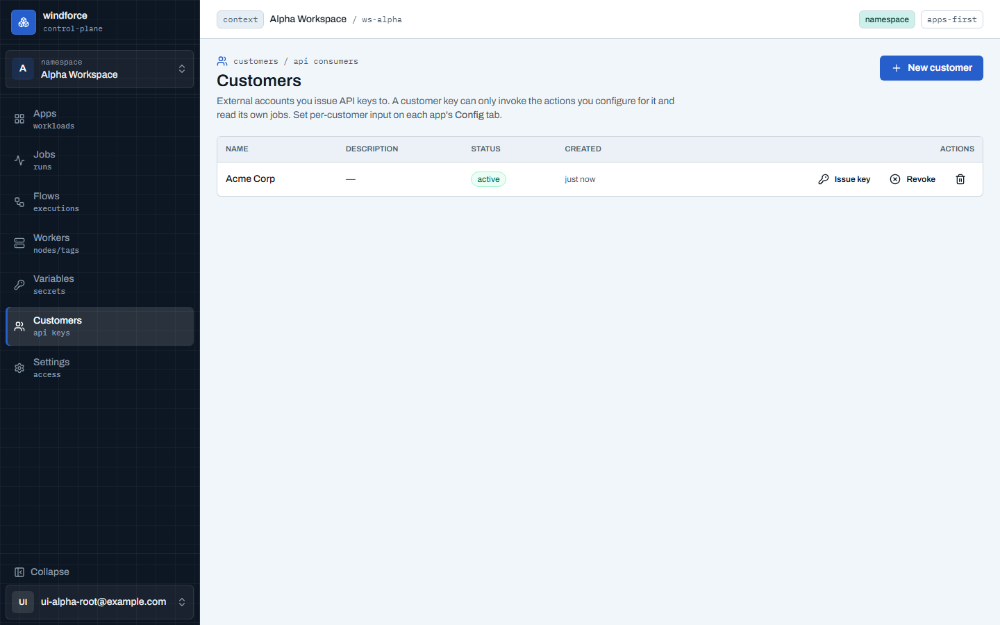
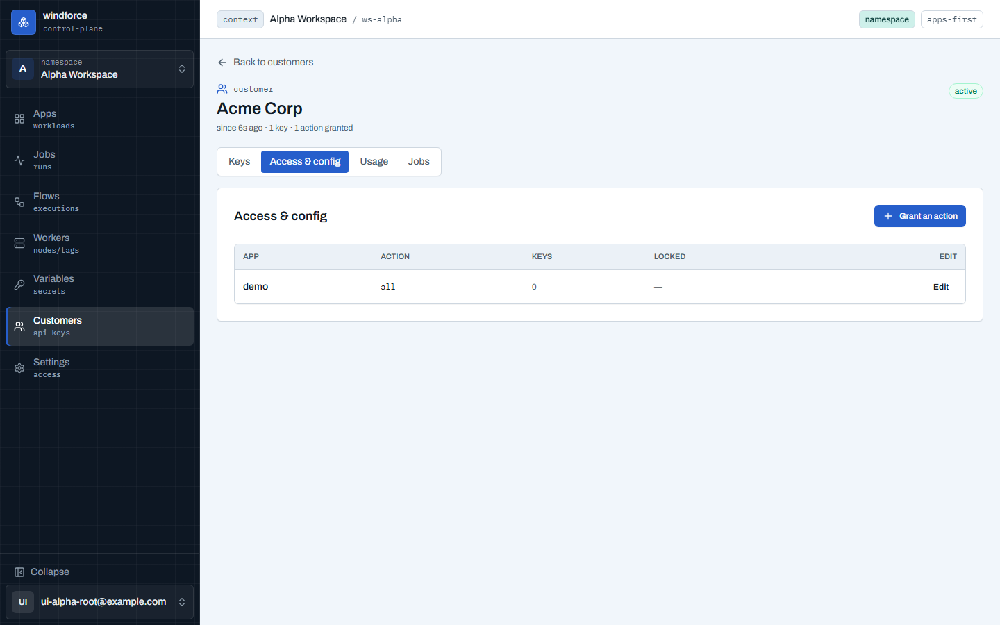
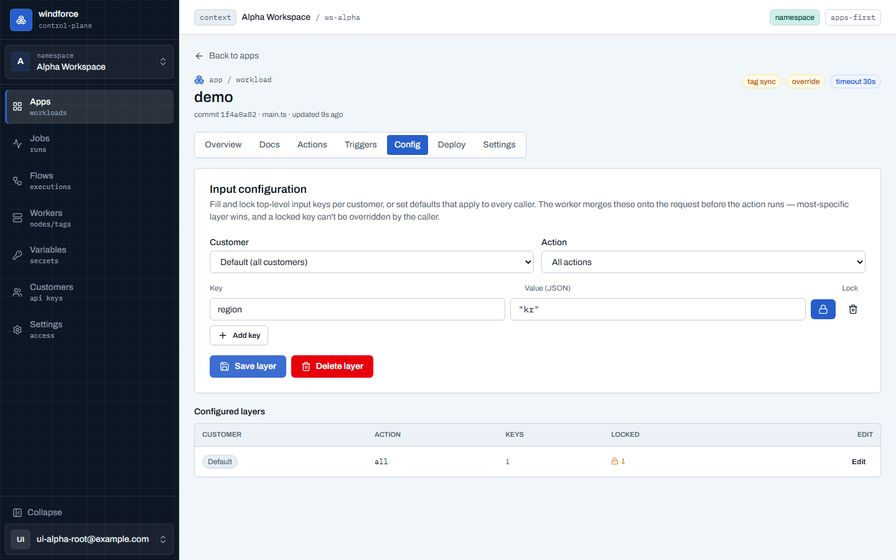

# Customers — 고객·입력 설정

워크스페이스가 API 키를 발급하는 **외부 고객**을 콘솔에서 관리한다. 각 고객은 발급한 키 뒤의 안정적인 정체성이고, 고객 키는 **설정해 준 액션만 호출하고 자기 잡만 읽는다**. 사이드바의 **Customers**(`/w/{workspace}/consumers`)로 연다. 관리 화면은 워크스페이스 admin(또는 `consumers` scope 토큰)에게만 보인다.

- **New customer**: 이름(+선택 설명)으로 고객을 등록한다. 이름은 활성 고객 사이에서 유일하다.
- 목록에서 **고객 이름을 누르면** 그 고객의 상세(허브)로 들어간다.

## 고객 상세 — 키·접근·사용량·잡의 허브

고객 하나에 대한 모든 것을 **탭**으로 모은다 — 런타임엔 하나(키 → 고객 각인 → 입력 오버레이 → 자기 잡 읽기)인 것을, 관리도 한곳에서 한다. 헤더가 정체성과 요약(키 수·grant 수)을 들고, 키만 있고 grant 가 없으면 "키가 아직 무력"이라는 경고가 **탭 위에**(어느 탭에서든 보이게) 뜬다.

- **Keys 탭**: 그 고객의 API 키 목록(label·prefix·마지막 사용·상태)과 **Issue key**·키별 **Revoke**. 키 발급은 **label 과 만료(선택)만** 받는다 — 고객 키에 scope 는 없다. 무엇을 할 수 있는지는 **Access & config** 의 grant 가 정한다. 키의 원문은 **딱 한 번** 보여주므로 그 자리서 복사해 고객에게 전달한다.
- **Access & config 탭**: 그 고객이 grant 받은 `(app, action)` 을 앱 넘어 한눈에. **Grant an action** 으로 앱·액션을 고르면 그 자리서 입력 설정을 편집한다 — **grant 를 만드는 것이 곧 그 액션에 대한 인가**다(빈 설정으로 저장하면 오버라이드 없이 접근만 부여).
- **Usage 탭**: 그 고객의 기간별 미터링 사용량(실행 수·런타임, outcome 별) — 기간 프리셋(이번 달·지난달·최근 30일)과 **Export CSV**. 이 수치는 잡 행이 아니라 **불변 과금 원장**(usage_event)에서 계산되므로, 잡이 retention 으로 지워진 뒤에도 정확하다. CSV 는 항목 원장(시각·잡 id·앱·액션·outcome·런타임) 그대로라 **과금 분쟁의 증거**로 쓴다 — 페이로드는 원장에 아예 없어 새지 않는다.
- **Jobs 탭**: 그 고객의 최근 잡만(디버그 렌즈 — retention 창 안).

키가 enqueue 하는 모든 잡·플로우런에는 **고객 정체성이 각인**되어 사용량·과금·감사·읽기 격리의 기반이 된다.

> **운영자 토큰과 분리**: 고객 키는 Settings → Tokens 목록에 **섞이지 않는다**. Settings 의 토큰은 운영자·연동용(당신·CI·자동화)이고, 고객 키는 이 고객 화면에서만 관리한다.

## Deny-by-default — 고객 키가 할 수 있는 것

고객 키는 운영자 토큰이 아니다. 다음만 허용되고 나머지 콘솔 표면(앱·멤버·토큰·플로우·스케줄·변수 등)은 전부 거부된다:

- **설정된 액션 호출**: 그 고객을 위한 **입력 설정(Config) 행이 있는** `(app, action)` 만 호출할 수 있다. 설정 행을 만드는 것이 곧 그 액션에 대한 **온보딩**이다.
- **자기 잡 읽기**: 잡 목록·상세·결과·로그는 **자기 고객의 잡만** 보인다. 다른 고객의 잡 id 로 조회하면 존재 여부조차 알 수 없게 404 로 응답한다.

고객을 **revoke** 하면 그 고객의 모든 키가 **즉시** 동작을 멈춘다(각 키를 따로 폐기할 필요 없이 한 번에 차단). 감사를 위해 고객 기록은 남는다. **삭제**는 살아있는 키가 있으면 거부되므로, 키를 먼저 폐기한 뒤 삭제한다.

## 입력 설정 — 고객별 + 기본 (앱의 Config 탭)

액션에 넘길 **입력 JSON**을 계층으로 설정한다. 같은 설정을 두 각도에서 편집한다 — 고객 상세의 **Access & config**(한 고객을 앱 넘어)와, 앱 상세의 **Config** 탭(한 앱을 모든 고객·기본에 대해). 둘은 같은 행을 편집한다. 앱 Config 탭은 앱 상세에서 연다.

편집할 계층은 **Customer × Action** 두 선택으로 고른다:

- **Customer** = `Default(고객 무관)` 또는 특정 고객.
- **Action** = `All actions(앱 전체)` 또는 특정 액션.

즉 네 종류의 계층이 있다 — 앱 기본 · 액션 기본 · 고객·앱 · 고객·액션. 각 계층에서 top-level 키마다 값(JSON)과 **잠금(Lock)** 여부를 정한다.

워커는 액션 실행 **직전에** 요청 입력 위로 이 계층들을 합성한다:

- **구체적인 계층이 이긴다**: 앱 기본 ← 액션 기본 ← 고객·앱 ← 고객·액션 순으로 덮어쓴다.
- **잠그지 않은 키**는 호출자의 요청 값이 이긴다(설정 값은 기본값 역할).
- **잠근 키**는 설정 값이 최종값이고, 호출자가 그 키를 보내면 거부된다 — 고객별 크리덴셜·단가처럼 고객이 바꾸면 안 되는 값을 고정한다.
- 합성은 **top-level 키 단위**(값은 객체·배열 통째 교체)라 잠금 단위와 병합 단위가 일치한다.

설정 값은 잡 입력과 동일하게 **워크스페이스 키로 at-rest 암호화**되어 저장되고, 잡의 `input` 에 병합·저장되지 않는다 — 따라서 잠근 값이 `jobs:read` 로 노출되지 않는다. 이 오버레이는 api·webhook·schedule·flow 스텝(루프·병렬·서브플로우 자식 포함) 등 **모든 트리거**가 지나는 워커라는 공통 지점에서 균일하게 적용된다.

값은 **JSON**으로 입력한다 — 문자열은 따옴표로 감싼다(예: `"kr"`), 숫자·불리언·객체는 그대로(예: `42`, `true`, `{"tier":"pro"}`). **Configured layers** 표가 이 앱에 설정된 모든 계층(고객·액션·키 수·잠금 수)을 한눈에 보여주고, 각 행의 **Edit** 로 그 계층 편집으로 바로 이동한다.

## 권한

Customers 관리와 Config 편집은 워크스페이스 **admin**, 또는 `consumers:read` / `consumers:write` scope 를 가진 API 토큰이 수행한다. 고객 키 자체는 이 화면들에 접근할 수 없다(deny-by-default).
