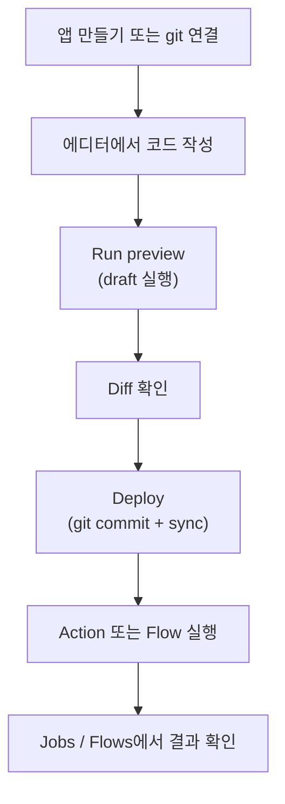

# 개발 가이드

이 페이지는 windforce에서 앱을 개발하는 기본 루프를 예제 화면으로 따라간다. 목표는 하나다: 코드를 쓰고, 배포 전에 preview로 검증하고, Deploy 후 잡과 flow 결과를 콘솔에서 확인하는 흐름을 익힌다.

## 개발 루프



## 1. 앱을 만든다

처음에는 **Create app**에서 시작한다. 새 앱을 바로 코딩하려면 **Start coding**을 선택하고, 이미 가지고 있는 저장소가 있으면 **Connect a git repo**를 선택한다.


- managed 앱은 플랫폼이 git 저장소를 만들고 콘솔 Deploy가 그 저장소에 commit한다.
- external 앱은 사용자 git이 정본이다. 콘솔은 source를 읽고 sync하지만, manifest 변경은 사용자 git push로 한다.
- browser 자동화 같은 capability 앱은 라우팅 태그를 직접 고르지 않고 capability로 워커를 찾는다.

자세한 생성 옵션은 [앱·액션 만들기](apps-and-actions.md)에서 다룬다.

## 2. 코드와 manifest를 함께 본다

앱은 하나의 entrypoint와 `windforce.json` manifest를 가진다. 예제 TypeScript 앱은 `createApp`으로 action key와 핸들러를 묶는다.


```ts
import { createApp } from "windforce-client";

export const main = createApp({
  actions: {
    "demo.hello": async (ctx) => {
      ctx.logger.info("hello-log", ctx.input.name);
      const greeting = "hello " + ctx.input.name;
      return { greeting: ctx.input.shout ? greeting.toUpperCase() : greeting };
    },
  },
});
```

`ctx`는 입력, 트리거 정보, actor, logger, variables, resources, state 같은 실행 표면을 담는다. 런타임 환경변수나 로컬 파일 경로에 기대지 말고 `ctx`를 통해 platform과 대화한다. 언어별 작성법은 [액션 코드 작성](writing-actions.md)을 따른다.

## 3. Deploy 전에 preview로 실행한다

에디터의 **Run** 패널은 저장된 draft를 실제 워커에서 실행한다. 아직 Deploy하지 않은 새 action도 preview할 수 있고, 결과 JSON과 로그는 에디터 안에서 바로 확인한다.


Preview는 카탈로그와 버전 이력을 바꾸지 않는다. 배포 전 로직 검증에는 preview를 쓰고, 사용자나 외부 시스템이 호출할 실행 표면은 Deploy 후의 catalog action을 쓴다.

## 4. Diff를 보고 Deploy한다

Source Control 패널은 현재 배포본과 draft의 차이를 파일별로 보여 준다. Deploy 전에 어떤 파일이 추가·수정·삭제됐는지 확인한다.


Deploy는 "파일을 워커에 복사"하는 버튼이 아니다. draft를 git commit으로 만들고, 그 commit을 sync해 카탈로그를 갱신한다. `deployed` 상태가 되어야 새 action과 manifest가 실행 가능해진다.


## 5. Action을 실행하고 Job을 확인한다

배포가 끝나면 App 상세의 Actions 탭에서 action을 실행한다. 입력 스키마가 있으면 콘솔이 폼을 만들고, 복잡한 입력은 JSON으로 보낼 수 있다.


실행 결과는 Jobs에서 확인한다. 잡 상세에는 enqueue 시점에 고정된 commit, entrypoint, tag, 입력, 결과, 로그가 남는다.


잡이 queued 상태에 오래 머무르면 라우팅 tag를 서빙하는 워커가 있는지 Workers와 운영자 Fleet을 확인한다. 실행 모델과 결과 조회는 [잡 실행·결과·로그](jobs.md)에 정리되어 있다.

## 6. Flow를 실행한다

여러 action과 승인 step을 묶은 flow는 **Flows**에서 실행한다. **Run flow**는 배포된 flow 목록을 `GET /flows`로 읽고, 선택한 flow를 `POST /flows/run/{app}/{flow}`로 시작한다.


Flow run은 Jobs 목록에 흩어진 child job을 묶어서 보여 준다. 승인 대기 step은 flow 상세 timeline에서 approve/reject할 수 있고, 일반 action step은 해당 job 상세로 연결된다.

처음 flow를 검증할 때는 레포의 `examples/hello-flow`가 가장 작다. 외부 API나 시크릿 없이 `hello_flow.greet` 결과를 다음 step인 `hello_flow.wrap`에 그대로 넘긴다.

| step | 하는 일 |
|---|---|
| `greet` | 입력 `{ "name": "Ada" }`를 받아 `{ "name": "Ada", "greeting": "hello Ada" }` 반환 |
| `wrap` | `${results.greet}`를 JSON 객체 그대로 받아 `"hello Ada -> wrapped by flow"` 반환 |

핵심 manifest는 두 번째 step의 `input`이다.

```json
{
  "key": "wrap",
  "action": "hello_flow.wrap",
  "input": "${results.greet}"
}
```

이처럼 문자열 전체가 `${results.greet}`이면 문자열 보간이 아니라 이전 step 결과가 JSON 타입 그대로 전달된다. 예제를 git source로 연결하고 sync한 뒤에는 API나 콘솔 **Run flow**로 시작할 수 있다.

```bash
curl -X POST "$BASE/api/w/$WS/flows/run/hello_flow/hello" \
  -H "Authorization: Bearer $TOKEN" \
  -H "Content-Type: application/json" \
  -d '{"name":"Ada"}'
```

flow 작성, 승인 step, 공개 end-user 실행, 현재 UI 범위는 [Flow 실행·승인 가이드](flows.md)에서 더 자세히 다룬다.

## 개발 체크리스트

- `windforce.json`의 `app`, `entrypoint`, `scriptLang`, `actions`가 코드와 맞는가?
- 입력은 JSON object이고, handler는 `ctx.input`을 자기 타입으로 좁히는가?
- 시크릿과 설정값은 `ctx.variables` 또는 `ctx.resources`로 읽는가?
- 배포 전 Run preview로 draft를 실행해 봤는가?
- Deploy 후 `deployed` 상태와 App history를 확인했는가?
- 실행 실패는 Job detail의 result와 logs에서 재현 가능한가?
- flow를 쓴다면 `examples/hello-flow`처럼 step 간 `${results.<step>}` 전달을 먼저 검증하고, approval step과 resume 이후 입력 흐름을 Flows에서 확인했는가?

## 로컬 예제 스택

레포를 직접 실행하며 이 화면을 만져 보려면 시드된 dev stack을 사용할 수 있다.

```powershell
cd frontend
bun run dev-stack
```

이 스택은 문서 스크린샷과 같은 예제 계정, 워크스페이스, `demo` 앱, `pipeline` flow, seeded jobs를 만든다. 화면 검증이나 문서 캡처가 목적이면 같은 fixture를 쓰는 release gate를 실행한다.

```powershell
cd frontend
$env:WINDFORCE_UI_E2E_SCREENSHOTS = "1"
bun run release-gate
```

서비스 사용자가 로컬에서 제품만 평가하려면 [로컬 평가 (Docker Compose)](../getting-started/self-hosting.md)가 더 짧은 경로다.

## 더 보기

- [빠른 시작](../getting-started/quickstart.md) - 첫 앱을 만들고 실행한다.
- [앱·액션 만들기](apps-and-actions.md) - managed/external 앱과 Draft → Deploy → sync.
- [액션 코드 작성](writing-actions.md) - TypeScript, Python, Go의 `ctx` 표면.
- [트리거](triggers.md) - API run, webhook, schedule.
- [Flow 실행·승인](flows.md) - multi-step workflow, HITL approval, 공개 링크 실행.
- [콘솔 사용법](console.md) - 사용자 콘솔의 전체 화면 지도.
