# 콘솔 편집기 — 저작·미리보기·배포

콘솔 편집기는 브라우저 안에서 앱 소스를 저작·미리보기·배포하는 전체화면 작업 공간이다. draft를 저장하고 Deploy를 눌러 git 커밋으로 카탈로그에 반영하기까지의 흐름을 한곳에서 처리한다.

콘솔에서 코드를 바꾸는 흐름은 **draft를 저장하고 → Deploy**하는 두 단계다. draft는 "배포될 전체 소스 번들"의 작업본일 뿐이며 실행과는 무관하다. Deploy를 눌러야 git에 커밋·푸시되고, 그 커밋이 sync된 뒤에야 카탈로그(실제로 실행되는 코드)가 바뀐다.

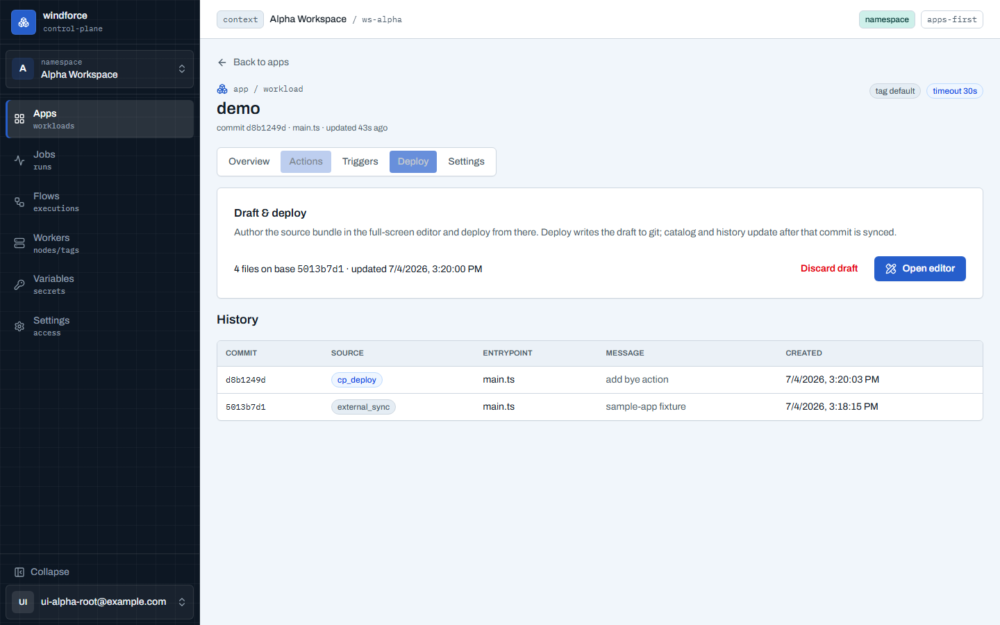

- **Deploy 탭**(저작은 admin 전용)은 저장된 draft 요약(파일 수·base commit·갱신 시각)과 **Open editor** 진입점, Discard, 그리고 버전 **History**를 보여준다. 외부에서 직접 push한 배포는 `external_sync`, 콘솔에서 한 배포는 `cp_deploy`로 구분된다.
- 실제 저작은 전체화면 편집기에서 한다.

배포 상태는 `pending → committed → syncing → deployed / failed` 순으로 진행되며, `deployed`에 도달해야 카탈로그·history·actions가 갱신된다.

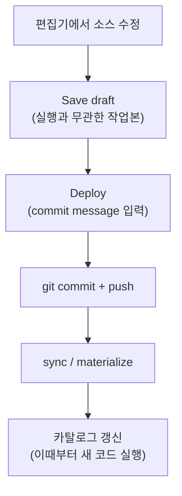

> **Read-only 원격**: push 자격증명 없이 연결된 공개 http(s) 저장소는 콘솔 deploy가 push 단계에서 거부된다. 편집기는 **Read-only remote 배지**를 띄우고 Deploy를 비활성화한다. 코드 열람·draft 저장·아래의 Run preview는 그대로 가능하며, 변경은 저장소에 직접 push한 뒤 **Sync now**로 반영한다. 콘솔 deploy까지 쓰려면 소스에 push 가능한 자격증명을 설정한다.

## 편집기 — 저작·미리보기·배포

**Open editor**는 셸을 벗어난 전체화면 편집기로 이동한다. TS/JSON 하이라이트에 더해 windforce 클라이언트 타입이 주입돼 `ctx.` 자동완성·시그니처 도움말·타입 에러가 살아 있는 작업 공간이다. draft가 없으면 빈 캔버스가 아니라 **현재 배포 커밋의 소스가 그대로 열린다** — 지금 돌고 있는 코드에서 시작한다.

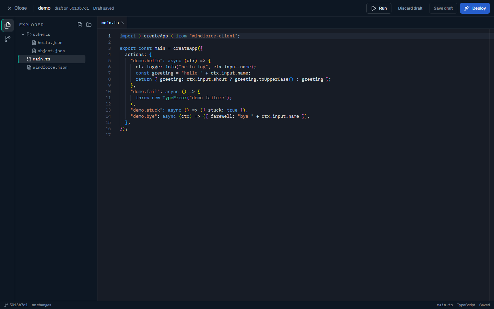

- 좌측 activity bar로 **Explorer**와 **Source Control** 패널을 전환한다. Explorer에서 배포될 전체 소스 번들(`windforce.json`, 엔트리포인트, 스키마)을 추가/편집/삭제한다. 새 파일은 하단 입력에 `schemas/new.json`처럼 전체 경로로 추가한다. 수정하면 상단에 **Unsaved changes**가 표시된다.
- **Save draft**로 미완성 번들도 저장된다(manifest·schema 검증은 deploy 단계에서 한다). **Discard draft**는 draft를 버리고 현재 배포 소스로 되돌린다.
- 파일을 열면 상단에 탭으로 쌓여 여러 파일을 오간다. `.md` 파일은 우상단 **Preview** 토글로 Mermaid 다이어그램까지 포함한 미리보기를 켠다. 맨 아래 상태바는 base commit·변경 수·읽기전용 여부·활성 파일의 경로/언어/저장 상태를 보여준다.

## Run preview — 배포 없이 실제 실행

상단 **Run** 토글은 우측 sheet를 연다. **draft manifest 기준**으로 action을 고르고(아직 배포하지 않은 새 action도 보인다) 입력 폼(또는 JSON)에 값을 넣어 **Run**하면 저장된 draft 스냅샷이 실제 워커에서 실행된다(미저장 변경은 먼저 자동 저장된다).

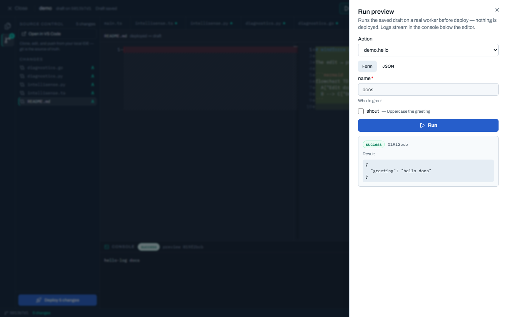

- 결과 JSON은 우측 sheet에, 콘솔 로그는 편집기 아래 **Console 패널**에 인라인으로 흐른다. Console은 sheet를 닫아도 유지되어 편집하면서 출력을 본다.
- preview 잡은 Jobs 목록에 `preview`로 보이며 **카탈로그나 배포 이력에는 아무것도 남기지 않는다**. read-only 원격이어도 preview는 가능하다 — 막히는 것은 deploy뿐이다.

## Diff — 배포본 대비 무엇을 바꿨나

activity bar의 **Source Control** 아이콘은 배포본 대비 draft 변경을 파일별로 보여준다(A/M/D 배지로 추가·수정·삭제 구분). 항목을 클릭하면 메인 영역이 **배포본 ↔ draft 좌우 diff**로 바뀌어 deploy 전에 변경 내용을 확인할 수 있다.

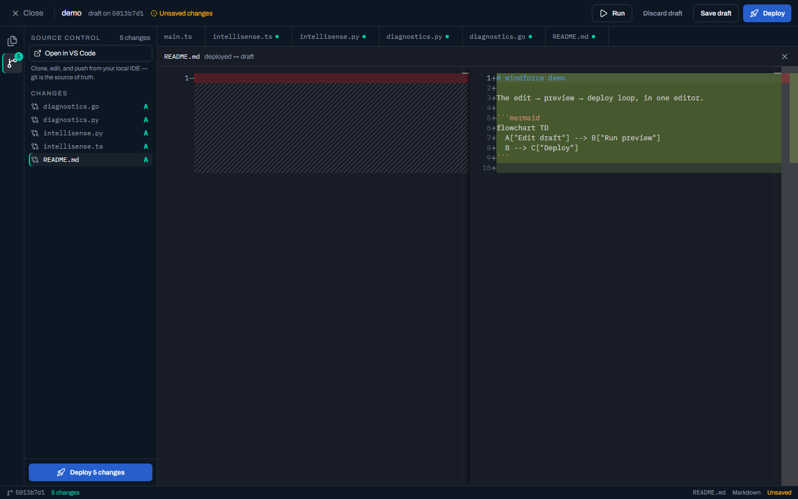

- 패널 하단의 **Deploy** 버튼은 배포 sheet를 연다.
- **Open in VS Code** 버튼은 딥링크로 로컬 VS Code에 저장소를 clone한다 — git이 정본이므로 풀 IDE 경험은 로컬에서 이어간다.

## Intellisense — `ctx.` 자동완성과 타입 검사

편집기는 스크립트 언어별로 플랫폼 계약(`ctx.`)을 가볍게 검사한다.

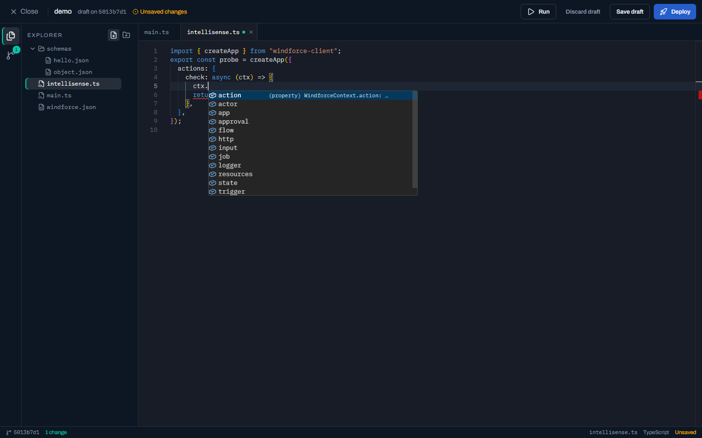

- **TypeScript**: windforce 클라이언트 타입이 주입돼 `ctx.` 자동완성·시그니처 도움말·타입 에러가 동작한다. 번들 내 파일끼리의 상대 import는 물론, 다른 npm 패키지를 import해도 타입을 자동으로 가져와 인식한다 — 타입이 도착하면 빨간 줄이 사라진다.
- **Python(`.py`)**: 문법 하이라이트와 `ctx.` 자동완성, 그리고 알 수 없는 `ctx.` 멤버 경고(예: `ctx.nope` 오타에 노란 밑줄)를 받는다. 런타임 오류를 미리 잡는 것이 목적이며, 일반 Python 의미 타입 검사는 범위 밖이다.
- **Go(`.go`)**: 같은 방식으로 문법 하이라이트와 `ctx.` 자동완성(`Input`·`Logger`·`Variables` 같은 PascalCase 멤버), 알 수 없는 멤버 경고를 받는다 — 워커 빌드에서 컴파일 에러가 될 멤버를 미리 잡는다.

## Flow 빌더 — 시각적 flow 저작

`windforce.json`을 열고 탭 우측의 **Flow** 토글을 켜면, 매니페스트가 구조화된 섹션 에디터(App·Actions·Flows)로 바뀐다. flow는 코드(`flows` 블록)가 정본이지만, 여기서 노드 캔버스로도 만들 수 있다.

여기 캡처들은 빌더 기능을 한눈에 보이려고 승인(`resumeForm`)·retry·실패 핸들러·분기/반복/중첩을 모두 갖춘 데모 flow를 연다. 같은 빌더로 [`examples/bank-transfer`](https://github.com/imprun/windforce/tree/main/examples/bank-transfer)의 `wire` flow(OTP·서명 HITL)나 [`examples/order-flow`](https://github.com/imprun/windforce/tree/main/examples/order-flow)의 `review` flow(composite 제어 흐름) 같은 실제 예제도 그대로 저작한다.

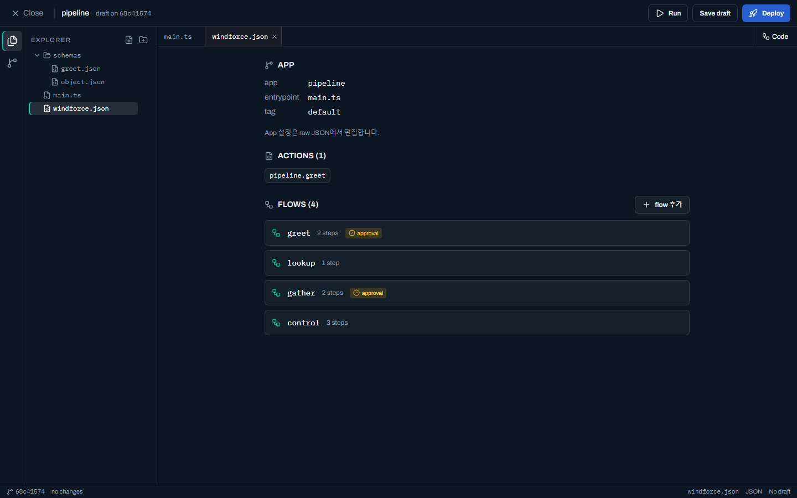

- **Flows 섹션**: 이 앱의 flow 목록(step 수·approval 여부)을 보여 준다. **flow 추가**로 새 flow를 만들고(키는 action 키 규칙), 휴지통으로 삭제한다.
- **캔버스 열기**: flow를 누르면 메인 영역이 **풀스크린 캔버스**로 전환된다. step이 위→아래 순서로 노드로 배치되고(자동 레이아웃), action step과 approval(사람 승인) step이 구분된다.
- **액션으로 이동(go-to-definition)**: action step을 **더블클릭**하면 그 action이 등록된 파일·라인으로 바로 간다 — entrypoint(예: `main.ts`)가 열리고 `createApp`의 해당 action 등록 라인이 하이라이트된다. 핸들러를 인라인으로 뒀으면 그 라인이 곧 코드다. composite step(approval·분기·반복·subflow)은 열 단일 action이 없어 동작하지 않는다.

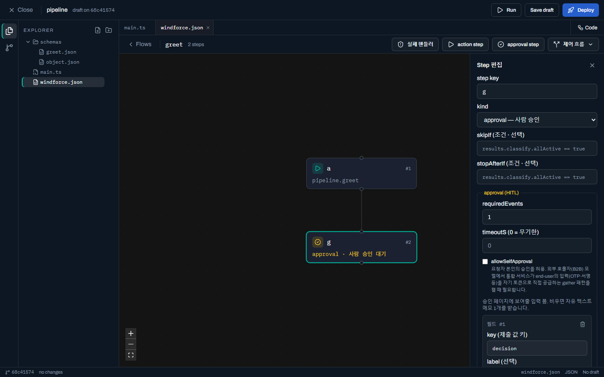

- **step 편집**: 상단 버튼으로 action / approval step을 추가하고, 노드를 누르면 우측 인스펙터에서 `kind`·`action`(이 앱의 action 선택)·`input`(정적 JSON 또는 `${results...}` 참조)·`skipIf`·`stopAfterIf`·approval 필드를 편집한다. 인스펙터에서 순서 이동·삭제도 한다. 예컨대 bank-transfer의 `submit_otp` step이라면 `input`에 `{ "otp": "${results.otp_check.code}" }`처럼 앞선 승인 step 결과를 참조한다.
- **retry(재시도)**: action step은 인스펙터에 retry 섹션이 있다 — `maxAttempts`(1=재시도 없음)·`delayMs`(다음 시도 전 대기)·`backoffFactor`(>1 지수 증가). 실패한 step을 자동으로 다시 시도한다.

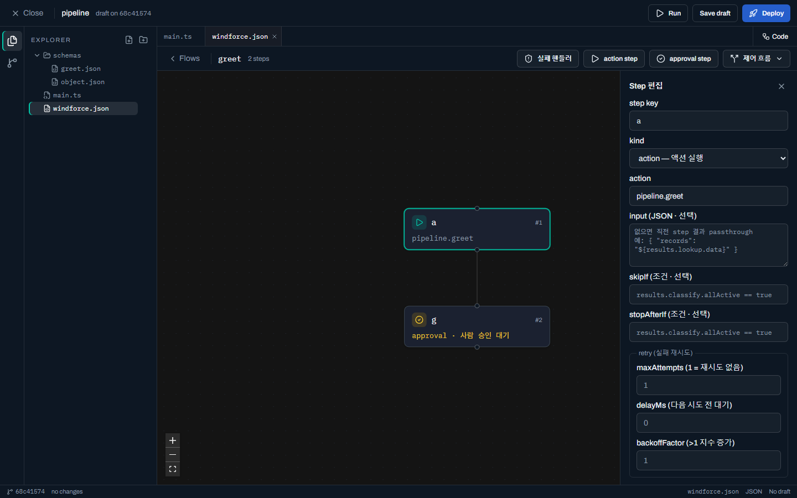

- **실패 핸들러**: 캔버스 상단의 **실패 핸들러** 버튼으로 flow-level `failureModule`을 설정한다 — 어떤 step이 종료적으로 실패하면 run이 실패로 끝나기 직전 여기서 고른 action이 1회 실행된다(정리·알림 등). 우측 패널에서 action·input을 지정하거나 제거한다.

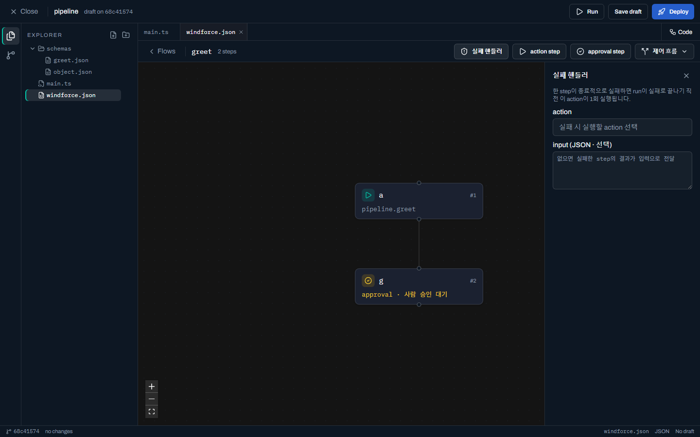

- **제어 흐름(분기·반복·중첩)**: `kind` picker나 캔버스 상단 **제어 흐름** 드롭다운으로 단순 action을 넘어선 제어 흐름을 만든다.
    - **branchone** — 조건 분기: arm 목록 중 **위에서부터 조건(`results.…`)이 처음 참인 arm**의 action을 실행한다(조건 빈 arm = 기본, 맨 아래에).
    - **branchall** — 병렬 분기: **모든 arm을 동시에** 실행하고, 결과를 arm 키로 묶어 합류한다.
    - **forloop / forloop_parallel** — 리스트 반복: `items`(JSON 배열 또는 `${results.<step>}` 참조)의 각 항목에 action을 순차 / 병렬로 실행한다.
    - **subflow** — 중첩 flow: 같은 앱의 **다른 flow**를 자식으로 실행한다(자기 참조·순환은 배포에서 거부).
  각 composite step은 캔버스에 전용 아이콘·요약을 단 **단일 노드**로 그려지고, 노드를 누르면 인스펙터가 kind 전용 에디터(arm 리스트 / items / subflow 피커)로 바뀐다. 각 arm은 action·키·조건과 함께 **선택적 static input**(JSON 또는 `${results}` 참조, 없으면 직전 결과 passthrough)도 가질 수 있다. `skipIf`·`stopAfterIf`·분기 조건은 입력하는 동안 **조건식(DSL) 구문을 검사**해 잘못된 식을 배포 전에 빨갛게 표시한다(괄호·연산자·토큰 등). 이 분기·반복·중첩을 한 flow로 묶은 실제 예제는 [`examples/order-flow`](https://github.com/imprun/windforce/tree/main/examples/order-flow)의 `review` flow다.

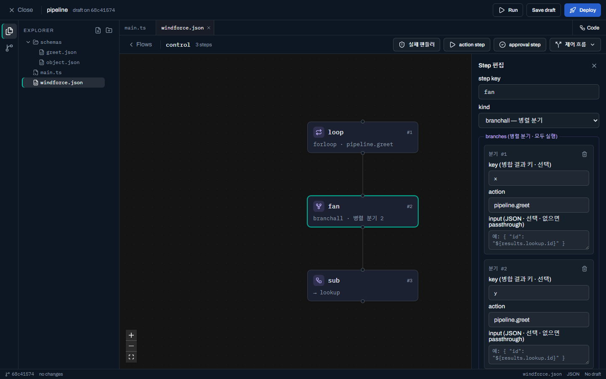

- **승인 폼(resumeForm)**: approval step 인스펙터의 **폼 빌더**로 승인 페이지가 보여줄 입력 필드를 구성한다 — 필드마다 key(제출 값 키)·label·type(text/textarea/number/boolean/select)·options(select 선택지)·required. 승인자가 제출한 값은 `ctx.flow.resumeValue`가 된다. 비우면 자유 텍스트 메모 1개를 받는다(예: bank-transfer의 `otp_check`는 `code`(text) 필드 하나, `sign`은 `signature`(textarea) 필드 하나로 구성한다).

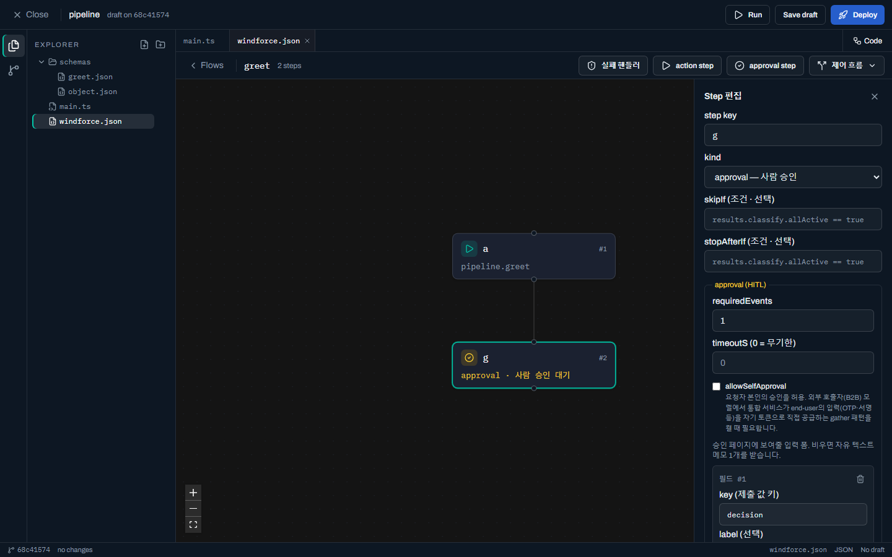

- **저장**: 편집은 `windforce.json`의 해당 flow만 다시 써넣어(`app`·`actions`는 그대로) draft가 된다. 평소처럼 **Deploy**하면 카탈로그에 반영되고, **Flows** 페이지의 Run flow로 실행한다. raw JSON으로 돌아가려면 토글을 **Code**로 끈다.

## 배포 sheet

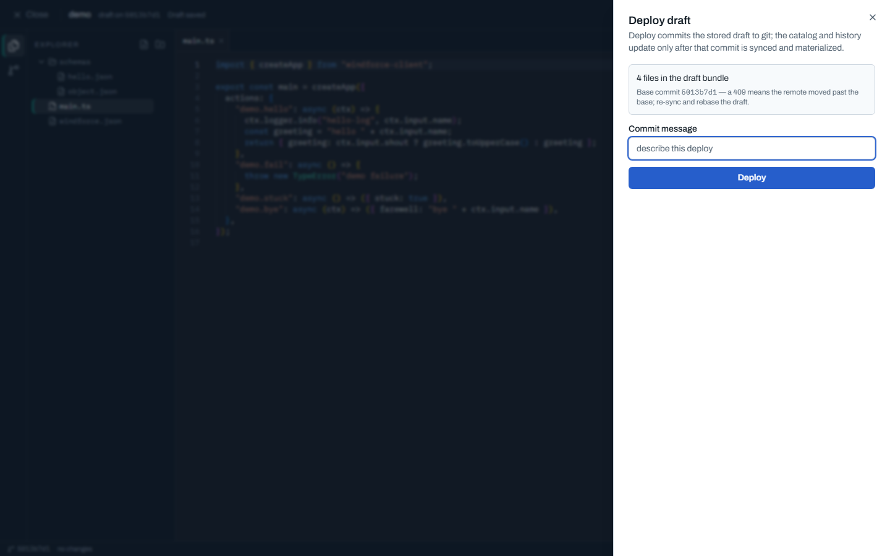

- sheet에서 commit message를 입력하고 **Deploy**하면 git에 커밋·푸시되고, 그 커밋이 sync된 뒤에야 카탈로그가 바뀐다. 완료되면 **Back to app**으로 복귀한다.
- 번들이 배포 소스와 동일하면 sheet가 "변경 없음"을 안내한다(이때는 보통 Sync now가 맞는 버튼이다).
- **409 conflict**는 draft의 base commit 이후 외부 push가 있었다는 뜻이다 — 소스를 다시 sync한 뒤 새 base에서 draft를 다시 저장한다.
