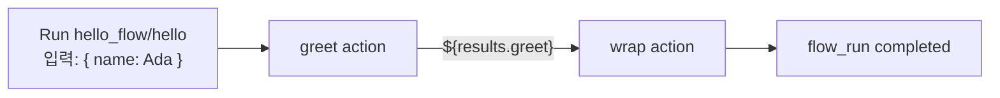
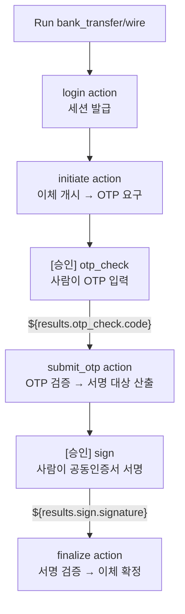
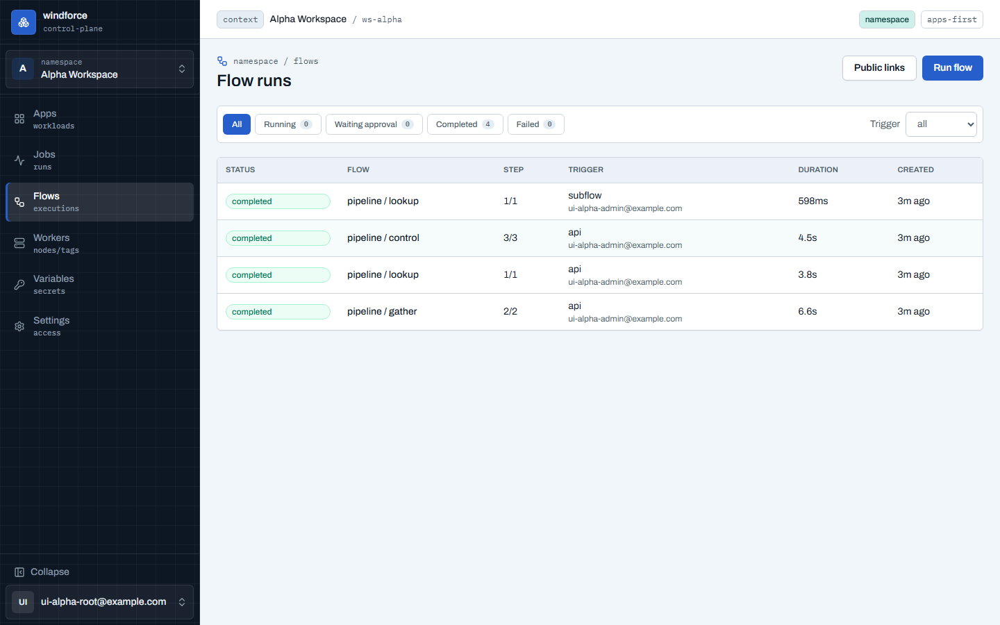
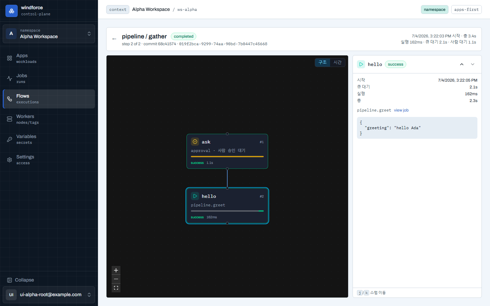
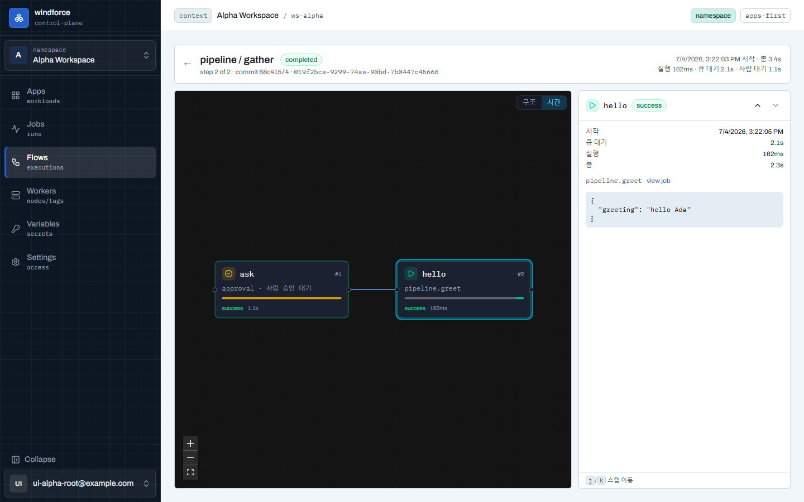

# Flow 실행·승인 가이드

flow는 여러 action을 하나의 사용자 workflow로 묶고, 필요한 곳에서 사람 승인(HITL)까지 기다렸다가 다시 진행하는 실행 단위다. 단일 action이 "함수 하나를 실행한다"면, flow는 "업무 절차 하나를 실행하고 추적한다"에 가깝다.

이 기능은 windforce의 정체성을 넓힌다. windforce는 단순 job runner가 아니라, git으로 배포한 코드를 durable workflow로 실행하고, 각 step의 결과·승인·감사 흔적을 `flow_run` 단위로 남기는 플랫폼이 된다.

## 현재 UI 범위

콘솔의 Flow UI는 이제 **작성 도구**이자 **실행·관찰·승인 도구**다. `windforce.json`을 손으로 쓰지 않고도 시각적 빌더로 flow를 저작할 수 있다.

| 범위 | 현재 지원 |
|---|---|
| flow 저작 | `windforce.json` 에디터의 **Flow** 토글 → 풀스크린 react-flow 캔버스에서 노드로 flow를 만든다 |
| 노드 인스펙터 | 노드를 누르면 `kind`·`action`·`input`·`skipIf`·`stopAfterIf`·`approval`·`retry`를 편집 |
| 제어 흐름 | 캔버스 상단 **제어 흐름** 드롭다운으로 `branchone`·`branchall`·`forloop`·`forloop_parallel`·`subflow` step 추가 |
| 실패 핸들러 | 캔버스 상단 **실패 핸들러**로 flow-level `failureModule` 설정 |
| 승인 폼 | approval step 인스펙터의 **폼 빌더**로 `resumeForm` 입력 필드 구성 |
| flow 발견 | 배포된 app manifest의 `flows`를 `GET /flows`로 읽고 Run flow 선택기에 표시 |
| flow 시작 | 콘솔 **Run flow**에서 flow를 고르고 입력 JSON object로 시작 |
| 진행 관찰 | **Flows** 목록에서 상태와 현재 step을 보고, 상세에서 step timeline 확인 |
| action step 디버깅 | step이 만든 child job으로 이동해 input/result/log 확인 |
| 승인 | `waiting_approval` step에서 콘솔 멤버가 Approve/Reject |
| 외부 승인 | action이 만든 HMAC 승인 링크를 외부 승인자에게 전달하고 hosted page에서 응답 |
| 공개 end-user 실행 | API로 공개 링크를 발급하면 익명 사용자가 hosted page에서 flow 실행 가능 |
| schedule 트리거 | **Schedules**에서 Target을 flow로 두면 cron이 정해진 시각에 flow를 시작한다(#124) |

시각적 빌더의 화면별 사용법은 [콘솔 편집기](editor.md)의 **Flow 빌더** 섹션에 정리되어 있다.

아직 콘솔 UI로는 못 하고 API/manifest로만 되는 것도 명확하다.

| 아직 없는 것 | 현재 대체 경로 |
|---|---|
| flow webhook 트리거의 콘솔 등록 UI | webhook→flow 라우트(`POST /flows/webhook/{app}/{flow}`)는 있으나 콘솔 등록 패널은 아직. schedule→flow는 **Schedules**에서 지원한다 |
| 첫 step이 approval/composite인 flow의 입력 폼 | Run flow는 첫 step이 스키마를 가진 action일 때만 폼을 만든다(아니면 raw JSON object) |
| 공개 링크 공유/QR 콘솔 패널 | `POST /flow-links/{app}/{flow}` API로 링크 발급 |
| approval이 포함된 flow의 공개 end-user 실행 | 현재 공개 링크는 approval step이 있는 flow를 거부 |

즉 저작·실행·관찰·승인·schedule 트리거는 콘솔에서 끝나고, webhook 트리거의 등록 UI와 공개 링크 공유 UX만 아직 API 경계에 남아 있다.

## 언제 flow를 쓰나

| 쓰는 경우 | 설명 |
|---|---|
| action 결과를 다음 action 입력으로 넘겨야 한다 | `${results.<step>}`로 step 결과를 조합한다. |
| 여러 step을 하나의 실행으로 추적해야 한다 | Jobs에 흩어진 child job을 `flow_run` 하나로 묶어 본다. |
| 중간에 사람 검토가 필요하다 | approval step에서 run을 `waiting_approval`로 세운다. |
| end-user가 계정 없이 업무를 시작해야 한다 | 공개 링크로 hosted input form을 열 수 있다(approval 없는 flow). |

단일 비동기 작업이면 action 하나가 더 단순하다. 정해진 시간에 반복 실행하는 작업이면 schedule을 action에 연결한다. 외부 시스템 이벤트를 받는다면 webhook action을 쓴다.

## 최소 예제

처음에는 [`examples/hello-flow`](https://github.com/imprun/windforce/tree/main/examples/hello-flow)가 가장 작다. 외부 API, 시크릿, 승인 없이 두 action 사이의 데이터 전달만 확인한다.



`windforce.json`의 핵심은 `flows.hello.steps`다.

```json
{
  "app": "hello_flow",
  "entrypoint": "main.ts",
  "tag": "default",
  "actions": {
    "hello_flow.greet": {
      "inputSchema": "schemas/greet.input.json",
      "outputSchema": "schemas/greet.output.json"
    },
    "hello_flow.wrap": {
      "inputSchema": "schemas/wrap.input.json",
      "outputSchema": "schemas/wrap.output.json"
    }
  },
  "flows": {
    "hello": {
      "steps": [
        { "key": "greet", "action": "hello_flow.greet" },
        { "key": "wrap", "action": "hello_flow.wrap", "input": "${results.greet}" }
      ]
    }
  }
}
```

두 번째 step의 `input`이 문자열 전체 `"${results.greet}"`이므로 문자열 보간이 아니라 `greet` 결과 객체가 JSON 타입 그대로 전달된다.

hello-flow가 step 간 데이터 전달의 골격이라면, 이 가이드의 **핵심 워크드 예제는 [`examples/bank-transfer`](https://github.com/imprun/windforce/tree/main/examples/bank-transfer)** — 은행 이체를 OTP·서명 두 번의 사람 개입(HITL)으로 분해한 flow다. 바로 아래 **승인 step**과 **액션 내부 HITL을 flow로 풀기**에서 이 예제를 끝까지 따라간다. 조건부 HITL(`skipIf`로 필요할 때만 사람 검토)은 [`examples/bizstatus`](https://github.com/imprun/windforce/tree/main/examples/bizstatus)가, 분기·반복·중첩 같은 제어 흐름은 [`examples/order-flow`](https://github.com/imprun/windforce/tree/main/examples/order-flow)가 보여 준다.

## manifest 작성 모델

flow는 app manifest의 top-level `flows` 아래 선언한다. flow key는 같은 app 안에서 실행 주소가 된다.

| 필드 | 의미 |
|---|---|
| `key` | flow 안에서 유일한 step 이름. `${results.<key>}` 참조 대상이다. |
| `action` | 실행할 action key. 같은 app 안의 action이어야 한다. |
| `kind` | 생략하거나 `"action"`이면 action step, `"approval"`이면 승인 step. |
| `input` | step 입력. 없으면 직전 step 결과가 그대로 넘어간다. |
| `skipIf` | step 진입 전 조건이 참이면 해당 step을 건너뛴다. |
| `stopAfterIf` | step 완료 후 조건이 참이면 다음 step 없이 run을 완료한다. |
| `approval` | approval step의 승인 수, timeout, self-approval, 입력 폼 설정. |

step은 순서대로 실행된다. action step은 child job을 하나 만들고, approval step은 job을 만들지 않고 `flow_run`을 대기 상태로 세운다.

## step 간 데이터 전달

입력 결정 순서는 단순하다.

1. step이 `input`을 선언하면 그 값이 입력이다.
2. `input`이 없으면 직전 step 결과가 그대로 넘어간다.
3. step 0에 `input`이 없으면 flow 시작 입력이 들어간다.

`input` 안에서는 이전 step 결과를 참조할 수 있다.

```json
{
  "key": "classify",
  "action": "bizstatus.classify",
  "input": { "records": "${results.lookup.data}" }
}
```

전체 문자열 토큰은 JSON 타입을 보존한다.

```json
{ "input": "${results.lookup}" }
```

문자열 안에 섞으면 스칼라 값을 문자열로 보간한다.

```json
{ "input": { "message": "안녕하세요 ${results.greet.name}님" } }
```

없는 step이나 없는 field를 참조하면 run은 결정적으로 실패한다. 기다리거나 재시도해서 해결되는 오류가 아니라 manifest/data mismatch로 본다.

## 조건과 조기 종료

`skipIf`는 step에 들어가기 전에 평가한다.

```json
{
  "key": "review",
  "kind": "approval",
  "skipIf": "results.classify.allActive == true",
  "approval": { "requiredEvents": 1 }
}
```

위 예시는 `classify` 결과가 모두 정상이라면 approval step을 만들지 않고 바로 다음 step으로 넘어간다.

`stopAfterIf`는 step이 끝난 직후 평가한다.

```json
{
  "key": "validate",
  "action": "order.validate",
  "stopAfterIf": "results.validate.accepted == false"
}
```

조건식은 제한된 DSL이다. `results.<step>[.path]`, 비교 연산자, `&&`, `||`, `!`, 괄호, `.length`를 쓴다. JavaScript 코드를 실행하는 모델이 아니므로 sandbox나 arbitrary code 실행 표면이 생기지 않는다.

같은 조건 DSL은 `branchone` step의 각 arm `condition`도 구동한다(아래 **제어 흐름(composite) 저작** 절). arm마다 `condition`과 함께 별도 `input`을 줄 수 있고, `input`을 생략하면 직전 step 결과가 그대로 그 arm으로 넘어간다.

콘솔 Flow 빌더는 `skipIf`·`stopAfterIf`·arm `condition`을 입력하는 동안 이 DSL 구문을 사전 검사해 잘못된 식을 배포 전에 표시한다. 다만 이 정적 참조 검증은 **콘솔 빌더의 사전 검증**이다 — raw git push로 오타난 조건(없는 step 참조 등)을 배포하면 deploy는 통과하고, 엔진이 그 step을 실행하는 시점에 결정적으로 실패시킨다(stall이나 무한 재시도가 아니라 그 run만 실패).

## 승인 step

approval step은 flow를 `waiting_approval` 상태로 세운다. 대기 중에는 runnable queue row가 없어서 worker가 잡을 claim하지 않고, 운영상으로도 "큐에 일이 쌓였다"로 보지 않는다.

```json
{
  "key": "review",
  "kind": "approval",
  "approval": {
    "requiredEvents": 1,
    "timeoutS": 86400,
    "allowSelfApproval": false,
    "resumeForm": [
      { "key": "note", "label": "검토 의견", "type": "textarea", "required": true }
    ]
  }
}
```

승인 경로는 두 가지다.

| 경로 | 쓰는 사람 | 설명 |
|---|---|---|
| 콘솔 인라인 승인 | workspace 멤버 | Flow 상세 timeline에서 Approve/Reject. 기본적으로 요청자 본인 승인은 차단된다. |
| HMAC 승인 링크 | 외부 승인자 | 승인 직전 action이 `ctx.approval.getResumeUrls()`로 링크를 만들어 메일·메신저로 보낸다. |

승인자가 제출한 값(`resumeForm` 필드들)은 그 approval step의 **결과**가 된다. 승인 *직후* action은 `ctx.flow.resumeValue`로 읽고, **이후 어떤 step이든 `${results.<approval-step>.<field>}`로 선언적으로 참조**한다(필드 `key` 단위). 즉 사람 입력은 한 다음 action에만 매이지 않고, 다른 step 결과와 똑같이 manifest에서 조합된다. 이렇게 여러 단계의 사람 입력을 잇는 실전 예시가 아래 **액션 내부 HITL을 flow로 풀기**다.

## 액션 내부 HITL을 flow로 풀기 (은행 이체)

가장 까다로운 경우는 **한 action *안*에서 사람 개입이 필요할 때**다. 예를 들어 은행 이체는 실제 이체 직전에 **OTP 입력**이 한 번, 최종 **공동인증서 서명**이 또 한 번 필요하다 — 둘 다 "transfer를 실행하는 코드" 중간에 끼어든다.

windforce action은 `main(ctx)`로 시작→끝까지 한 번에 도는 stateless 실행이라 **중간에서 멈춰 사람을 기다렸다 같은 프로세스로 재개하지 않는다**. 멈춤·재개는 flow 엔진이 step 사이에서 (상태를 durable하게 영속화하며) 한다. 그래서 "액션 내부 HITL"은 **그 개입 지점을 action 경계로 쪼개는 것**으로 푼다 — HITL 경계 = action 경계.

[`examples/bank-transfer`](https://github.com/imprun/windforce/tree/main/examples/bank-transfer)가 이 분해를 보여 준다. 한 덩어리 transfer 대신, 재개 가능한 action 세그먼트 사이에 approval을 끼운다.



| step | kind | 동작 |
|---|---|---|
| `login` | action | 자격증명 → 세션 |
| `initiate` | action | `${results.login.session}`로 이체 개시 → 은행이 OTP 요구 |
| `otp_check` | approval | 사람이 OTP 입력(`resumeForm` 필드 `code`) |
| `submit_otp` | action | `${results.otp_check.code}`로 OTP 검증 → 서명 대상 산출 |
| `sign` | approval | 사람이 공동인증서로 서명(`resumeForm` 필드 `signature`) |
| `finalize` | action | `${results.sign.signature}` 검증 → 이체 확정 |

approval과 그 뒤 action을 잇는 핵심은 `${results.<approval-step>.<field>}`다 — 사람이 입력한 OTP가 다음 action의 입력 필드로 흐른다.

```json
{
  "key": "otp_check",
  "kind": "approval",
  "approval": {
    "requiredEvents": 1,
    "allowSelfApproval": true,
    "resumeForm": [
      { "key": "code", "label": "OTP 코드", "type": "text", "required": true }
    ]
  }
},
{
  "key": "submit_otp",
  "action": "bank_transfer.transfer_otp",
  "input": {
    "session": "${results.initiate.session}",
    "txnId": "${results.initiate.txnId}",
    "otp": "${results.otp_check.code}"
  }
}
```

이 모양이 통하는 이유와 경계:

- **세션은 살아있는 프로세스에 붙들리지 않는다.** login이 받은 세션은 flow 결과로 다음 세그먼트에 넘어가고(at-rest 암호화), 각 action은 그 세션으로 재개하는 새 실행이다. 그래서 사람이 OTP를 입력하는 동안 worker 슬롯을 점유하지 않고, **worker가 재시작돼도 in-flight 이체가 유실되지 않는다** — 직전 체크포인트("OTP 끝, 서명 대기")부터 재개한다. 돈을 다루는 흐름에서 이게 핵심이다.
- **사람 입력은 `${results.<approval>.<field>}`로 흐른다.** OTP·서명값은 `resumeForm`으로 받아 그 step 결과가 되고, 이후 어떤 action이든 선언적으로 참조한다(특별한 코드 경로가 아니라 일반 step 데이터 전달과 동일).
- **공동인증서 서명은 본질적으로 클라이언트-사이드 HITL이다.** 개인키는 사용자 단말을 떠나지 않는다 — action은 "서명 대상"만 만들고, hosted 승인 페이지의 `resumeForm`이 서명 결과만 받아 온다. 플랫폼은 개인키를 갖지 않는다. 액션 안에서 하면 안 되는 일을 HITL이 올바르게 단말로 밀어낸다.
- **전제 = 세션이 직렬화·재개 가능할 것**(쿠키·토큰·거래ID 리플레이). 대부분의 은행 웹/앱 API가 그렇다. 어떤 외부 시스템이 OTP·서명 challenge를 살아있는 연결이나 프로세스 메모리에 묶어 새 프로세스에서 리플레이가 안 되면, 이 분해로는 세션을 못 넘긴다 — 그땐 그 연결을 쥐는 별도 상주 세션 브로커(잡이 아닌 서비스)가 필요하고, 그건 action/flow 모델 밖이다.

이 flow의 OTP·서명을 하는 사람은 **거래 당사자**다 — 워크스페이스 멤버이거나, 외부자라면 HMAC 승인 링크로 응답한다(익명 대중이 아니다). 그래서 콘솔 Run flow·API·schedule로 시작하고, 사람 개입은 콘솔 인라인 승인 또는 HMAC resume로 처리한다. OTP·서명을 입력하는 사람이 곧 시작한 본인이므로 `examples/bank-transfer`는 두 approval에 `allowSelfApproval: true`를 줘 콘솔에서 본인이 직접 입력·승인하게 한다(끄면 요청자 본인 승인이 차단된다 — in-session gather 패턴). 틀린 OTP·서명은 재입력 루프 대신 `failureModule`로 거래를 취소·통지한다. "틀리면 N회 재입력 재시도"가 왜 v1 flow 모델로 표현되지 않는지(skip된 step 참조 불가·coalesce 부재·forward-only)는 [flow 저작 제약과 패턴](https://github.com/imprun/windforce/blob/main/docs/contracts/flow-authoring-patterns.md)에 워크드 분석으로 정리돼 있다. 같은 이유로 windforce는 action 중간을 영속 정지·재개하는 기능을 넣지 않는다 — flow 엔진이 durable 체크포인트를 갖는 층이고 action은 그 위의 결정적 leaf다. 돈에서는 "각 단계가 DB에 커밋된 검사 가능한 체크포인트"가 "action 내부 어딘가에서 멈춤"보다 안전하다.

## 제어 흐름(composite) 저작

순차 action·approval 외에, 한 step을 분기·반복·중첩으로 만드는 composite step이 있다. `kind`로 종류를 정하고, 각 종류가 쓰는 필드가 다르다. 손으로 `windforce.json`을 쓰는 경우 아래 모양을 따른다(콘솔 Flow 빌더는 같은 JSON을 노드로 그려 준다). 아래 `branchone`·`forloop`·`subflow`·`retry`·`failureModule` 예시는 모두 [`examples/order-flow`](https://github.com/imprun/windforce/tree/main/examples/order-flow)의 `review`/`tally` flow에서 그대로 가져온 것이다(`branchall`만 그 예제에 없어 형태만 보인다).

| `kind` | 핵심 필드 | 동작 |
|---|---|---|
| `branchone` | `branches[]` (arm마다 `condition`·`action`·`input`·`key`) | 위에서부터 `condition`이 처음 참인 arm의 `action`을 실행. 빈 `condition` arm = default. 어떤 arm도 안 맞으면 투명하게 skip. |
| `branchall` | `branches[]` (arm마다 `action`·`input`·`key`) | 모든 arm을 병렬 실행하고 결과를 arm `key`로 묶은 object로 합류. 한 arm이라도 실패하면 fail-fast. |
| `forloop` | `action`, `items` | `items`의 각 원소에 `action`을 **순차** 실행하고 결과를 순서대로 누적. |
| `forloop_parallel` | `action`, `items` | `items`의 각 원소에 `action`을 **병렬** 실행하고 순서 배열로 합류. 한 항목이라도 실패하면 fail-fast. |
| `subflow` | `subflow` | 같은 app의 다른 flow key를 중첩 자식 flow로 실행. |

`items`는 JSON 배열 리터럴이거나, 배열로 풀리는 단일 `${results.<step>}` 참조여야 한다(그 외 값은 배포에서 거부). `branchone`·`branchall`·`subflow` step은 step 자체에 `action`을 두지 않는다(arm 또는 `subflow`가 대상을 갖는다).

조건 분기(`order-flow`는 주문 합계가 1000을 넘으면 escalate, 아니면 auto_approve):

```json
{
  "key": "decide",
  "kind": "branchone",
  "branches": [
    { "condition": "results.intake.total > 1000", "action": "order_flow.escalate", "input": { "total": "${results.intake.total}", "flags": "${results.check}" } },
    { "action": "order_flow.auto_approve", "input": { "total": "${results.intake.total}", "flags": "${results.check}" } }
  ]
}
```

병렬 분기(결과를 arm `key`로 묶음 — 형태 예시):

```json
{
  "key": "enrich",
  "kind": "branchall",
  "branches": [
    { "key": "credit", "action": "billing.creditCheck" },
    { "key": "fraud", "action": "billing.fraudScan" }
  ]
}
```

리스트 반복(`items`를 배열 리터럴 또는 `${results.<step>}` 참조로 — `order-flow`는 intake가 만든 주문 배열을 항목마다 검사):

```json
{
  "key": "check",
  "kind": "forloop",
  "action": "order_flow.check_item",
  "items": "${results.intake.orders}"
}
```

중첩 flow(같은 app의 `tally` flow를 자식으로):

```json
{
  "key": "summary",
  "kind": "subflow",
  "subflow": "tally"
}
```

step별 재시도와 flow-level 실패 핸들러도 manifest에 직접 쓴다. `retry`는 같은 슬롯·같은 입력으로 다시 실행한다.

```json
{
  "key": "intake",
  "action": "order_flow.intake",
  "retry": { "maxAttempts": 3, "delayMs": 200, "backoffFactor": 2 }
}
```

`failureModule`은 step이 아니라 flow 정의 바로 아래에 둔다 — 어떤 step이 종료적으로 실패하면 run이 실패로 끝나기 직전 한 번 실행된다(`{failedStep, error}` 컨텍스트). 핸들러 결과와 무관하게 run은 `failed`로 끝난다.

```json
{
  "flows": {
    "review": {
      "steps": [
        { "key": "intake", "action": "order_flow.intake" }
      ],
      "failureModule": { "key": "on_failure", "action": "order_flow.notify_failure" }
    }
  }
}
```

v1 경계는 명확히 둔다.

- `branchone`은 v1에서 재시도하지 않는다(arm은 1회 실행).
- `forloop`·`forloop_parallel`·`branchall`은 fail-fast다 — 항목/arm 단위 재시도나 continue-on-error가 없다(한 항목이 실패하면 run이 실패).
- `subflow`는 자율 실행이다 — 중첩 flow 안에서 다시 사람 승인(approval)을 둘 수 없고, approval을 포함한 flow를 subflow 대상으로 쓰면 배포에서 거부된다. 자기 참조·순환 참조도 배포에서 거부된다(중첩 깊이 상한도 있다).

`${results}` 참조와 조건 DSL이 표현식 표면의 전부다. JavaScript로 변환해 실행하는 레이어는 없다.

## 콘솔에서 실행하기

1. flow가 선언된 app을 Deploy 또는 sync한다.
2. 사이드바 **Flows**로 이동한다.
3. **Run flow**를 누른다.
4. 배포된 flow를 고르고 입력 JSON object를 넣는다.
5. 시작하면 flow run 상세로 이동해 step timeline을 따라간다.


Run flow 입력은 **첫 step이 스키마를 가진 action이면**(정적 `input` 없이 flow 입력이 그 action으로 바로 흐를 때) action run처럼 **필드 폼이 자동 생성**된다(필수·타입·제출 전 검증, **폼↔JSON 토글**로 raw 입력도 가능). 첫 step이 approval이나 composite면 폼 대상이 아니라 raw JSON object로 받는다. 그래서 그런 flow는 입력 schema를 문서화하거나 단순 object shape로 유지하는 것이 좋다.

같은 실행은 API로도 가능하다.

```bash
curl -X POST "$BASE/api/w/$WS/flows/run/hello_flow/hello" \
  -H "Authorization: Bearer $TOKEN" \
  -H "Content-Type: application/json" \
  -d '{"name":"Ada"}'
```

응답은 결과가 아니라 `flow_run_id`다.

```json
{ "flow_run_id": "..." }
```

flow는 승인에서 멈출 수 있으므로 동기 wait API로 보지 않고, 상세나 `GET /flow-runs/{id}`로 진행을 본다.

## 실행 관찰과 디버깅

Flows 목록은 flow run을 1급 실행 단위로 보여 주는 **운영 홈**이다. 승인 대기 run이 있으면 맨 위 **승인 인박스**(마감 임박 순, 클릭=콕핏 승인 폼)와 사이드바 뱃지가 처리할 일을 앞세우고, 각 행은 step 컨텍스트(`2/3 · review`)·**트리거 출처**(api·schedule·webhook·public·subflow)·소요 시간을 말한다. Trigger 필터로 저작자의 테스트(api)와 고객 트래픽을 같은 화면에서 가른다.



상세 화면은 run 하나의 실행 추적(trace)을 **콕핏** 레이아웃으로 보여 준다 — 왼쪽 무대에 run에 고정된 정의가 그래프로, 오른쪽 focus dock에 선택된 step의 전부가 열린다.

| 보이는 것 | 해석 |
|---|---|
| run status | `running`, `waiting_approval`, `completed`, `failed`, `canceled` |
| current step | 현재 진행 위치 |
| commit | 시작 시점에 고정된 app commit |
| 시작·경과·시간 회계 | 헤더에 run 시작 시각과 총 경과 시간, "실행 · 큐 대기 · 사람 대기" 합계, 승인 대기면 마감 카운트다운과 승인 처리 버튼 |
| 무대(그래프) | run에 고정된 정의를 빌더와 같은 그래프로 — 노드마다 실행 상태·소요 시간·마이크로 타임바(큐 회색/실행 상태색/사람 대기 앰버), 지나간 경로 엣지는 밝게 |
| 구조 ⇄ 시간 투영 | 무대 우상단 토글 — 같은 노드를 활성화 순서대로 시간축에 재배치(긴 대기는 압축) |
| focus dock | 선택된 step의 상태·시작 시각·큐/실행/사람 대기 분해·attempt·composite 진행률·`view job` 링크·결과 JSON·승인 폼 |
| 기본 초점 | run 상태가 정한다 — 실행 중이면 현재 step 자동 추적(따라가기), 승인 대기면 승인 폼, 실패면 실패 step, 완료면 마지막 step |
| step state | 각 step의 `running`, `success`, `failure`, `waiting_approval`, `skipped` 등 |
| 소요 시간 | 액션 step은 잡 실행 시간, 승인 step은 대기 시간 |
| attempt | 재시도가 있으면 `attempt 2/3` — 현재 attempt / maxAttempts |
| composite 진행률 | 병렬 composite(branchall·forloop_parallel)의 `완료/전체` 카운터 |





실패를 볼 때는 무대에서 붉은 노드(실패 step)를 찾는다 — run이 실패로 끝났다면 dock이 이미 그 step을 열어 두고 있다. action step이면 `view job`으로 들어가 job result/log를 확인하고, approval step에서 멈췄다면 승인 마감, 승인자, self-approval 정책을 확인한다. 재시도로 성공한 step은 `attempt` 카운터가 남아 불안정한 액션을 식별할 수 있다. flow 레벨 실패 핸들러가 실행됐다면 무대 좌하단 칩으로 표시된다.

## 공개 end-user 실행

공개 flow 실행은 워크스페이스 멤버가 링크를 발급하고, 계정 없는 end-user가 hosted page에서 입력을 제출해 flow를 시작하는 경로다.

현재 구현된 경로는 API와 서버 렌더 hosted page다. 콘솔에서 링크를 켜고 QR을 복사하는 공유 패널은 아직 없다.

```bash
curl -X POST "$BASE/api/w/$WS/flow-links/hello_flow/hello" \
  -H "Authorization: Bearer $TOKEN" \
  -H "Content-Type: application/json" \
  -d '{
    "max_uses": 100,
    "expires_in_days": 7,
    "public_form": [
      { "key": "name", "label": "이름", "type": "text", "required": true }
    ]
  }'
```

응답의 `url`을 end-user에게 전달한다.

```json
{
  "link_id": "...",
  "url": "https://<host>/api/flow/run?t=..."
}
```

공개 링크의 경계는 중요하다.

- approval step이 있는 flow는 공개 링크로 발급할 수 없다.
- link row가 source of truth라서 revoke하면 토큰이 남아 있어도 즉시 막힌다.
- 제출값은 `flow_run.input`에 workspace DEK로 at-rest 암호화되어 저장된다(변수와 같은 자기식별 봉투, step 결과·child job 입력도 동일하게 봉인). 즉 DB에 평문으로 남지 않는다.
- 다만 공개 링크 flow는 익명 신원(`public:<link-id>`)으로 실행되고, 그 실행이 워크스페이스 변수·리소스를 읽을 수 있다. 따라서 secret/password/API key 같은 민감값은 입력 필드로 받지 않는다 — 저장이 평문이라서가 아니라, 인증되지 않은 익명 신원이 시크릿을 다루는 실행을 트리거하게 되기 때문이다.
- 익명 실행은 `created_by=public:<link-id>`로 남는다.

링크 목록과 회수:

```bash
curl "$BASE/api/w/$WS/flow-links" \
  -H "Authorization: Bearer $TOKEN"

curl -X DELETE "$BASE/api/w/$WS/flow-links/$LINK_ID" \
  -H "Authorization: Bearer $TOKEN"
```

## 운영상 주의

- flow run은 시작 시점의 정의를 self-pin한다. 이후 재sync가 진행 중 run의 step을 바꾸지 않는다.
- 다음 step enqueue도 일반 action과 같은 workspace, quota, capability, tag gate를 탄다.
- approval 대기는 queue depth를 늘리지 않는다. 대기 flow를 worker backlog로 해석하면 안 된다.
- 공개 링크는 인터넷 입력 표면이다. max uses, 만료, revoke, rate limit, 입력 필드 최소화를 기본 운영 습관으로 둔다.
- 외부 side effect가 있는 action은 flow 안에서도 idempotent하게 설계해야 한다.

## 더 보기

- [개발 가이드](development.md) - 앱 작성부터 Deploy, Jobs, Flows까지의 기본 루프.
- [앱·액션 만들기](apps-and-actions.md) - manifest와 Deploy → sync 모델.
- [잡 실행·결과·로그](jobs.md) - action step child job 디버깅.
- [트리거](triggers.md) - action run, webhook, schedule.
- [콘솔 편집기](editor.md) - 시각적 Flow 빌더로 저작. 화면별 지도는 [콘솔 둘러보기](console.md).
- [flow 엔진 정본](https://github.com/imprun/windforce/tree/main/docs/runtime/flow-engine.md) - durable flow_run·composite·HITL·암호화의 엔지니어링 정본.
- [저자 계약 — ctx 표면](https://github.com/imprun/windforce/tree/main/docs/contracts/author-contract.md) - `ctx.approval.getResumeUrls`·`ctx.flow.resumeValue` 등 flow 관련 ctx API.
