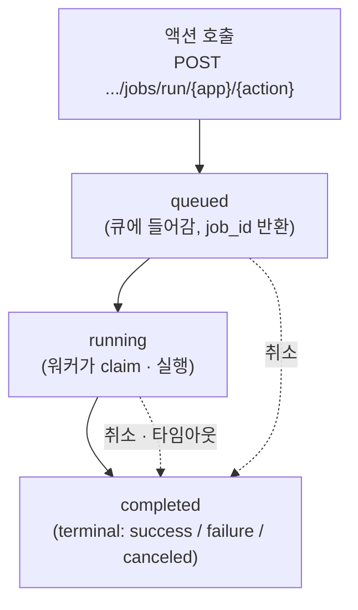
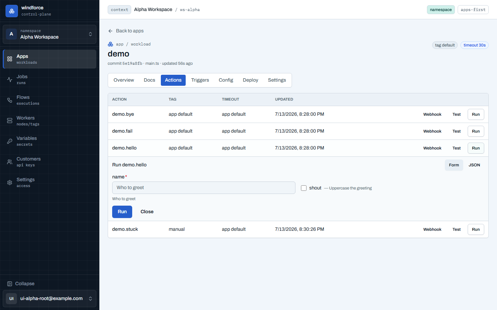
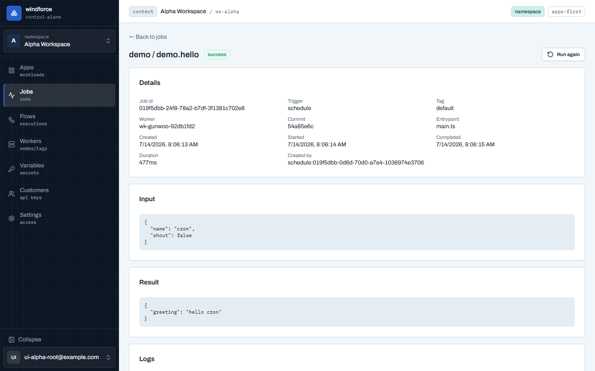
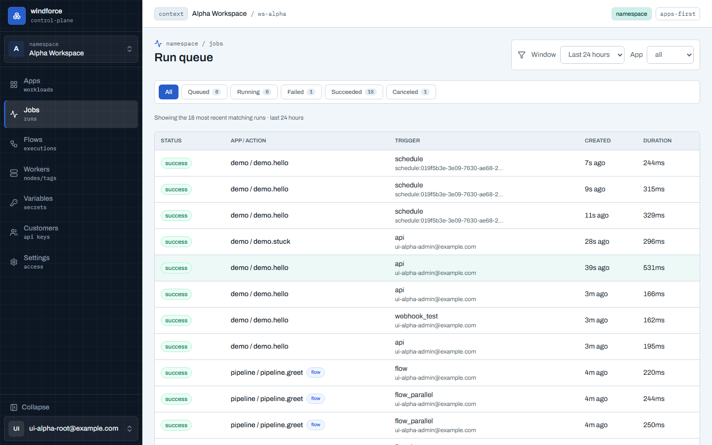

# 잡 실행·결과·로그

액션을 호출하면 windforce는 **잡(job)** 하나를 만들어 큐에 넣고, 워커가 그것을 실행한다. 이 페이지는 잡이 어떤 상태를 거치는지, 결과·로그를 어떻게 받아 보는지, 실행 중인 잡을 어떻게 취소하는지, 그리고 완료된 잡 기록이 얼마나 오래 남는지를 설명한다.

API 경로의 `{ws}`는 워크스페이스 ID, `{app}`/`{action}`은 앱·액션 키, `{id}`는 잡 UUID다. 모든 잡 API는 워크스페이스 세션 쿠키 또는 워크스페이스에 묶인 API 베어러 토큰으로 인증한다.

## 잡 생애주기

잡 실행은 **비동기**다. 액션을 호출하면 즉시 `job_id`를 돌려받고(`201`), 실제 실행은 워커가 큐에서 잡을 꺼내 진행한다. 결과는 그 `job_id`로 폴링한다 — 호출이 워커 풀이나 실행 시간에 묶이지 않으므로 큐가 깊어져도 호출 자체는 빠르고 견고하다.



| 상태 | 의미 |
|---|---|
| `queued` | 큐에 들어갔고 아직 워커가 가져가지 않음 |
| `running` | 워커가 claim해 실행 중 |
| `success` / `failure` / `canceled` | 완료(terminal) — 더 이상 바뀌지 않음 |

terminal 상태에 도달한 잡은 불변이다. 한 번 완료되면 결과·로그가 고정된다.

## 잡 실행하기

```bash
curl -X POST \
  -H "Authorization: Bearer $WF_TOKEN" \
  -H "Content-Type: application/json" \
  -d '{"name":"world"}' \
  https://<host>/api/w/$WS/jobs/run/greet/hello
```

요청 본문(JSON 객체)이 그대로 `ctx.input`이 된다. 응답은 `201`과 `{"job_id":"<uuid>"}`다.

| 상황 | HTTP |
|---|---|
| 큐에 등록됨 | `201` |
| 앱/액션 키가 잘못됨, 또는 본문이 JSON 객체가 아님 | `400` |
| 앱 또는 액션을 찾을 수 없음 | `404` |
| 본문이 서버 한도 초과 | `413` |
| 인증/워크스페이스 권한 실패 | `401` / `403` |

콘솔에서는 액션 상세의 **Run** 화면에서 입력을 채워 같은 경로로 호출한다.



같은 요청을 두 번 보내면 잡도 두 개 만들어진다(at-least-once enqueue). 중복을 막아야 하면 호출자 쪽에서 처리한다.

### 결과를 기다렸다 받기

테스트 버튼처럼 짧게 결과를 바로 받고 싶을 때 쓰는 편의 변형이다.

```bash
curl -X POST \
  -H "Authorization: Bearer $WF_TOKEN" \
  -H "Content-Type: application/json" \
  -d '{"name":"world"}' \
  "https://<host>/api/w/$WS/jobs/run/greet/hello/wait?timeout_ms=30000"
```

이 경로도 일반 실행과 **같은 비동기 큐**를 거친 다음, 완료(`job_completed`)될 때까지 기다린다. `timeout_ms`는 서버가 최대 `30000`(30초)으로 제한하며, 생략하면 30000을 쓴다.

| 상황 | HTTP | 본문 |
|---|---|---|
| 타임아웃 전 완료 | `200` | `{"job_id":"...","status":"success\|failure\|canceled","result":...}` |
| 타임아웃 시점에 아직 대기 중 | `202` | `{"job_id":"...","status":"pending"}` |
| 잘못된 timeout | `400` | error |

## 잡 결과 받기

```bash
curl -H "Authorization: Bearer $WF_TOKEN" \
  https://<host>/api/w/$WS/jobs/$JOB_ID/result
```

| 상황 | HTTP | 본문 |
|---|---|---|
| 알 수 없는 id | `404` | error |
| 큐 대기 중 또는 실행 중 | `202` | `{"status":"pending"}` |
| 성공 완료 | `200` | `{"status":"success","result":...}` |
| 실패 완료 | `200` | `{"status":"failure","result":{"name","message"}}` |
| 취소 완료 | `200` | `{"status":"canceled","result":{"name":"Canceled","message":...}}` |

**스크립트 실패는 HTTP 실패가 아니다.** 잡이 완료되었다면 HTTP는 `200`이고, 성공/실패 여부는 본문의 `status` 필드로 판단한다. 아직 끝나지 않은 잡은 `202`와 `{"status":"pending"}`을 돌려주므로, 폴링 루프는 `202`를 "다시 시도"로, `200`을 "끝났음"으로 다루면 된다.

### 결과 상태 매트릭스

완료된 잡의 `status`는 다음 세 갈래다.

| 결과 상태 | 언제 | result 본문 |
|---|---|---|
| **success** | 스크립트가 정상 반환 | 스크립트가 돌려준 값 |
| **failure** | 스크립트가 예외/에러로 끝남 | `{"name","message"}` |
| **canceled** | 사용자가 취소함 | `{"name":"Canceled","message":...}` |

> 액션에 핀된 timeout 초과는 별도 상태가 아니라 `failure`로 완료된다. 결과를 분류할 때는 위 매트릭스의 result 본문(`name`/`message`)으로 구분한다.

## 로그 보기

```bash
# 전체 로그
curl -H "Authorization: Bearer $WF_TOKEN" \
  https://<host>/api/w/$WS/jobs/$JOB_ID/logs

# 마지막 N바이트만 (실행 중 tail 보기)
curl -H "Authorization: Bearer $WF_TOKEN" \
  "https://<host>/api/w/$WS/jobs/$JOB_ID/logs?tail_bytes=65536"
```

응답은 `text/plain; charset=utf-8`이며 본문은 그때까지 누적된 stdout·stderr 텍스트다. **잡이 끝나기 전에도 부분 로그를 볼 수 있다.** `tail_bytes`(0 이상, 최대 `1048576`)를 주면 마지막 N바이트만 받는다 — 실행 중인 잡의 로그 꼬리를 폴링할 때 쓴다.

콘솔의 잡 상세 화면이 이 결과·로그를 그대로 보여 준다. 목록 행의 app/action 링크를 누르면 상세로 들어간다.



- **flow 역링크**: 이 잡이 flow run의 한 step이면 제목 아래 `part of flow <flow> · step <step>` 링크가 떠서 그 run의 [콕핏](flows.md)으로 바로 돌아간다 — 콕핏의 `view job`과 짝을 이뤄 flow↔job 왕복이 닫힌다. 일반 잡에는 표시되지 않는다.
- **Details / Input / Result / Logs**: enqueue 시점에 고정된 실행 메타(commit·entrypoint·tag·worker·시각·duration·생성자), 받은 입력 JSON, 결과 JSON(실패/취소 시 에러 name·message), 실행 중 라이브로 따라가는 로그.
- **Run again**: 완료된 잡을 같은 입력으로 재실행하고 새 잡 상세로 이동한다 — 일시 장애 재시도나 수정 배포 후 재검증에 쓴다.
- **Cancel job**: 상세에서 바로 취소한다(권한·동작은 아래 **잡 취소** 절 참조). queued인데 안 도는 잡은 그 tag를 서빙하는 라이브 워커가 없다는 뜻이며, 상세 화면이 경고로 알려주고 [Workers 커버리지](workers.md)로 안내한다.

> 실시간 스트리밍(SSE)은 현재 잡 API에 포함되지 않는다. 콘솔은 상태·결과를 폴링하고, 실행 중 로그는 `tail_bytes`로 꼬리를 가져와 표시한다.

## 잡 취소

```bash
curl -X POST \
  -H "Authorization: Bearer $WF_TOKEN" \
  -H "Content-Type: application/json" \
  -d '{"reason":"operator requested"}' \
  https://<host>/api/w/$WS/jobs/$JOB_ID/cancel
```

본문의 `reason`은 선택이다. 응답은 `200`과 `{found, completed_now, soft_canceled, already_completed}`이고, 알 수 없는 id는 `404`다.

**동작:**

- **큐 대기 중 잡** — terminal `canceled` 완료를 쓰고 큐 행을 제거한다(즉시 취소).
- **실행 중 잡** — soft-cancel 표시를 남기면 워커가 이를 관측해 `canceled`로 완료한다.
- **이미 완료된 잡** — `already_completed`를 돌려준다(변화 없음).

**권한:**

- 워크스페이스 admin·super_admin은 워크스페이스 안의 어떤 잡이든 취소할 수 있다.
- 일반 멤버는 자신이 만든 잡(`created_by`가 본인 이메일)만 취소할 수 있다.
- 다른 멤버의 잡을 취소하려 하면 `403`이다.

## 잡 목록과 큐 현황

`GET /api/w/{ws}/jobs`로 잡을 나열한다. 주요 쿼리 파라미터:

- `status`: `queued`, `running`, `success`, `failure`, `canceled`, `completed`(모든 terminal), `all`
- `app`, `action`, `trigger_kind` 필터
- `since`/`until`: RFC3339, `created_at` 범위
- `limit`: `1..500`, 기본 `50`
- `cursor`: 이전 응답의 `pagination.next_cursor`. 첫 페이지는 생략한다.

페이지네이션은 오프셋이 아니라 **키셋(cursor)** 방식이다. 커서가 직전 페이지 마지막 행의 위치를 고정하므로, 페이징 중에 새 잡이 들어와도 행이 중복되거나 밀리지 않는다. 커서를 따라 넘길 때는 필터(`status`/`app`/`since` 등)를 동일하게 유지한다.



콘솔 목록은 상태 칩(라이브 카운트)으로 필터하고, 행이 잡의 정체를 스스로 말한다:

- **실패 행은 그 자리에서 이유를 보인다** — 실패 잡은 에러 요약(`ExecutionError: …`, result 를 서버에서 복호화해 추출)을 붉은 서브라인으로, 취소 잡은 취소 사유를 함께 보여 주므로 원인을 보려고 상세를 열 필요가 없다(전체 문구는 hover, 전체 result·로그는 상세에서).
- **Duration 이 살아 있다** — 실행 중 잡은 경과 시간이, 큐 대기 잡은 `waiting …` 대기 시간이 폴링을 따라 자란다. 완료 잡은 기록된 실행 시간이다.
- **Queued 칩에 적체 신호** — 큐에 쌓여 있으면 가장 오래 기다린 잡의 대기 시간(`oldest 4m ago`)까지 표시한다.
- Trigger 열에 트리거 종류와 요청자가 함께 표시된다.

큐 깊이·최근 처리량을 한눈에 보려면 `GET /api/w/{ws}/jobs/summary`를 쓴다. `queued_count`·`running_count`·최근 완료/실패/취소 수와 함께, 태그별(`by_tag`)·앱별(`by_app`) 집계를 돌려준다(`recent_seconds`로 최근 창을 조절, 기본 86400초).

## 결과 공유 (공개 view token)

잡 결과·로그를 워크스페이스 밖의 사람과 공유하는 **공개 job view token**은 보안 계약으로 확정돼 있다. 핵심 성질은 다음과 같다.

- **읽기 전용**이다 — 노출 capability는 `status`·`result`·`logs`뿐이고, **취소는 공유 토큰으로 할 수 없다.**
- **워크스페이스 인증을 대체하지 않는다.** 발급은 대상 잡을 읽을 수 있는 인증된 사용자(또는 `jobs:read` 스코프의 API 토큰)만 할 수 있고, 공유 토큰으로 또 다른 공유 토큰을 발급할 수는 없다.
- **반드시 만료된다** — 기본 24시간, 최대 7일. 만료되면 실패한다.
- **언제든 폐기**할 수 있다 — 토큰 단위 또는 잡 단위로 일괄 revoke하며, revoke 즉시 실패한다.
- **결과·로그는 스크립트가 출력한 데이터**라서 secret이 들어 있을 수 있다. 서버는 이를 자동으로 정화하지 않으므로, 공유를 발급하는 사람이 그 내용에 책임을 진다. (잡 입력·소스 코드·worker 신원·variable/resource 값 등은 공유 토큰으로 노출되지 않는다.)

> 공개 view token은 위 보안 계약이 확정된 **설계** 단계다. 현재 모든 잡 상태·결과·로그·취소는 워크스페이스 세션 또는 API 토큰 인증을 거친다. 공개 엔드포인트가 구현되더라도 기존 워크스페이스 멤버·API 토큰 동작은 바뀌지 않는다.

## 보존 정책

완료된(terminal) 잡 기록은 무기한 쌓이지 않고, 정해진 보존 기간이 지나면 자동으로 삭제된다.

- 보존 기간은 인스턴스 설정 `JOB_RETENTION_DAYS`로 정하며 **기본 30일**이다. `0`으로 두면 보존이 꺼져 아무것도 삭제되지 않는다(셀프호스트용).
- `completed_at`이 보존 창보다 오래된 terminal 잡은 그 **로그와 잡 기록까지 함께 삭제**된다. 삭제 후 그 `id`는 Get Job·Get Result·Logs에서 `404`가 되고 잡 목록에도 더 이상 나오지 않는다.
- **큐 대기 중·실행 중 잡은 절대 삭제 대상이 아니다.** 보존은 완료 기록만 대상으로 하므로 활성 잡은 구조적으로 건드리지 않는다.
- 삭제는 서버의 주기 sweep로 일정 배치씩 진행된다. 보존을 막 켰을 때 같은 대량 백로그는 한 번에 지우지 않고 여러 틱에 걸쳐 점진적으로 정리된다.

보존 기간이 지난 잡 기록과 로그는 **영구 삭제**된다 — 오래 보관해야 하는 데이터가 있으면 보존 창 안에서 따로 내보내 둔다. 현재 보존 일수는 콘솔의 Jobs 화면 안내에도 표시되며, 사전 인증이 필요 없는 `GET /api/config`가 `job_retention_days`로 같은 값을 돌려준다(표시용 값일 뿐 quota 한도가 아니다).

> **사용량·과금 기록은 삭제되지 않는다.** 잡이 완료되는 순간 페이로드 없는 **과금 이벤트 원장**(고객·앱·액션·outcome·실행 시간)이 별도로 기록되고, 이 원장은 잡 보존과 **독립적으로 장기 보관**된다. 잡 행이 프룬돼도 [고객 상세의 Usage 탭](customers.md)과 CSV export(과금 증거·재계산)는 계속 정확하다.

## 더 보기

- [핵심 개념 — Workspace·App·Action·Job](../getting-started/concepts.md)
- [앱과 액션 만들기](apps-and-actions.md)
- 전체 Job/Run API 계약: [api-contract.md](https://github.com/imprun/windforce/blob/main/docs/contracts/api-contract.md)
- 결정 배경(왜 비동기 큐인가): [ADR-0007 async run API](https://github.com/imprun/windforce/blob/main/docs/decisions/decision-ledger.md)
- 결정 배경(공개 view token 보안 계약): [ADR-0017](https://github.com/imprun/windforce/blob/main/docs/decisions/decision-ledger.md)
- 결정 배경(보존 정책): [ADR-0026](https://github.com/imprun/windforce/blob/main/docs/decisions/decision-ledger.md)
