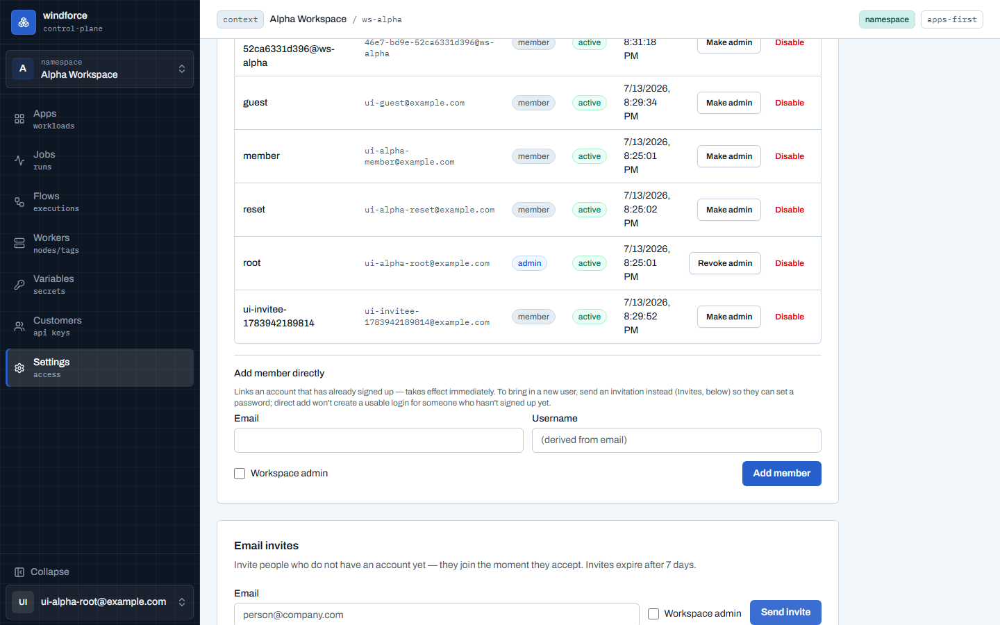
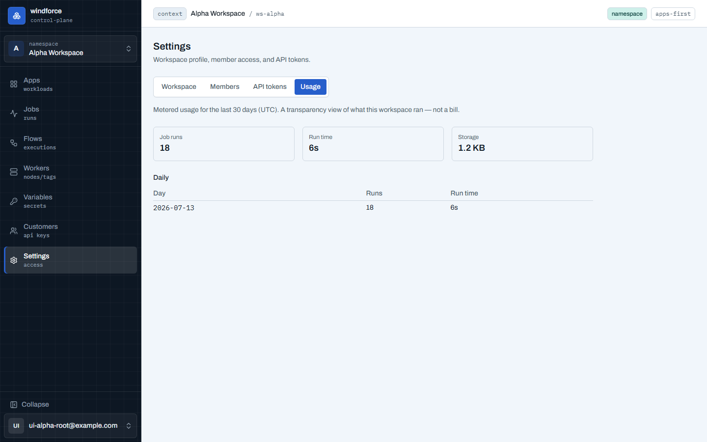

# Settings — 워크스페이스·멤버·토큰·사용량

Settings는 **Workspace / Members / API tokens / Usage** 네 영역을 탭으로 나누며, 탭은 URL(`?tab=`)에 반영되어 링크로 공유할 수 있다.

- **Workspace**(admin): 워크스페이스 이름을 변경한다. 변경 즉시 사이드바 스위처에 반영된다.

## Members

- **Email invites** — 표준 합류 경로다. 이메일 주소(아직 가입하지 않은 사람도 가능)와 역할을 골라 **Send invite**하면 초대 메일이 발송되고, 링크가 화면에도 표시돼 **Copy**로 직접 전달할 수 있다(SMTP가 없는 환경 포함). 열린 초대는 만료 시각과 함께 목록에 보이며 **Revoke**로 회수한다. 같은 주소에 열린 초대는 1건만 허용된다.
- **Add member directly** — 초대 메일 없이 즉시 멤버십을 만든다.
- 역할 토글(Make admin / Revoke admin)과 **Disable**(확인 후 접근 즉시 차단) / Enable이 있다. 마지막 enabled admin은 강등·비활성화할 수 없다.

## API tokens

- **운영자·연동용 토큰**이다 — 나(운영자)·CI·자체 자동화가 쓰는 워크스페이스 스코프 bearer 토큰. **외부 고객에게 건네는 키는 여기가 아니라 [Customers](customers.md)에서 발급**하며, 이 목록에도 섞이지 않는다(고객 키는 scope가 아니라 grant로 통제된다).
- **최소권한 우선**으로 발급한다 — 스코프는 영역별(Jobs·Flows·Apps·Git sources·Variables 등)로 묶여 있고, 흔한 용도는 **프리셋**(Read-only observer / CI deploy / Flow trigger / Webhook invoke) 버튼으로 채운 뒤 미세조정한다. 선택 요약이 "N scopes 선택됨 · 읽기 전용"처럼 권한 범위를 알려 준다. **전체 접근(`*`)**은 별도 경고 카드로 분리돼 있어 실수로 고르기 어렵다(선택 시 개별 스코프는 비활성). **만료**(없음/30일/90일/1년)를 정할 수 있고 목록의 Expires·Status에 반영된다. **raw 토큰은 생성 직후 1회만 표시**되므로 즉시 복사해 보관한다(목록에는 prefix만 남는다). **Revoke**는 확인 후 즉시 적용된다. 전체 스코프 목록은 [API 토큰 scope](../reference/api-tokens.md)에서 다룬다.

## Usage

- **Usage**는 최근 30일(UTC)의 **잡 실행 수·실행 시간·저장량** 요약과 일별 표를 보여준다. 과금 화면이 아니라 투명성 뷰다.
- 인스턴스에 테넌트 quota가 설정돼 있으면 같은 카운터를 quota가 읽는다 — 한도를 넘으면 새 잡 실행이 거부되거나 API 호출이 제한된다.
