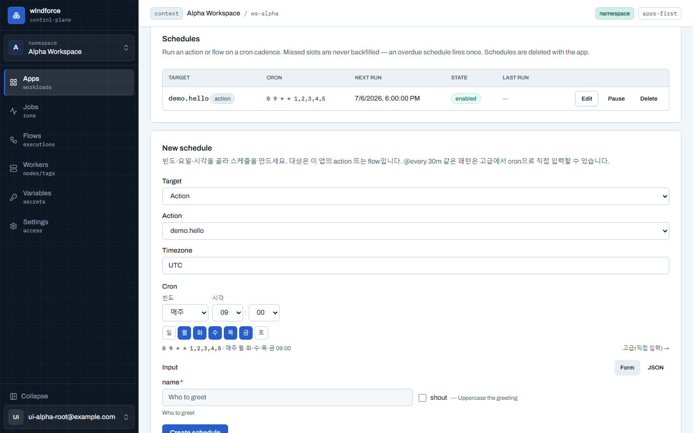
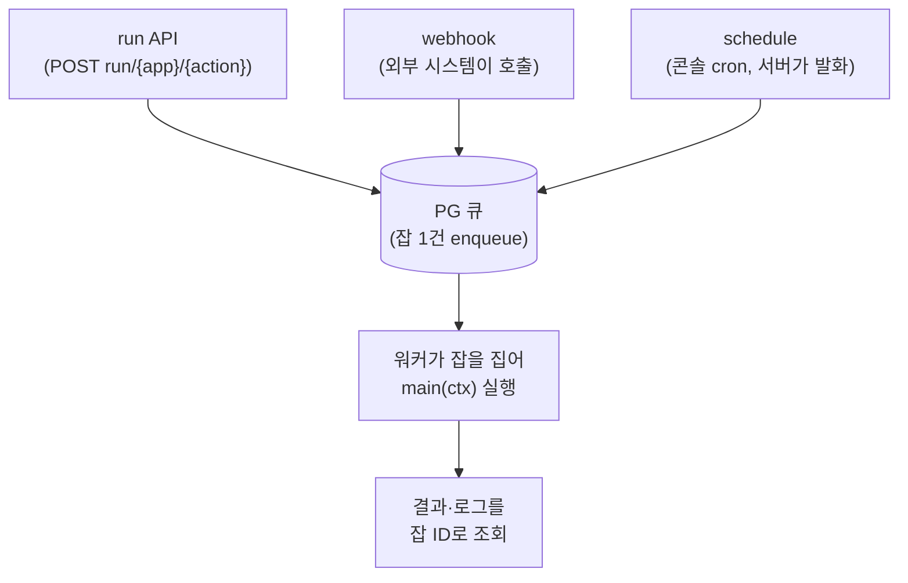
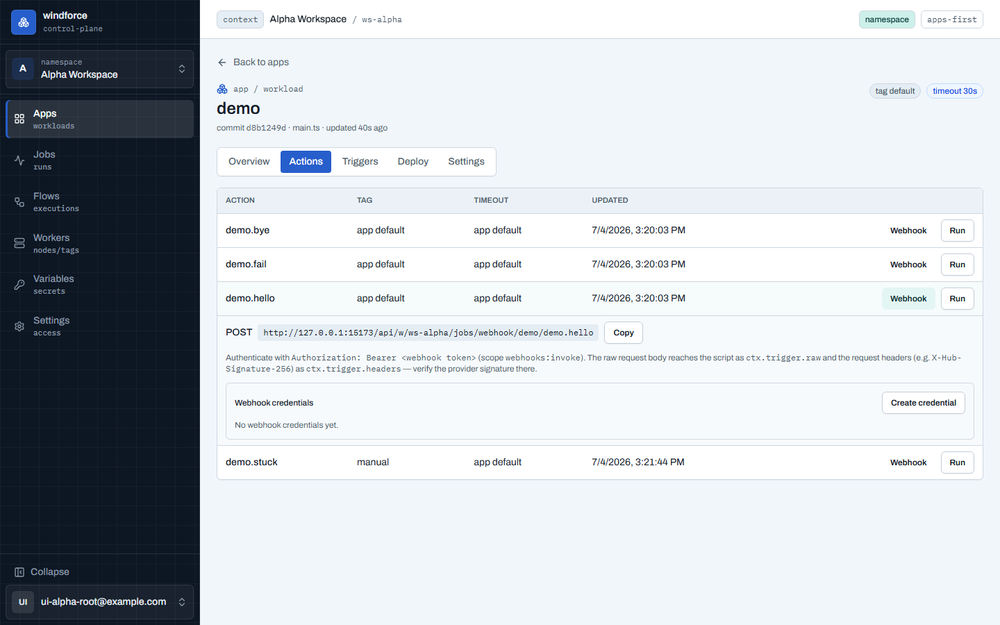

# 트리거 (run · webhook · schedule)

이 페이지는 windforce 액션을 **무엇이 실행시키는가**를 설명한다. 액션을 호출하는 길은 세 가지다 — HTTP로 직접 부르는 **run API**, 외부 시스템이 호출하는 **webhook**, 콘솔이 관리하는 cron **schedule**. 셋 다 결국 같은 큐에 잡(job)을 하나 넣는 것으로 수렴하고, 워커가 그 잡을 집어 `main(ctx)`를 실행한다.



## 공통 모델 — 트리거는 "잡을 만든다", 끝나면 폴링한다

어떤 트리거든 호출하면 잡이 **큐에 들어가고(enqueue)** 즉시 잡 ID가 돌아온다. 호출이 결과까지 기다리는 게 아니라, 잡은 비동기로 워커에서 실행된다. 결과는 잡 ID로 따로 조회한다.



- 모든 트리거는 같은 enqueue 경로를 쓴다. 실행 메타(commit·entrypoint·스키마·timeout)는 enqueue 시점에 잡에 고정(self-pin)되므로, 이후 코드를 다시 sync해도 이미 큐에 들어간 잡은 흔들리지 않는다.
- 트리거 종류는 잡에 `trigger_kind`(`api`·`webhook`·`schedule`)로 출처 메타로 기록된다. 스크립트에서는 `ctx.trigger.kind`로 읽을 수 있다.
- **at-least-once**: 같은 run 요청을 2번 보내면 잡이 2개 만들어진다. 중복 억제가 필요하면 호출하는 쪽에서 책임진다.

결과를 받는 법(잡 ID로 status·result·logs 조회)은 [잡 실행·결과·로그](jobs.md)에서 다룬다. 아래에서는 각 트리거를 "어떻게 부르는가"에 집중한다.

## 1. run API — HTTP로 직접 호출

가장 기본 경로다. 인증된 워크스페이스 호출자(세션 또는 API 토큰)가 액션을 직접 부른다.

```
POST /api/w/{ws}/jobs/run/{app}/{action}
```

- **요청 본문 = JSON 객체** → 그대로 `ctx.input`이 된다.
- 응답은 `201 {"job_id":"<uuid>"}`. 잡이 큐에 들어갔다는 뜻이고, 결과는 아직 없다.
- 주요 상태 코드: `400`(app/action 키가 잘못됨 또는 본문이 JSON 객체가 아님), `404`(app·action 없음), `413`(본문이 서버 한도 초과), `401/403`(인증·워크스페이스 권한 실패).

```bash
curl -X POST \
  https://<host>/api/w/my-workspace/jobs/run/greet/hello \
  -H "Authorization: Bearer wf_..." \
  -H "Content-Type: application/json" \
  -d '{"name":"Ada"}'
# → 201 {"job_id":"3f2a..."}
```

그러면 잡 ID로 결과를 폴링한다.

```bash
curl https://<host>/api/w/my-workspace/jobs/3f2a.../result \
  -H "Authorization: Bearer wf_..."
# 아직 실행 중: 202 {"status":"pending"}
# 끝났으면:    200 {"status":"success","result":{...}}
```

### 콘솔 테스트 버튼용 — run-and-wait

콘솔의 "테스트" 버튼처럼 결과를 한 번에 받고 싶을 때는 wait 변형이 있다. enqueue는 일반 run과 똑같이 비동기로 하되, 타임아웃까지 완료를 기다려 준다.

```
POST /api/w/{ws}/jobs/run/{app}/{action}/wait?timeout_ms=30000
```

- `timeout_ms`는 서버가 최대 `30000`(30초)으로 캡한다. 생략하면 `30000`.
- 타임아웃 전에 끝나면 `200`에 결과까지 담아 준다. 아직 안 끝났으면 `202 {"job_id":"...","status":"pending"}` — 이후 잡 ID로 계속 폴링하면 된다.

## 2. webhook — 외부 시스템이 호출

GitHub·Stripe 같은 외부 시스템이 이벤트를 보낼 때 쓰는 공개 호출 경로다.

```
POST /api/w/{ws}/jobs/webhook/{app}/{action}
```

run과 다른 점은 세 가지다.

**(1) 전용 토큰으로 인증한다.** 외부 시스템에 박는 자격은 워크스페이스 전체를 쥔 일반 API 토큰이 아니라, `webhooks:invoke` 스코프 하나만 가진 전용 토큰이다. webhook 엔드포인트는 이 스코프만 받는다(일반 `jobs:run` 토큰으로는 호출할 수 없다). 즉,

- `webhooks:invoke` 토큰은 webhook 발화 외에는 아무것도 못 한다 — 외부에 노출돼도 피해 범위가 좁다.
- 유출되면 그 토큰만 회수하면 즉시 끊긴다(다른 자격은 영향 없음).

토큰은 콘솔의 Triggers 탭에서 발급한다.



**(2) 본문은 raw payload 그대로 들어온다.** 외부 제공자가 보내는 임의의 본문이 JSON 문자열로 저장돼 `ctx.input`(= `ctx.trigger.raw`)로 전달된다. 객체로 reshape하려면 액션의 `createApp` 미들웨어에서 `JSON.parse` 후 매핑한다(아래 참고).

**(3) 요청 헤더가 스크립트로 전달된다.** webhook 요청 헤더는 enqueue 시점에 캡처돼 잡에 고정되고, 스크립트에서 `ctx.trigger.headers`(`Record<string,string>`, HTTP canonical-case 키)로 읽힌다. 다른 트리거에서는 `undefined`다.

- **비밀 헤더는 제거된다**: `Authorization`·`Cookie`·`Proxy-Authorization`은 denylist되어 스크립트로 가지 않는다.
- 크기 캡: 헤더당 값 ≤ 1 KiB, 전체 ≤ 8 KiB. 다중 값 헤더는 `, `로 결합된다.

```bash
curl -X POST \
  https://<host>/api/w/my-workspace/jobs/webhook/gh-events/on-push \
  -H "Authorization: Bearer wf_...(webhooks:invoke)" \
  -H "X-Hub-Signature-256: sha256=abc123..." \
  -H "Content-Type: application/json" \
  --data-binary '{"ref":"refs/heads/main","commits":[...]}'
# → 201 {"job_id":"..."}
```

### 서명 검증은 스크립트가 한다

windforce는 제공자별 서명 방식을 내장하지 않는다. 토큰이 호출자를 인증하고, 플랫폼은 **헤더를 보존**할 뿐이다. 서명 검증은 스크립트가 보존된 헤더와 자기 공유 비밀(`ctx.variables`)로 직접 한다 — 제공자마다 서명 방식이 다르기 때문이다(GitHub은 `X-Hub-Signature-256` HMAC-SHA256, Stripe는 `Stripe-Signature` 타임스탬프+서명 등).

```ts
// webhook 본문을 객체로 정규화 + 서명 검증 (createApp 미들웨어)
app.use((ctx, next) => {
  if (ctx.trigger.kind === "webhook") {
    const sig = ctx.trigger.headers?.["X-Hub-Signature-256"]; // 보존된 서명 헤더
    verifySignature(ctx.trigger.raw as string, sig, ctx.variables.GH_SECRET); // 저자가 검증
    ctx.input = mapEvent(JSON.parse(ctx.trigger.raw as string));  // raw(string) → input(객체)
  }
  return next();
});
```

미들웨어를 두지 않으면 `main` 안에서 `ctx.trigger.raw`(문자열)를 직접 파싱·검증한다.

## 3. schedule — 콘솔이 관리하는 cron

정해진 시각마다 액션을 자동으로 부르는 경로다. run·webhook이 외부에서 들어오는 "push"라면, schedule은 서버가 시간을 보고 스스로 잡을 만드는 "pull"이다.

스케줄은 **콘솔이 소유**한다 — 코드(manifest)가 아니라 워크스페이스의 운영 객체다. 그래서 enable/disable·cron 변경 같은 조작에 deploy가 필요 없고, 콘솔에서 바로 켜고 끈다. CRUD는 다음 엔드포인트로 한다(워크스페이스 admin 또는 `schedules:write` 스코프).

```
GET   /api/w/{ws}/schedules            # 목록
POST  /api/w/{ws}/schedules            # 생성
PATCH /api/w/{ws}/schedules/{id}       # 수정
DELETE /api/w/{ws}/schedules/{id}      # 삭제
```

스케줄 한 건은 다음을 가진다: cron 식, timezone, 대상 app/action, 호출 시 넘길 input, enabled 플래그. 앱을 삭제하면 그 앱의 스케줄도 함께 삭제된다(CASCADE).

### cron 문법

- 표준 **5필드** cron + 디스크립터 `@hourly`·`@every 30m`. (초 단위 6필드는 지원하지 않는다.)
- timezone은 IANA 이름(예: `Asia/Seoul`), 기본값 UTC.

```jsonc
// POST /api/w/{ws}/schedules 본문 예시
{
  "app_key": "reports",
  "action_key": "daily-summary",
  "cron": "0 9 * * *",          // 매일 09:00
  "timezone": "Asia/Seoul",
  "input": { "range": "yesterday" },
  "enabled": true
}
```

### 발화 동작 — 정확히 한 번, 백필 없음

- **정확히 한 번**: 서버가 due가 된 스케줄을 한 트랜잭션에 하나씩 행 잠금으로 집어 잡을 만든다. 서버 파드가 여러 대여도 같은 회차는 정확히 한 번만 발화한다(클러스터 단일 리더 같은 건 두지 않는다).
- **no-backfill**: 다음 발화 시각은 항상 "지금 이후 첫 슬롯"이다. 서버가 한동안 죽어 있다 살아나도 밀린 회차를 몰아서 터뜨리지 않고, 1회만 발화한다. 재활성화하거나 cron을 바꾸면 다음 발화 시각이 즉시 재계산된다.
- **자기치유 비활성화**: 발화 시점에 cron이 파싱되지 않거나 대상 action이 사라졌으면 그 스케줄을 자동으로 disabled로 바꾸고 로그를 남긴다(무한 재시도 방지). 운영자는 콘솔에서 disabled 상태로 발견한다.
- **서버가 전부 내려가면 스케줄도 멈춘다** — 잡을 못 만들 뿐 데이터 유실은 없다. 그래서 스케줄을 쓰는 운영에서는 서버를 항상 한 대 이상 띄워 둔다.

schedule이 만든 잡에는 감사용으로 `trigger_kind="schedule"`, `created_by="schedule:<id>"`가 남고, 실행 권한은 스케줄을 만든 사람의 것으로 기록된다(`permissioned_as`).

## 세 트리거 한눈에

| | run API | webhook | schedule |
|---|---|---|---|
| 누가 부르나 | 워크스페이스 내부 호출자 | 외부 시스템(GitHub·Stripe 등) | 서버(cron 시각 도래 시) |
| 인증 | 세션 또는 API 토큰(`jobs:run`) | 전용 토큰(`webhooks:invoke`) | 서버 내부 발화(CRUD는 `schedules:write`) |
| 입력 | 본문 JSON 객체 → `ctx.input` | raw payload → `ctx.input`/`ctx.trigger.raw`(미들웨어가 reshape) | 스케줄에 저장된 `input` |
| 헤더 | — | `ctx.trigger.headers`(비밀 제거·캡) | — |
| 정의 위치 | 호출 시점 | 콘솔 Triggers 탭에서 토큰 발급 | 콘솔 소유(테이블) |

## 더 보기

- [잡 실행·결과·로그](jobs.md) — 잡 ID로 status·result·logs를 조회하는 법
- [액션 코드 작성](apps-and-actions.md) — `main(ctx)`와 `ctx.input`·`ctx.trigger`
- 엔드포인트 계약 전체: [api-contract.md](https://github.com/imprun/windforce/blob/main/docs/contracts/api-contract.md) · 트리거 평면: [triggers-and-enqueue.md](https://github.com/imprun/windforce/blob/main/docs/runtime/triggers-and-enqueue.md)
- 결정의 배경(왜): [비동기 run API](https://github.com/imprun/windforce/blob/main/docs/decisions/decision-ledger.md) · [외부 webhook 인증·헤더](https://github.com/imprun/windforce/blob/main/docs/decisions/decision-ledger.md) · [콘솔 소유 스케줄](https://github.com/imprun/windforce/blob/main/docs/decisions/decision-ledger.md)
