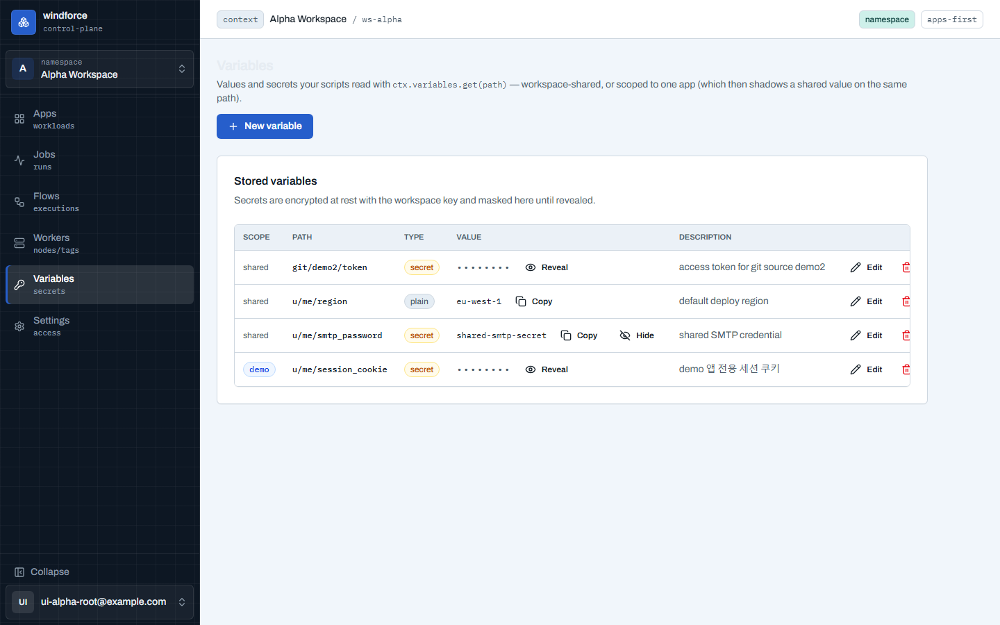

# 변수 — 값과 시크릿

스크립트가 `ctx.variables.get(path)` 로 읽는 값과 시크릿을 콘솔에서 관리한다. 사이드바의 **Variables**(`/w/{workspace}/variables`)로 연다.



## 값과 시크릿

- **path 가 식별자**다(예: `u/me/api_key`). 같은 스코프에서 같은 path 로 다시 저장하면 덮어쓴다.
- **plain** 값은 목록에 그대로 보이고 복사할 수 있다.
- **secret** 은 저장할 때 **워크스페이스 키로 암호화**(AES-256-GCM)되어 저장되고 목록에서 `••••••` 로 가려진다. **Reveal** 을 누를 때만 복호해 보여주며(1회성이 아니라 필요할 때마다 다시 볼 수 있다), **Hide** 로 다시 가린다.

## 스코프 — 워크스페이스 공유와 앱 전용

변수는 두 레벨의 스코프를 가진다:

- **Workspace shared** (스코프 배지 `shared`): 워크스페이스의 **모든 앱**의 잡이 읽는다 — SMTP 자격 증명처럼 여러 앱이 공유하는 값에 쓴다.
- **앱 전용** (스코프 배지 = 앱 이름): **그 앱**의 잡만 읽는다. 티스토리 세션 쿠키·은행 시크릿처럼 한 앱의 크리덴셜을 워크스페이스 전체에 노출하지 않는다.

같은 path 에 공유 값과 앱 전용 값이 둘 다 있으면, 그 앱의 잡은 **앱 전용 값이 공유 값을 가린다**(shadow). 다른 앱의 앱-전용 변수는 아예 보이지 않는다 — 이것이 최소권한 경계다. 특히 공개 링크로 익명 실행되는 앱은 자기 앱 전용 변수 + 공유 변수만 읽으므로, 다른 앱의 시크릿이 새지 않는다.

## 만들기 · 수정 · 삭제

- **New variable**: **Scope**(Workspace shared 또는 앱 선택) · `path` · `value` · `description` 와 **Secret** 토글. Secret 으로 저장하면 암호화·마스킹된다. 인스턴스에 저장 quota 가 설정돼 있으면 한도 초과 시 거부된다(422).
- **수정**: Secret 을 편집하면 현재 값을 미리 채워 두므로, 설명만 바꿔도 저장된 값이 지워지지 않는다. path 와 스코프는 변수의 정체라 수정 중 잠긴다.
- **삭제**: 확인 게이트를 거친다 — 그 변수를 읽던 스크립트는 실행 시 실패한다. 같은 path 의 다른 스코프 값은 영향받지 않는다.

## 권한

API 토큰과 달리 **워크스페이스 멤버면 누구나** 변수를 관리한다(admin 전용이 아니다). 값 노출은 워크스페이스 경계 안에 머문다.

## 스크립트에서 쓰기

저장한 변수는 액션 코드에서 잡 토큰으로 콜백해 읽는다. 시크릿은 복호된 값으로 들어온다. `get(path)` 는 **실행 중인 앱의 앱-전용 스코프를 먼저 보고**(같은 path 의 공유 값을 가림) 없으면 공유로 폴백한다 — 코드는 스코프를 신경 쓸 필요 없이 같은 path 를 읽으면 된다.

``` ts
export async function main(ctx) {
  const apiKey = await ctx.variables.get("u/me/api_key")
  // ... apiKey 로 외부 호출
  return { ok: true }
}
```
