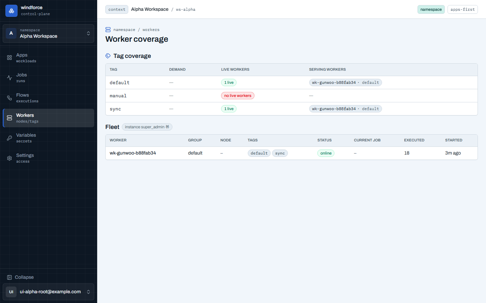

# Workers — 태그 커버리지

Workers 화면의 질문은 하나다: **"내 잡이 왜 안 빠지지?"** — Jobs의 미서빙 경고나 잡 상세의 "이 태그를 서빙하는 워커 없음" 알림이 이 화면으로 deep-link(`?tag=` 하이라이트)한다.

- **Tag coverage**: 태그마다 **Demand**(지금 queued/running 잡 수)와 **공급**(live 워커·서빙 워커)을 한 행에 짝지어 보여 준다. "no live workers" 자체는 문제가 아닐 수 있다 — **수요가 있는데 서빙 워커가 없는 행**(앰버 강조)이 진짜 신호이고, 그 태그의 잡은 워커가 생기거나 라우팅이 바뀔 때까지 대기한다.
- **경고 배너**: 그 상태의 태그가 있으면 상단 배너가 태그·대기 수와 함께 **해결 경로**를 준다 — 대부분은 앱 라우팅이 의도치 않은 태그(오타·미사용 커스텀 태그)를 가리키는 경우라 **앱 Settings → Runtime에서 직접 고칠 수 있고**, 플랫폼이 제공해야 하는 태그(capability 등)라면 문의 링크(인스턴스에 설정된 경우)로 에스컬레이션한다. 조용하면 배너는 없다.
- **Fleet**(instance super_admin 전용): 워커별 그룹·노드·구독 태그·상태·현재 잡(잡 상세 링크)·처리 수·기동 시각(상대시각). 일반 멤버에게는 태그 커버리지까지만 보이고 Fleet은 권한 안내로 대체된다. 워커 그룹·스케일 운영은 [워커 그룹·스케일](../operating/worker-groups.md)에서 다룬다.
