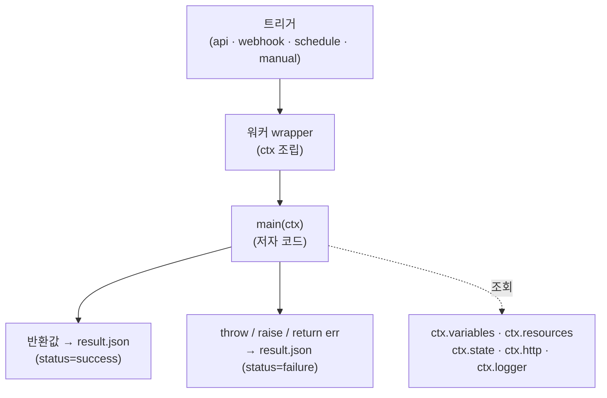

# 액션 코드 작성

이 페이지는 windforce에서 실행되는 액션 코드를 **어떻게 쓰는지**를 설명한다. 진입점 형태(`main(ctx)`), 입력/출력 스키마, 반환값과 에러 처리, `ctx`로 받는 상태·시크릿·리소스·HTTP, 여러 파일로 나누는 법을 다룬다. TypeScript·Python·Go 세 언어를 모두 다루며, 실행 계약은 언어와 무관하게 동일하다 — 갈리는 것은 코드 표면뿐이다.

용어가 처음이라면 먼저 [핵심 개념](../getting-started/concepts.md)과 [앱과 액션](apps-and-actions.md)을 보는 편이 좋다.

## 한 줄 요약: 모든 것은 `ctx`로 온다

windforce 액션은 단 하나의 인자 `ctx`를 받는 함수다. 입력, 트리거 정보, 식별자, 실행자(actor), 로거, 시크릿/리소스 조회, 영속 상태, 인증된 HTTP — **저자가 보는 모든 실행 표면은 `ctx` 하나에 담겨 주입된다.**

- `input.json`이나 환경변수를 **직접 읽지 않는다**. 모두 `ctx`로 온다.
- 결과는 **반환값**으로 돌려준다(로그는 데이터 채널이 아니다).
- 실패는 각 언어의 관용으로 신호한다(TS `throw`, Python `raise`, Go `return nil, err`).



## 진입점: `main(ctx)`

앱(App)마다 진입점 파일은 **하나**다. 그 파일은 액션 핸들러를 묶어 `main`을 export 하는 "조립" 파일이고, 실제 로직은 액션별 파일에 둔다(아래 "여러 파일로 나누기").

진입점을 만드는 방법은 두 가지다.

1. **SDK 헬퍼(권장)** — `createApp`(언어별 동형)에 `action_key → 핸들러` 맵을 주면 SDK가 `ctx.action`으로 분기하는 `main`을 만들어 준다.
2. **raw `main`(escape hatch)** — 직접 `main(ctx)`를 작성해 `ctx.action`을 `switch` 한다.

워커는 진입점에서 `main`을 찾아 `main(ctx)`를 한 번 호출한다. `main`이 없으면 즉시 실패한다.

=== "TypeScript"

    ```ts
    // main.ts — 진입점 = 조립. 핸들러는 액션별 파일에서 import.
    import { createApp } from "windforce-client";
    import { sync }   from "./actions/approval/sync";
    import { create } from "./actions/approval/create";

    export const main = createApp({
      actions: {
        "approval.sync":   sync,    // action_key → 핸들러
        "approval.create": create,
      },
      // use:     [audit],          // (선택) 미들웨어
      // onError,                   // (선택) 에러 핸들러
    });
    ```

=== "Python"

    ```python
    # main.py — 진입점 = 조립. create_app이 ctx.action 분기.
    from windforce_client import create_app
    from actions.approval.sync import sync
    from actions.approval.create import create

    main = create_app(actions={
        "approval.sync":   sync,
        "approval.create": create,
    })
    ```

=== "Go"

    ```go
    // main.go — 진입점 = 조립(package main, var Main만 export).
    // func main 은 쓰지 않는다 — 워커가 wrapper로 생성해 붙인다.
    package main

    import (
        wf "windforce-client"
        "myapp/actions/approval"
    )

    var Main = wf.CreateApp(wf.App{Actions: wf.Actions{
        "approval.sync":   approval.Sync,
        "approval.create": approval.Create,
    }})
    ```

!!! note "Go는 `func main`을 쓰지 않는다"
    Go에서는 저자가 `package main`에 `var Main = wf.CreateApp(...)`만 export 한다. `func main`은 워커가 컴파일 단계에서 wrapper로 생성해 붙인다. 직접 `func main`을 정의하면 충돌한다.

### 언어별 표면 한눈에

계약은 언어 중립이고 **표면만** 다르다.

| | TypeScript | Python | Go |
|---|---|---|---|
| 진입점 파일 | `main.ts` | `main.py` | `main.go` |
| SDK import | `import { createApp } from "windforce-client"` | `from windforce_client import create_app` | `import wf "windforce-client"` |
| 조립 | `export const main = createApp({ actions, use, onError })` | `main = create_app(actions=…, use=…, on_error=…)` | `var Main = wf.CreateApp(wf.App{Actions, Use, OnError})` |
| 핸들러 | `async (ctx) => …` / `(ctx) => …` | `async def h(ctx): …` / `def h(ctx): …` | `func h(ctx *wf.Context) (any, error)` |
| `ctx` 표기 | camelCase (`ctx.trigger.scheduledFor`) | snake_case (`ctx.trigger.scheduled_for`) | PascalCase (`ctx.Trigger.ScheduledFor`) |
| 메서드 호출 | `await ctx.state.get()` | `await ctx.state.get()` | `ctx.State.Get()` → `(값, error)` |
| 에러 신호 | `throw` | `raise` | `return nil, err` (던지지 않음) |
| 의존성 | `package.json` + `bun.lock` | `requirements.txt`(버전 고정) | `go.mod` + `go.sum` |

같은 값이고 케이스만 다르다: TS `ctx.actor.permissionedAs` = Python `ctx.actor.permissioned_as` = Go `ctx.Actor.PermissionedAs`. TypeScript와 Python의 메서드는 `await`로 기다리고, **Go는 동기 메서드가 `(값, error)`를 반환**한다.

## 액션 핸들러 작성

핸들러는 `ctx`를 받아 결과를 반환하는 함수다. 같은 앱의 여러 핸들러는 공통 모듈을 공유할 수 있다.

=== "TypeScript"

    ```ts
    // actions/approval/sync.ts
    import type { WindforceContext } from "windforce-client";
    import { fetchApprovals } from "../../lib/client";  // 공통 모듈(여러 액션 공유)

    interface SyncInput { since?: string; dryRun?: boolean }

    export async function sync(ctx: WindforceContext) {
      const input = (ctx.input ?? {}) as SyncInput;       // 저자가 자기 타입으로 좁힘
      ctx.logger.info(`sync ${ctx.app}/${ctx.action} as ${ctx.actor.email}`);

      const processed = await fetchApprovals(input.since);
      return { ok: true, processed, since: input.since ?? null };
    }
    ```

=== "Python"

    ```python
    # actions/approval/sync.py
    from windforce_client import WindforceContext
    from lib.client import fetch_approvals    # 공통 모듈(여러 액션 공유)

    async def sync(ctx: WindforceContext) -> dict:
        data = ctx.input or {}
        ctx.logger.info(f"sync {ctx.app}/{ctx.action} as {ctx.actor.email}")

        processed = await fetch_approvals(data.get("since"))
        return {"ok": True, "processed": processed, "since": data.get("since")}
    ```

=== "Go"

    ```go
    // actions/approval/sync.go
    package approval

    import (
        "fmt"
        wf "windforce-client"
        "myapp/lib"    // 공통 모듈(여러 액션 공유)
    )

    func Sync(ctx *wf.Context) (any, error) {
        in, _ := ctx.Input.(map[string]any)               // 타입 단언으로 좁힘
        ctx.Logger.Info(fmt.Sprintf("sync %s/%s as %s",
            ctx.App, ctx.Action, ctx.Actor.Email))

        processed, err := lib.FetchApprovals(in["since"])
        if err != nil {
            return nil, err                               // 에러는 반환(던지지 않음)
        }
        return map[string]any{
            "ok": true, "processed": processed, "since": in["since"],
        }, nil
    }
    ```

### `ctx`가 담고 있는 것

| `ctx` 경로 | 무엇 |
|---|---|
| `ctx.input` | 호출 입력. 타입은 미지정(저자가 좁힌다). 자세한 내용은 아래 "입력: `ctx.input`". |
| `ctx.trigger.kind` | 이 실행을 만든 트리거: `api` · `webhook` · `schedule` · `manual`. |
| `ctx.trigger.raw` | webhook 원본 본문(JSON **문자열** — 직접 파싱). api/manual은 비어 있음. |
| `ctx.trigger.scheduledFor` | schedule 트리거의 예약 시각. |
| `ctx.trigger.headers` | webhook 요청 헤더(외부 제공자 서명 검증용). `Authorization`/`Cookie` 등 비밀 헤더는 제외된다. |
| `ctx.app` / `ctx.action` | 앱 키 / 액션 키. 핸들러를 직접 분기할 때 쓴다. |
| `ctx.job.{id, workspace, tag}` | 잡 식별자. |
| `ctx.actor.{email, username, permissionedAs}` | 누가 실행했는가. |
| `ctx.logger.{info, warn, error, debug}` | 로그 채널(아래 "로그: `ctx.logger`"). |
| `ctx.variables.get(path)` | 시크릿/변수 조회(아래 "시크릿·변수, 리소스"). |
| `ctx.resources.get(path)` | 리소스(JSON) 조회. |
| `ctx.state.get()` / `ctx.state.set(v)` | 액션별 영속 상태(아래 "영속 상태: `ctx.state`"). |
| `ctx.http.fetch(...)` | 인증·base URL이 미리 세팅된 HTTP. 외부/플랫폼 호출의 유일한 통로. |

`token`·`baseUrl`은 `ctx`에 노출되지 않는다. 인증이 필요한 외부 호출은 `ctx.http.fetch`로 한다.

## 입력: `ctx.input`

입력은 `ctx.input`으로 받는다. 타입은 정해져 있지 않으니 저자가 자기 타입으로 좁힌다.

- **API 실행**은 요청 본문이 그대로 객체로 들어온다 — `ctx.input`이 바로 객체다.
- **webhook**은 원본 본문이 `ctx.input`(= `ctx.trigger.raw`)에 **JSON 문자열**로 들어온다. 핸들러에서 `JSON.parse` 하거나, 미들웨어로 정규화한다(아래 "트리거 입력 정규화 (미들웨어)").

입력의 모양은 **companion JSON 스키마 파일**로 선언하는 것을 권장한다(아래 "매니페스트와 스키마"). 현재 플랫폼은 입력/출력 스키마를 저장·노출만 하고 **실행 시 검증하지는 않는다** — 따라서 런타임 방어(필수 필드 확인 등)는 저자 책임이다.

```ts
interface SyncInput { since?: string; dryRun?: boolean }
const input = (ctx.input ?? {}) as SyncInput;
if (input.since && typeof input.since !== "string") {
  throw new Error("since must be a string");   // 스키마 미검증 → 저자가 방어
}
```

## 반환값(결과)

핸들러가 반환한 값이 곧 잡의 결과다.

- **JSON으로 직렬화 가능한 값**만 반환한다(객체·배열·원시값·`null`).
- 함수·순환 참조·`Symbol` 등 직렬화 불가능한 값을 반환하면 실패로 처리된다.
- `undefined`를 반환하면 `null`로 기록된다.

결과는 `GET /api/w/{ws}/jobs/{id}/result`로 조회한다(잡이 끝나기 전이면 `202`).

```ts
return {
  ok: true,
  processed: 42,
  since: "2026-06-01",
};
```

(선택) 출력 모양도 companion output 스키마로 선언할 수 있다. 마찬가지로 현재는 저장·문서화 용도이고 검증하지는 않는다.

## 에러 처리

실패는 각 언어의 관용으로 신호한다. 플랫폼은 어느 언어든 동일한 평탄(flat) JSON 에러 — `{ "message", "name", "stack" }` — 로 기록하고 잡을 실패 상태로 만든다.

=== "TypeScript"

    ```ts
    export async function sync(ctx: WindforceContext) {
      const input = (ctx.input ?? {}) as { since?: string };
      if (!input.since) {
        throw new Error("`since` is required");   // throw 로 실패 신호
      }
      // ...
    }
    ```

=== "Python"

    ```python
    async def sync(ctx: WindforceContext) -> dict:
        data = ctx.input or {}
        if not data.get("since"):
            raise ValueError("`since` is required")   # raise 로 실패 신호
        # ...
    ```

=== "Go"

    ```go
    func Sync(ctx *wf.Context) (any, error) {
        in, _ := ctx.Input.(map[string]any)
        if in["since"] == nil {
            return nil, fmt.Errorf("`since` is required")   // error 반환으로 실패 신호
        }
        // ...
    }
    ```

!!! warning "Go는 에러를 던지지 않는다"
    Go 핸들러는 `panic`이 아니라 **`return nil, err`**로 실패를 신호하는 것이 정상 경로다. `panic`도 실패로 매핑되지만(스택 포함), 예측 가능한 실패는 error 반환으로 처리한다.

플랫폼이 만드는 실패(준비 실패·타임아웃·취소·좀비)도 같은 평탄 형식으로 통일되며, 저자 코드가 던진 에러에만 `stack`이 추가된다.

### 멱등하게 설계한다

타임아웃이나 사용자 취소 시 실행 중인 프로세스는 강제 종료(SIGTERM → SIGKILL)된다. 잡은 최소 1회(at-least-once) 실행 모델이므로 외부 부수효과는 재실행될 수 있다. 외부 쓰기는 멱등하게(같은 입력에 같은 결과) 설계한다.

## 로그: `ctx.logger`

진단·관측에는 `ctx.logger.{info, warn, error, debug}`(권장)나 `console.*`/`print`를 쓴다. **로그를 데이터 채널로 쓰지 않는다** — 결과는 반환값으로 돌려준다.

```ts
ctx.logger.info("starting sync", { since: input.since });
ctx.logger.warn("rate limited, retrying");
```

stdout/stderr는 주기적으로 잡 로그에 모인다. 잡당 로그 상한이 있고(기본 20MiB) 초과분은 뒤가 잘린다. 로그는 `GET /api/w/{ws}/jobs/{id}/logs`로 조회한다.

## 시크릿·변수, 리소스

설정값은 **워커 환경변수가 아니라** `ctx`로 받는다. 워커 호스트의 비밀은 잡 환경에 노출되지 않는다.

| 메서드 | 반환 | 용도 |
|---|---|---|
| `ctx.variables.get(path)` | 문자열 | 변수·시크릿(시크릿이면 복호화). 없으면 실패. |
| `ctx.resources.get(path)` | 객체(JSON) | 구조화된 리소스(예: 연결 정보). 없으면 실패. |

=== "TypeScript"

    ```ts
    const creds = await ctx.resources.get("u/me/myservice");   // 객체
    let token = "";
    try {
      token = await ctx.variables.get("u/me/api_token");        // 시크릿(복호화)
    } catch {
      /* 없을 수 있음 */
    }
    ```

=== "Python"

    ```python
    creds = await ctx.resources.get("u/me/myservice")
    try:
        token = await ctx.variables.get("u/me/api_token")
    except Exception:
        token = ""    # 없을 수 있음
    ```

=== "Go"

    ```go
    creds, _ := ctx.Resources.Get("u/me/myservice")
    token, _ := ctx.Variables.Get("u/me/api_token")   // 없으면 "" + error
    ```

인증이 필요한 외부 HTTP는 `ctx.http.fetch`로 한다. 잡 토큰과 base URL이 미리 세팅돼 있어 토큰을 직접 다룰 필요가 없다.

```ts
const res = await ctx.http.fetch("/api/echo");   // 상대 경로 → 플랫폼 base URL로 해소
return { ok: res.ok };
```

!!! note "제공되지 않는 것"
    변수 쓰기, 다른 스크립트/플로 호출, 객체 스토리지 헬퍼, 결과 대기(`getResult`/`waitJob`), AI/MCP 헬퍼는 제공되지 않는다. 외부 자원은 `ctx.http.fetch`로 직접 호출한다. (승인/HITL 표면 `ctx.approval`·`ctx.flow`는 flow 안에서 제공된다 — 아래 "Flow / HITL `ctx`" 참고.)

## 영속 상태: `ctx.state`

실행 사이에 작은 상태(예: 마지막 커서)를 보존하려면 `ctx.state`를 쓴다.

- `ctx.state.get()` — 저장된 상태를 읽는다(없으면 빈 값).
- `ctx.state.set(v)` — 상태를 저장한다(JSON).

상태 키는 **`{app}/{action}`** — 앱 전체가 아니라 **액션별**이다. 같은 워크스페이스·앱·액션이면 잡 사이에 상태를 공유하고, 다른 액션과는 격리된다.

=== "TypeScript"

    ```ts
    const prev = (await ctx.state.get()) ?? { runs: 0 };
    await ctx.state.set({ runs: (prev as any).runs + 1 });
    ```

=== "Python"

    ```python
    prev = await ctx.state.get() or {"runs": 0}
    await ctx.state.set({"runs": prev["runs"] + 1})
    ```

=== "Go"

    ```go
    prev, _ := ctx.State.Get()
    runs := 0
    if m, ok := prev.(map[string]any); ok {
        if r, ok := m["runs"].(float64); ok {
            runs = int(r)
        }
    }
    if err := ctx.State.Set(map[string]any{"runs": runs + 1}); err != nil {
        return nil, err
    }
    ```

!!! warning "상태는 작게, 경쟁을 가정하지 않는다"
    상태는 작은 JSON으로 유지한다. 동시 실행 시 잠금이 없어 마지막 쓰기가 이긴다(last-write-wins) — 경쟁을 가정한 로직은 두지 않는다.

## Flow / HITL `ctx`

action을 [flow](flows.md)의 step으로 실행하면, 같은 `ctx`에 사람 승인(HITL)을 다루는 두 표면이 더 붙는다. flow 밖(단독 action)에서는 쓰지 않는다.

| `ctx` 경로 | 무엇 |
|---|---|
| `ctx.approval.getResumeUrls(approver?)` | **바로 다음 step이 approval일 때**, 그 승인의 승인/거부 resume URL을 미리 발급한다. 서명·만료는 서버가 처리하고, 핸들러는 URL만 받아 이메일·메신저로 승인자에게 보낸다. `approver`를 주면 그 신원으로 발급한다. |
| `ctx.flow.resumeValue` | **승인 직후 step**에서, 승인자가 제출한 값을 읽는다(같은 값이 `ctx.input`으로도 전달된다). |

아래 예시는 [`examples/bank-transfer`](https://github.com/imprun/windforce/blob/main/examples/bank-transfer)의 step 구조를 따른다 — `initiate`(approval `otp_check` 바로 앞) → `submit_otp`(그 approval 바로 다음).

- **`ctx.approval.getResumeUrls(approver?)`** — approval step 앞 action에서 호출해 외부 승인 링크를 만든다. flow는 그 다음 step에서 `waiting_approval`로 멈춰 응답을 기다린다.

    ```ts
    // initiate — 바로 다음 step이 approval(otp_check). 외부 승인자에게 보낼 resume 링크를 미리 만든다.
    // (bank-transfer 예제 자체는 콘솔 인라인 승인으로 OTP를 받지만, 외부 승인자 경로는 이렇게 만든다.)
    export async function initiate(ctx: WindforceContext) {
      const { approve, reject } = await ctx.approval.getResumeUrls(ctx.actor.email);
      await sendApprovalLink(ctx.actor.email, { approve, reject });   // 메일/메신저로 OTP 입력 링크 전달
      return { txnId: "txn:…", status: "otp_required" };
    }
    ```

- **`ctx.flow.resumeValue`** — 승인이 끝난 뒤 실행되는 action에서 승인자 제출값을 읽는다.

    ```ts
    // submit_otp — 승인(otp_check) 바로 다음 action. 승인자가 제출한 OTP를 읽는다.
    export async function submitOtp(ctx: WindforceContext) {
      const { code } = ctx.flow.resumeValue;   // ctx.input 으로도 같은 값(resumeForm 필드 code)이 온다
      // …code 로 OTP 검증 후 다음 서명 step이 쓸 toSign 산출
      return { toSign: "tosign:…", status: "signature_required" };
    }
    ```

Python·Go도 같은 ctx-first 동등 표면이다(케이스만 다름: Python `ctx.approval.get_resume_urls(...)`/`ctx.flow.resume_value`, Go `ctx.Approval.GetResumeURLs(...)`/`ctx.Flow.ResumeValue`).

자세한 승인 흐름·콘솔 인라인 승인·HMAC 링크는 [Flow 실행·승인 가이드의 승인 step](flows.md#step_1)을 본다.

## 트리거 입력 정규화 (미들웨어)

webhook처럼 원본 payload를 핸들러가 다루기 좋은 모양으로 바꾸려면 **별도 전처리 함수가 아니라 `createApp` 미들웨어**(`use`)를 쓴다. 미들웨어는 `(ctx, next)`를 받는 onion 구조로, `ctx`를 보강하거나 입력을 재설정한 뒤 `next()`를 호출한다.

```ts
import { createApp, type Middleware } from "windforce-client";
import { sync } from "./actions/approval/sync";

const normalize: Middleware = async (ctx, next) => {
  if (ctx.trigger.kind === "webhook") {
    // webhook의 ctx.input 은 raw 문자열 → 객체로 변환
    ctx.input = mapEvent(JSON.parse(ctx.trigger.raw as string));
  }
  return next();   // → 핸들러가 보강된 ctx.input 을 받음
};

export const main = createApp({
  actions: { "approval.sync": sync },
  use: [normalize],
});
```

API 실행은 입력이 이미 객체라 정규화가 필요 없다. raw `main`(미들웨어 미사용)을 쓴다면 `main` 안에서 직접 `ctx.trigger.raw`를 파싱한다.

## 여러 파일로 나누기

진입점은 앱당 하나지만, 코드는 여러 파일로 나눌 수 있다. 같은 커밋 트리 안에서 상대 경로(또는 모듈 경로)로 import 한다. 커밋 트리 **바깥** 자원에 경로로 의존하지 않는다(워커는 stateless).

전형적인 앱 레이아웃:

```
myapp/                       # 앱 루트 = 하나의 git 소스
├─ windforce.json            # 매니페스트(앱당 1개)
├─ package.json + bun.lock   # 의존성(선언 시 lockfile 필수)
├─ main.ts                   # 진입점 = 조립
├─ actions/approval/         # 액션 핸들러(자체 파일)
│  ├─ sync.ts
│  └─ create.ts
├─ lib/client.ts             # 공통 모듈(여러 액션 공유)
└─ schemas/                  # companion JSON(액션별)
   ├─ approval.sync.input.json
   └─ approval.sync.output.json
```

- **TypeScript**: 상대 경로 import(`../../lib/client`).
- **Python**: 모듈 import(`from lib.client import ...`).
- **Go**: 모듈 경로의 하위 패키지(`myapp/actions/approval`, `myapp/lib`).

의존성을 선언했다면 lockfile을 **소스 루트에 커밋해야 한다**(TS `bun.lock`, Python `requirements.txt`의 버전 고정, Go `go.sum`). 커밋하지 않으면 sync가 그 커밋을 거부한다.

## 매니페스트와 스키마

앱 루트의 매니페스트 `windforce.json`이 진입점·기본값·액션별 스키마를 선언한다. sync가 이 파일과 companion JSON 스키마를 읽어 카탈로그에 적재한다 — **코드를 파싱하지 않는다**.

```jsonc
// windforce.json — 앱당 1개
{
  "app": "myapp",
  "entrypoint": "main.ts",       // 진입점 파일(조립)
  "scriptLang": "typescript",     // 생략 = typescript · "python" · "go"
  "timeout": 300,                 // 앱 기본 타임아웃(초)
  "tag": "default",               // 앱 기본 라우팅 태그
  "actions": {
    "approval.sync": {
      "inputSchema":  "schemas/approval.sync.input.json",
      "outputSchema": "schemas/approval.sync.output.json",
      "timeout": 600              // (선택) 액션별 override
    },
    "approval.create": { "inputSchema": "schemas/approval.create.input.json" }
  }
}
```

- 진입점은 앱당 1개(`entrypoint`). 분기는 `createApp`/`ctx.action`이 담당한다.
- 스키마는 코드의 export가 아니라 **액션별 companion JSON 파일**이다. 입력 스키마는 권장, 출력은 선택. 없으면 임의 JSON 허용(`{}`)으로 간주된다.
- 매니페스트의 `actions` 키와 코드(`createApp`)의 액션 키는 **`action_key`로 맞아야 한다**. 어긋난 키로 호출하면 런타임에 `"unknown action"`으로 실패한다.

### 언어 선택

`scriptLang`으로 언어를 선언한다(생략하면 `typescript`). Python·Go 앱은 각 워커 클래스로 라우팅되도록 `tag`도 함께 지정한다.

| 언어 | `scriptLang` | 진입점 | 의존성 | 라우팅 태그 |
|---|---|---|---|---|
| TypeScript | `typescript`(또는 생략) | `main.ts` | `package.json` + `bun.lock` | `default` |
| Python | `python` | `main.py` | `requirements.txt`(고정) | `python` |
| Go | `go` | `main.go` | `go.mod` + `go.sum` | `go` |

SDK(`windforce-client`)는 워커가 커밋에 주입하므로 별도 설치가 필요 없다 — 저자는 import만 한다.

- **TypeScript / Python**은 인터프리터로 실행된다(bun / CPython).
- **Go**는 컴파일된다 — 워커가 SDK를 주입하고 wrapper를 붙여 `go build`로 커밋별 바이너리를 만들고, 그 바이너리를 실행한다. 같은 커밋의 첫 잡만 컴파일하고(수 초), 이후 잡은 캐시된 바이너리를 바로 실행한다.

## SDK와 `WF_*` 환경변수에 대해

저자가 import 하는 `windforce-client` SDK는 **타입과 조립 헬퍼**를 제공한다(`createApp`/`WindforceContext` 등). 네트워크 동작(`variables.get`·`http.fetch`·`state` 등)은 실제로는 워커가 연결해 준다 — 저자는 `ctx` 메서드를 호출하기만 하면 된다. SDK는 레지스트리에서 설치하지 않는다. 워커가 커밋에 주입한다.

내부적으로 워커는 `WF_*` 환경변수(`WF_JOB_ID`, `WF_WORKSPACE`, `WF_TOKEN`, …)로 `ctx`를 조립한다. **저자는 이 환경변수를 직접 읽지 않는다** — 필요한 모든 값은 `ctx`에 들어 있다.

## 더 보기

- [앱과 액션](apps-and-actions.md) — 앱·액션을 만들고 배포하는 흐름.
- [트리거](triggers.md) — api·webhook·schedule로 액션을 호출하기.
- [핵심 개념](../getting-started/concepts.md) — Workspace·App·Action·Job.
- 저자-플랫폼 양방향 계약 전문(MUST/GUARANTEE까지) — [author-contract.md](https://github.com/imprun/windforce/blob/main/docs/contracts/author-contract.md).
- 왜 `main(ctx)`·app/action·companion 스키마인가 — [ADR-0014](https://github.com/imprun/windforce/blob/main/docs/decisions/decision-ledger.md).
- 다언어 SDK 레이아웃 — [ADR-0038](https://github.com/imprun/windforce/blob/main/docs/decisions/decision-ledger.md) · Go 런타임 — [ADR-0040](https://github.com/imprun/windforce/blob/main/docs/decisions/decision-ledger.md).
