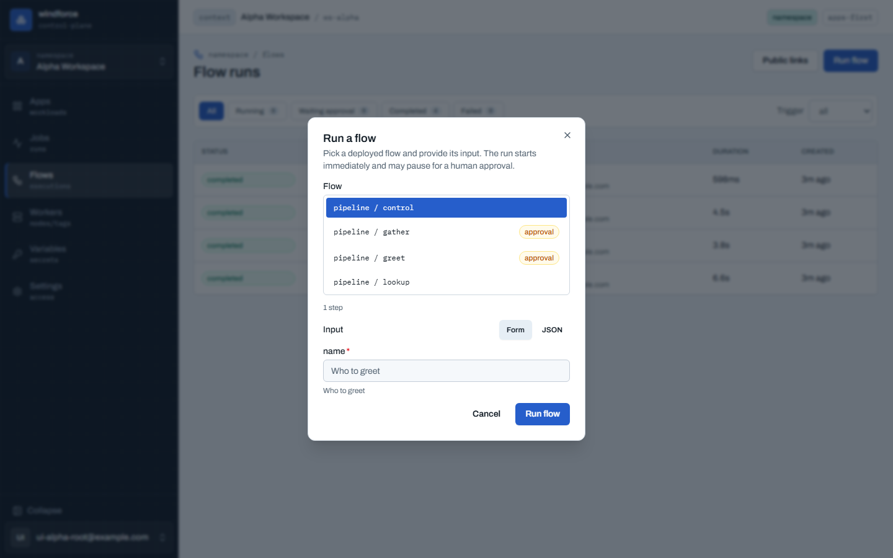

# windforce

**git으로 배포한 코드를 안전하게 실행하는 멀티테넌트 워커 플랫폼.**

windforce는 브라우저에서 앱을 만들고, 코드를 배포하고, API·webhook·schedule·flow로 실행한 뒤, 결과와 로그를 감사 가능한 형태로 남긴다. 사용자는 함수 개발 경험에 집중하고, 운영자는 워커 그룹·스케일·테넌트·관측을 분리된 운영자 평면에서 관리한다.

- **앱과 액션을 만든다** - 앱(App) 안에 액션(Action)을 정의하고 `ctx`를 첫 인자로 받는 핸들러를 작성한다. TypeScript, Python, Go를 같은 플랫폼에서 실행한다.
- **git 커밋으로 실행을 고정한다** - Deploy는 git commit과 sync를 거쳐 카탈로그를 갱신하고, 잡은 enqueue 시점의 commit·entrypoint·schema·timeout을 self-pin한다.
- **콘솔에서 개발 루프를 닫는다** - 에디터, Run preview, diff, Deploy, Jobs, Flows가 하나의 사용자 콘솔에 있다.
- **운영할 수 있다** - Kubernetes 위에서 워커 그룹, capability, 멀티테넌시, 시크릿, 관측, CI/CD를 GitOps로 운영한다.

---

## 어디서 시작할까

-   :material-rocket-launch: **처음 오셨나요?**

    ---

    콘솔에서 첫 액션을 5분 안에 만들고 실행한다. 핵심 개념(Workspace·App·Action·Job)도 여기서. 초대받은 인스턴스가 없으면 Docker Compose로 로컬 평가한다.

    [:octicons-arrow-right-24: 빠른 시작](getting-started/quickstart.md) · [핵심 개념](getting-started/concepts.md) · [로컬 평가](getting-started/self-hosting.md)

-   :material-code-braces: **windforce로 만드는 분 (사용자)**

    ---

    앱·액션을 만들고, 액션 코드를 작성하고, preview와 deploy를 거쳐 잡·flow 결과를 받는 법.

    [:octicons-arrow-right-24: 개발 가이드](guide/development.md) · [앱·액션](guide/apps-and-actions.md) · [Flow](guide/flows.md)

-   :material-server-network: **windforce를 운영하는 분 (운영자)**

    ---

    **운영 self-host는 Kubernetes 기준.** Helm·GitOps 배포, 워커 그룹·스케일, 멀티테넌시, 시크릿, 관측, CI/CD. (로컬 평가는 Docker Compose — [로컬 평가](getting-started/self-hosting.md).)

    [:octicons-arrow-right-24: 운영자 가이드](operating/deployment.md)

-   :material-sitemap: **내부가 궁금하신 분**

    ---

    3 평면 + PG 큐, 큐 스파인의 정확성 불변식, 2계층 샌드박싱, 재현성.

    [:octicons-arrow-right-24: 아키텍처 & 내부 동작](architecture/overview.md)

---

## 한눈에

windforce는 **제어 평면, 워커 평면, 운영자 평면**과 그것들을 잇는 Postgres 큐로 구성된다. "일을 만드는 모든 것은 enqueue하고, 워커는 consume한다"가 전체 설계의 한 줄 요약이다.

| 영역 | 무엇 |
|---|---|
| 언어/스택 | Go 단일 정적 바이너리(`server`/`worker`/`standalone`) · Postgres 큐(외부 브로커 없음) |
| 지원 언어 | TypeScript(정본) · Python · Go — 한 워커가 모두 실행 |
| 격리 | gVisor(호스트 커널 경계) + per-job bubblewrap(테넌트 간 격리) **2계층** |
| 재현성 | 잡이 실행 메타(commit·entrypoint·스키마·timeout)를 자기 자신에 **self-pin** |
| 멀티테넌시 | 워크스페이스별 envelope 암호화 + 사용량 측정·테넌트 quota |
| 배포 | 릴리스 태그 → 인클러스터 CI → Flux GitOps |

---

## 콘솔로 보는 개발 흐름

아래 화면은 실제 API, 일회용 Postgres, 예제 git source, 워커를 띄워 캡처한 사용자 콘솔이다. 정적 mock이 아니라 `demo` 앱과 `pipeline` flow 예제가 sync된 상태에서 나온 화면이다.

Apps에서 앱을 만들거나 연결하고, 배포 커밋과 최근 실행 상태를 확인한다.

전체화면 편집기에서 파일을 고치고, Run preview로 배포 전 코드를 실제 워커에서 검증한다.

Deploy 후에는 Actions, Jobs, Flows에서 실행과 결과를 추적한다. flow는 step과 승인 대기를 `flow_run` 단위로 묶어 보여 준다.

---

!!! info "이 문서 사이트에 대해"
    이 사이트는 **windforce를 사용·운영하는 사람**을 위한 가이드다. 설계 결정의 *근거*(왜 이렇게 했나)는 레포의 [엔지니어링 문서](https://github.com/imprun/windforce/tree/main/docs)(아키텍처 정본·결정 기록·전체 명세)에 정리돼 있고, 이 사이트의 "아키텍처 & 내부 동작" 섹션은 운영에 필요한 만큼을 압축해 설명하고 더 깊은 원문으로 링크한다.
