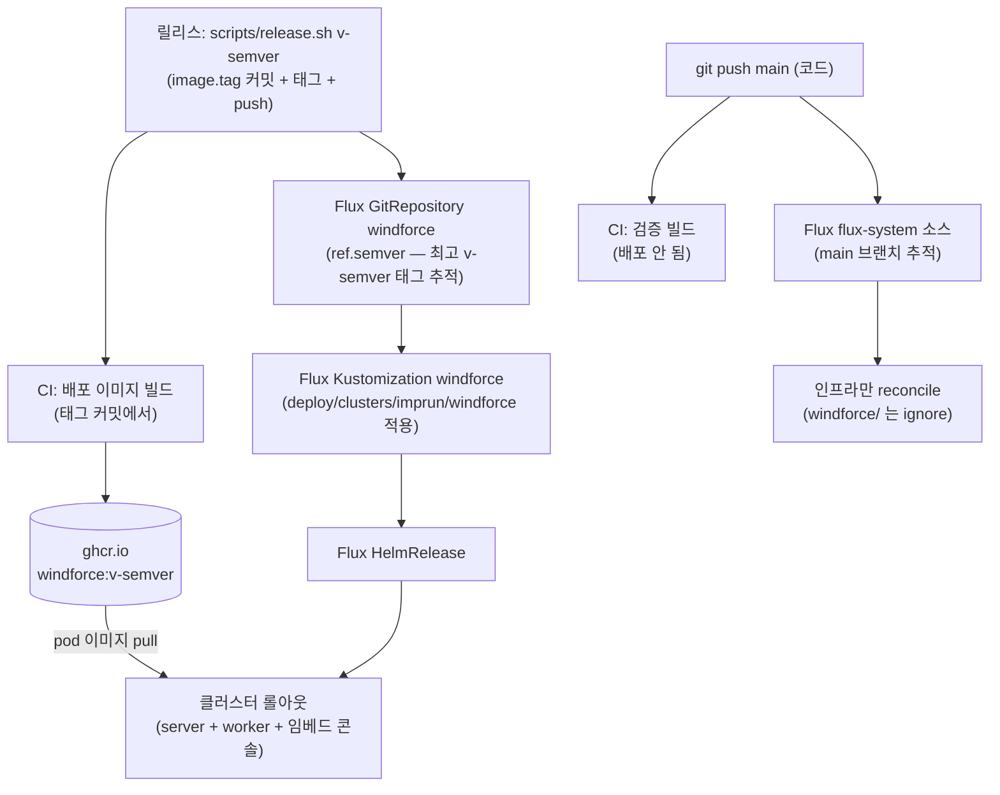

# CI/CD 운영

windforce **플랫폼 자체**(server·worker 바이너리와 임베드된 콘솔)를 클러스터에 배포하는 방법을 다룬다. 핵심은 한 가지다 — 배포는 릴리스 태그 `v<semver>`를 push할 때 일어나고, 그 뒤는 전부 자동이다. 수동 `docker push`나 `helm upgrade`는 쓰지 않는다.

> **이 페이지의 "배포"는 플랫폼 배포다.** 콘솔의 **Deploy 버튼**(사용자가 작성한 액션을 git에 export하는 흐름)은 완전히 다른 층이다 — 그건 [콘솔 가이드](../guide/console.md)와 [앱·액션](../guide/apps-and-actions.md)을 참고한다. 이 페이지는 windforce 바이너리·콘솔 *그 자체*를 어떻게 빌드해 클러스터에 올리느냐다.

> **레퍼런스 배포를 예시로 든다.** 아래 **GitOps·릴리스 모델**(태그=배포 / main=검증, 릴리스 태그를 추적하는 Flux 소스가 롤아웃)은 어디서나 그대로 통한다. 다만 **CI 러너·이미지 레지스트리·부트스트랩 세부**는 이 프로젝트 자체 클러스터의 구성을 예로 든 것이니, 자기 환경(GitHub-hosted 러너, 다른 레지스트리 등)에 맞춰 바꾼다.

## 두 가지 트리거 — 검증과 배포

코드를 main에 push하는 것과 릴리스 태그를 push하는 것은 결과가 다르다.

| 행위 | 빌드되는 이미지 | 배포되나? |
|---|---|---|
| `git push` (main) | 검증 이미지 `main-<run>-<sha>` | **아니오** — 빌드만 하고 끝 |
| `git tag v<semver>` + push | 배포 이미지 `v<semver>` | **예** — Flux가 자동 롤아웃 |

main 머지는 "이 코드가 빌드는 되는가"를 확인하는 검증 단계일 뿐이다. **무엇을 언제 배포할지는 릴리스 태그라는 명시적 행위**가 정한다. 그래서 main에 머지가 쌓여도 운영 환경은 가만히 있고, 릴리스 준비가 됐을 때 태그를 쳐야 비로소 롤아웃된다.

## 파이프라인 한눈에



각 단계가 하는 일:

- **CI 빌드** — CI가 태그된 커밋을 이미지로 빌드해 레지스트리에 push한다. **러너는 무엇이든 좋다**(GitHub-hosted 포함) — 핵심은 *semver 태그로 빌드해 레지스트리에 올리는 것*뿐이다. (이 레퍼런스 환경은 클러스터 노드가 arm64라, 클러스터 안의 arm64 러너 pod(GitHub Actions Runner Controller, ARC)로 네이티브 빌드해 ghcr에 push하고 별도 CI 서버를 두지 않는다 — push 인증은 워크플로의 `GITHUB_TOKEN`.)
- **단일 이미지** — 멀티스테이지 빌드로 콘솔(SPA)을 server 바이너리에 임베드한다. 그래서 **콘솔은 별도 이미지가 아니라** server 바이너리에 들어가고, 하나의 windforce 이미지가 API와 콘솔을 모두 서빙한다.
- **Flux 태그 추적** — `windforce`라는 **별도 GitRepository**(ns `flux-system`)가 ghcr가 아니라 git의 **릴리스 태그**를 본다. `ref.semver: ">=0.0.0"`으로 올라온 `v<semver>` 태그 중 **가장 높은 것**을 골라 그 태그 트리를 artifact로 삼는다. **ghcr 스캔도, git으로 되쓰는 자동 커밋(write-back)도 없다** — 릴리스 커밋 자체가 `image.tag`를 담고(`scripts/release.sh`가 박는다), 태그가 곧 유일한 배포 트리거다.
- **HelmRelease 롤아웃** — `windforce` Kustomization이 그 태그 트리의 `deploy/clusters/imprun/windforce`를 적용한다. git이 클러스터 상태의 정본인 것은 그대로다 — Flux가 HelmRelease를 reconcile해 server·worker를 새 이미지로 굴린다.

main으로의 코드 push는 **앱을 배포할 수 없다** — main을 추적하는 `flux-system` 소스가 `deploy/clusters/imprun/windforce/`를 `ignore`하기 때문이다(`gotk-sync.yaml`의 `spec.ignore`). 그래서 "태그=배포 / main=검증" 불변식이 규율이 아니라 **설계로 강제**된다. 검증 빌드는 이미지만 만들고 어디에도 롤아웃되지 않는다.

## 배포하기

릴리스 준비가 됐으면 릴리스 헬퍼를 한 번 돌린다. 이 스크립트가 `image.tag`를 매니페스트에 박고 커밋한 뒤 그 커밋에 태그를 달아 main과 태그를 함께 push한다.

```bash
scripts/release.sh v0.1.1
# → helmrelease.yaml(image.tag)·render-workers-cronjob.yaml(image)에 v0.1.1 박기
# → "release: windforce v0.1.1" 커밋 → 그 커밋에 태그 → main+태그 push

# 빌드 진행 확인
gh run watch

# CI가 끝나면 windforce GitRepository가 최고 태그를 잡아 Kustomization → HelmRelease → 롤아웃
```

태그 push 후엔 기다리면 된다. 즉시 반영을 보려면 아래 강제 reconcile로 단계를 당길 수 있다.

## 지금 무엇이 떠 있나

배포 상태의 정본 가시성은 Grafana 대시보드다. CLI로 즉답이 필요하면:

```bash
flux get all -A            # GitRepository / Kustomization / HelmRelease 한눈에

# windforce 앱 소스가 지금 추적 중인 릴리스 태그 (v-semver@sha1:...)
kubectl -n flux-system get gitrepository windforce \
  -o jsonpath='{.status.artifact.revision}'

kubectl -n windforce get helmrelease windforce

# 실제로 배포된 이미지 태그
kubectl -n windforce get deploy windforce-server \
  -o jsonpath='{.spec.template.spec.containers[0].image}'
```

## 강제 reconcile

Flux의 주기적 조정을 기다리기 싫을 때, 앱 소스부터 순서대로 당긴다.

```bash
flux reconcile source git windforce            # 태그 재해소 (최고 v-semver)
flux reconcile kustomization windforce
flux reconcile helmrelease windforce -n windforce
```

flux CLI 없이 annotate로도 같은 일을 한다.

```bash
kubectl -n flux-system annotate gitrepository windforce \
  reconcile.fluxcd.io/requestedAt="$(date +%s)" --overwrite
kubectl -n flux-system annotate kustomization windforce \
  reconcile.fluxcd.io/requestedAt="$(date +%s)" --overwrite
```

## 롤백

직전 정상 릴리스로 되돌린다. 주의할 점이 하나 있다 — **`windforce` GitRepository는 항상 가장 높은 semver 태그를 고른다.** 그래서 옛 태그를 다시 미는 것만으로는 롤백되지 않는다(추적기가 여전히 최고 태그를 집는다). 이미지 자동화가 없으니 `flux suspend`/`resume`도 없다.

두 가지 올바른 절차:

```bash
# 방법 A — 나쁜 태그를 지운다 → semver가 직전 최고 태그로 폴백 → 자동 재배포
git push --delete origin v0.1.1
git tag -d v0.1.1                       # 로컬 태그도 정리

# 방법 B — 직전 정상 코드 상태에서 더 높은 새 태그를 낸다
#          (CI가 그 코드를 새 이미지로 다시 빌드해 롤아웃)
git checkout <직전 정상 커밋>
scripts/release.sh v0.1.2
```

방법 A는 나쁜 태그가 사라지면 추적기가 다음으로 높은 (직전 정상) 태그를 골라 그 트리의 `image.tag`로 되돌린다. `main`에는 여전히 나쁜 릴리스 커밋이 남지만, main은 `windforce/`를 배포하지 않으므로(ignore) 무해하다.

## 차트만 바꿀 때

바꾸는 것이 무엇이냐에 따라 반영 경로가 갈린다.

- **차트 템플릿**(`deploy/helm/windforce/**` — 예: HTTPRoute, 리소스 한도 헬퍼)은 **main을 추적**한다. HelmRelease가 이 차트를 `flux-system`(main) 소스에서 직접 읽으므로, 템플릿 변경은 main push만으로 반영되고 **이미지를 다시 빌드할 필요가 없다.** (빌드 워크플로는 `deploy/**` 변경을 무시하므로 불필요한 이미지 빌드도 없다.)
- **HelmRelease 값·시크릿·렌더된 워커 ConfigMap**(`deploy/clusters/imprun/windforce/**` — `helmrelease.yaml`의 `image.tag`·route·env, `*.sops.yaml`, `workers-configmap.yaml`)은 이제 **태그로 게이트된다.** 이 디렉터리는 main 소스가 `ignore`하고 태그를 추적하는 `windforce` Kustomization만 적용하므로, 값만 바꿔도 **릴리스 태그를 내야** 반영된다. (cilium·cert-manager·monitoring·pg 같은 다른 인프라 디렉터리는 여전히 main 추적이라 즉시 조정된다.)

## 부트스트랩 함정 (1회 — 또는 재해 복구)

아래는 이 레퍼런스 배포(Flux + 인클러스터 ARC + private ghcr)를 세팅할 때 알아둘 함정들이다. **예전 이미지 자동화 시절의 함정(bump push용 read-write 키, 이미지 컨트롤러 포함, `Terminating`에 묶인 Image* CRD)은 태그 추적 모델로 오면서 대부분 사라졌다** — Flux가 더 이상 git에 되쓰지 않기 때문이다. 다른 러너/레지스트리를 쓰면 일부는 해당 없다. 모두 부트스트랩 시 1회성이지만, 순서를 어기면 막히므로 미리 알아둔다.

부트스트랩은 이제 추가 이미지 컨트롤러도, read-write 키도 필요 없다 — 표준 bootstrap이면 된다:

```bash
flux bootstrap github \
  --owner <owner> --repository <repo> --branch main \
  --path deploy/clusters/<cluster> --personal
```

이미지 pull 자격(ghcr private 패키지)은 **`windforce` 네임스페이스**에만 두면 된다 — pod가 이미지를 pull할 dockerconfigjson Secret(HelmRelease의 `imagePullSecrets: ghcr-pull`). 예전의 `flux-system` 네임스페이스 **스캔용** secret은 이미지 자동화와 함께 사라졌다.

### 함정 1 — `flux-system/kustomization.yaml`는 명시 목록이다

`deploy/clusters/imprun/flux-system/kustomization.yaml`은 자동 스캔이 아니라 **명시적 `resources` 목록**이다. `flux-system/` 아래 새 파일(예: 앱 소스를 정의하는 `windforce-source.yaml`)을 추가하면 **이 목록에 반드시 등록**해야 한다 — 빠뜨리면 에러 하나 없이 조용히 적용되지 않는다.

### 함정 2 — `windforce` GitRepository의 git 자격 (read-only로 충분)

앱을 배포하는 별도 `windforce` GitRepository는 repo를 읽어 태그를 해소하려면 git 자격이 필요하다 — bootstrap이 만든 `flux-system` Secret을 그대로 `secretRef`로 재사용한다. **이제 Flux가 git에 되쓰지 않으므로 read-only deploy key로 충분하다** — 예전처럼 `--read-write-key=true`를 켤 이유가 없다.

### 함정 3 — 차트 라벨의 `+`

Flux가 git에서 차트를 패키징하면 차트 버전이 `0.1.0+<sha>`가 된다. `+`는 k8s 라벨로 부적합이라 HelmRelease가 `Invalid value ... must be ...`로 실패한다. 차트의 `helm.sh/chart` 라벨 헬퍼가 `+`를 새니타이즈하면 해결된다(현재 차트에는 이미 반영돼 있다 — 새 차트를 만들 땐 같은 패턴을 유지한다).

## ARC 러너 메모

이 레퍼런스 환경은 인클러스터 러너(ARC)로 빌드한다 — 그 운영 메모다. **GitHub-hosted 러너나 다른 CI를 쓰면 이 절은 건너뛴다.**

- **러너 스케일셋** — `arc-runners` 네임스페이스, repo 스코프, `containerMode=dind`, `minRunners=0`/`maxRunners=2`. 유휴 시 러너 pod는 0개다(빌드가 들어올 때만 뜬다).
- **ghcr 패키지 접근** — private 패키지는 빌드 레포에 **Actions repo-access**를 부여해야 push가 된다(패키지 → Manage Actions access → 빌드 레포 Write). 누락되면 빌드 push가 `403 Forbidden`으로 실패한다.
- **빌드 캐시** — BuildKit registry cache(`type=registry`)로 ephemeral 러너에서도 Go·레이어 캐시를 유지한다.

## 더 보기

- [시크릿 관리 (SOPS + age)](secrets.md) — 클러스터 시크릿(DB 자격·이미지 pull 토큰 등)을 암호화한 채 git에 선언하고 Flux가 복호하는 흐름.
- [콘솔 가이드](../guide/console.md) — 사용자 앱의 **Deploy 버튼**(액션 git export)은 이쪽 — 플랫폼 배포와 다른 층.
- [CI/CD 운영 가이드 (원문)](https://github.com/imprun/windforce/blob/main/docs/operations/deployment-and-operations.md) — 구성 요소 표·이미지 태그 규칙 등 클러스터 고유 상세.
- [ADR-0024: CI/CD — 인클러스터 빌드 + Flux GitOps](https://github.com/imprun/windforce/blob/main/docs/decisions/decision-ledger.md) — 이 모델을 택한 결정 근거.
