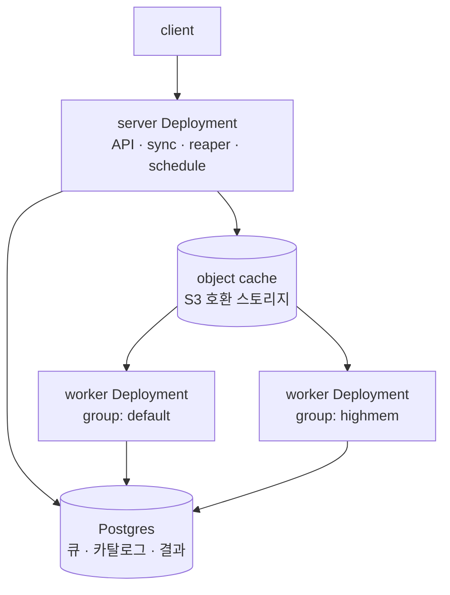

# Kubernetes 배포

이 페이지는 windforce를 Kubernetes 클러스터에 배포·운영하는 방법을 다룬다. 배포 토폴로지(server·worker·migration), object cache 구성, 무중단 업데이트(graceful drain)와 health probe, 샌드박스 실행을 위한 securityContext·RuntimeClass, 그리고 Helm/GitOps로 클러스터 상태를 관리하는 절차를 설명한다.

> **이 문서가 운영(production) self-host의 기준이다.** [Docker Compose 스택](../getting-started/self-hosting.md)은 로컬 평가·기능 테스트용이고, 운영에 필요한 격리(gVisor + bubblewrap)·스케일(KEDA)·노드 배치·GitOps reconcile·백업·NetworkPolicy는 여기 Kubernetes 경로에서 구성한다. 콘솔 저작 경험은 같고 운영 모델이 다르다.

## 운영 모델 한눈에

windforce의 배포 모델은 **잡(job)마다 Pod를 만들지 않는다**. 핵심은 다음과 같다.

- **상시 worker Deployment가 PG 큐를 pull한다.** 워커는 늘 떠 있고, Postgres의 잡 큐에서 자기 태그에 맞는 잡을 claim해 실행한다. K8s Job/Pod를 잡 단위로 생성하지 않는다.
- **K8s와 windforce의 책임이 나뉜다.** K8s는 worker pod의 수명·replica 수·resource·노드 배치를 책임지고, windforce는 PG 큐의 claim/heartbeat/reaper로 잡 실행 소유권을 책임진다.
- **worker pod는 한 번에 한 잡을 실행한다.** 처리량은 worker group별 replica 수로 확장한다.
- **클러스터 리소스는 운영자가 Helm/GitOps/kubectl로 관리한다.** windforce control plane은 Deployment를 직접 만들거나 patch하지 않고, 워커 상태·큐 메트릭·관측 API만 제공한다.



## 컴포넌트

배포는 세 가지 워크로드와 하나의 데이터스토어로 구성된다.

| 컴포넌트 | 역할 | K8s 형태 |
|---|---|---|
| **migration** | server/worker 시작 전에 DB 스키마를 적용 | 단일 실행 Job (Helm pre-install/pre-upgrade hook) |
| **server** | HTTP API · 콘솔 SPA · git sync · reaper · schedule 발화 | Deployment |
| **worker** | PG 큐에서 잡을 claim해 실행 | group/tag별 Deployment |
| **Postgres** | 카탈로그 · 큐 · 결과 · 스케줄 · 계정 (정본 상태 전부) | 데이터스토어 |

### migration Job

스키마 마이그레이션은 server/worker가 뜨기 **전에 단일 실행 Job으로** 적용한다. 여러 pod가 동시에 마이그레이션을 수행하지 않도록 막는 것이 핵심이다. Helm 차트에서는 migration이 `pre-install`/`pre-upgrade` hook으로 본체 롤아웃 전에 한 번 실행된다. 마이그레이션은 forward-only·additive라 구 pod와 신 스키마가 잠시 공존해도 안전하다 — 무중단 업그레이드의 전제다.

### server

`server`는 HTTP API와 콘솔 SPA, git sync, reaper, schedule 발화 루프를 한 바이너리에 담는다. 콘솔(SPA)은 server 바이너리에 임베드되어 있어 별도 정적 이미지가 필요 없다.

**server replica를 2 이상으로 늘려도 안전하다.** 모든 백그라운드 역할에 cross-pod 중복 실행을 막는 장치가 있다.

- reaper는 행 잠금(`FOR UPDATE SKIP LOCKED`) 기반이라 여러 pod가 동시에 돌아도 안전하다.
- deploy/manual sync는 git source별 DB lease로 같은 소스의 중복 실행을 직렬화한다.
- schedule 발화는 행 단위 claim으로 같은 회차가 정확히 한 번만 enqueue된다.

### worker

worker는 group/tag별 Deployment로 운영한다. group마다 resource requests/limits, nodeSelector, tolerations, affinity를 다르게 둘 수 있다. 워커 pod에는 실행에 필요한 환경변수(`DATABASE_URL`·`SECRET_KEY`·`BASE_URL`·`WORKER_TAGS` 등)만 주입한다.

**git credential은 워커에 주입하지 않는다.** git clone과 materialize는 server/sync 쪽 책임이고, 워커는 object cache에서 커밋별 소스만 받아 실행한다.

```yaml
workers:
  - name: default
    replicas: 3
    tags: ["default"]
    resources:
      requests: { cpu: "500m", memory: "1Gi" }
      limits:   { cpu: "1",    memory: "2Gi" }
  - name: highmem
    replicas: 1
    tags: ["highmem"]
    resources:
      requests: { cpu: "1", memory: "4Gi" }
      limits:   { cpu: "2", memory: "8Gi" }
```

워커 그룹·태그 라우팅·스케일에 대한 자세한 운영은 [워커 그룹·스케일](worker-groups.md)을 참고한다.

## object cache (소스 분배)

server는 git에서 받은 커밋별 소스를 **object cache**에 두고, 워커는 거기서 소스를 받아 실행한다. 백엔드는 환경변수 `STORAGE_BACKEND`로 고른다.

| 백엔드 | 구성 | 언제 |
|---|---|---|
| **`s3` (권장)** | MinIO 호환 오브젝트 스토리지 (`S3_ENDPOINT`·`S3_BUCKET`·자격증명) | 다중 노드 워커 확장의 기본 선택. server와 워커가 공유 볼륨 없이 같은 캐시를 본다 |
| **`local` + RWX PVC** | server·worker가 같은 ReadWriteMany 볼륨을 `STORAGE_ROOT`에 mount | 단일 노드/소규모에서만 |

피해야 할 구성:

- server와 워커가 각자 `emptyDir`이나 pod-local PVC를 object cache로 쓰는 형태 (서로 캐시가 갈린다).
- 워커가 git credential을 받아 직접 clone하는 형태.

워커 안에서 `bun install`로 만들어지는 `node_modules`는 **워커 pod 내부 캐시**다. pod 재시작 시 사라질 수 있지만 이는 correctness 문제가 아니라 cold start 비용 문제로 본다 — 다음 실행에서 재생성된다.

## graceful drain — 무중단 업데이트

워커가 받는 `SIGTERM`은 "실행 중인 잡을 죽이는 신호"가 아니라 **drain 신호**다. 롤링 업데이트·scale-in 시 진행 중인 잡이 유실되지 않도록 동작한다.

- `SIGTERM`을 받으면 **즉시 새 잡 claim을 멈춘다.** 이미 실행 중인 잡은 `WORKER_DRAIN_TIMEOUT_S`(기본 600초)까지 계속 돌고, drain 동안에도 heartbeat를 유지해 reaper가 좀비로 오인하지 않는다.
- grace 안에 끝나면 정상 완료한다.
- grace를 넘기면 실행이 취소되고 heartbeat가 끊겨, reaper가 기존 좀비 회수 경로로 안전하게 회수한다 — 데이터 유실 없는 정상 복구 경로다.

차트는 `terminationGracePeriodSeconds`를 `drainTimeoutSeconds + 30`으로 잡아, SIGKILL이 떨어지기 전에 drain이 끝나도록 한다.

## health probe

server는 두 가지 probe를 노출한다.

- **liveness `/healthz`** — 프로세스가 살아 있는지. 실패하면 K8s가 pod를 재시작한다.
- **readiness `/readyz`** — DB ping. DB가 응답할 때만 트래픽을 받는다. DB가 끊기면 readiness가 빠져 새 요청이 라우팅되지 않는다.

워커는 별도로 모니터링한다 — pod restart count와 OOMKilled 여부, group별 alive worker 수와 마지막 ping을 본다. 관측 항목은 [관측](observability.md)을 참고한다.

## securityContext와 샌드박스 RuntimeClass

windforce의 기본 하드닝과 비신뢰 코드 실행을 위한 2계층 샌드박스 구성이다.

### 하드닝 기본값

차트의 securityContext 기본값은 다음과 같다.

- **non-root 실행** (uid 65532).
- **모든 capability drop** (`drop: ["ALL"]`).
- 쓰기 경로는 스크래치용 `/data` emptyDir 하나로 제한.
- `networkPolicy.enabled=true`면 워커는 전면 ingress 차단, server는 8080 포트만 연다.

스크립트 실행 pod에는 writable work/cache dir이 필요하므로, read-only root filesystem을 적용하려면 writable mount 경로를 명시해야 한다.

### 2계층 샌드박스 (gVisor + bubblewrap)

비신뢰 저자 코드는 **per-job 2계층 샌드박스** 아래에서 실행된다.

- **gVisor (RuntimeClass)** — 호스트 커널과의 경계. 워커 pod가 gVisor sentry 안에서 돌아 호스트 커널 syscall에 직접 닿지 않는다.
- **bubblewrap (per-job 네임스페이스)** — 같은 워커가 처리하는 잡 사이의 격리. 잡은 다른 워크스페이스 캐시·형제 잡 토큰·호스트 시크릿에 닿지 못한다.

샌드박스를 켜는 절차는 **노드 프로비저닝**과 **앱 배선** 두 단계다. 순서를 지키지 않으면(앱만 켜고 노드가 준비 안 되면) 워커 pod가 스케줄에 실패한다.

**1) 노드 프로비저닝** — 워커를 돌릴 컨테이너 런타임 노드에 gVisor 런타임(`runsc`)을 설치한다. 이는 노드 라벨로 게이트되는 인스톨러 DaemonSet으로 자동화되어 있어, 노드에 라벨을 달면 그 노드에만 적용된다.

```bash
kubectl label node <node-name> windforce.io/gvisor-runtime=enabled
```

**2) 앱 배선 (Helm)** — RuntimeClass를 만들고 워커가 그것을 쓰도록 지정한다.

```bash
helm upgrade --install windforce deploy/helm/windforce \
  --set gvisor.runtimeClass.create=true \
  --set workers[0].runtimeClassName=gvisor
```

전역 `runtimeClassName: gvisor` 또는 워커 그룹별 `workers[].runtimeClassName: gvisor`로 지정할 수 있다 — 고-비신뢰 태그 그룹부터 단계적으로 거는 롤아웃이 가능하다. 켜진 워커 pod에서 `uname -a`가 `gVisor`를 보이면 sentry 안에서 도는 것이다.

> **주의**: gVisor는 컨테이너 런타임이 containerd인 노드에서 동작한다. I/O가 많은 잡은 로컬 파일시스템 syscall에 약 2배 오버헤드가 있으나, 연산·외부 네트워크 위주 잡은 거의 영향이 없다.

샌드박스 모델의 동작·격리 보장에 대한 자세한 설명은 [2계층 샌드박싱](../architecture/sandboxing.md)에 있다.

## Helm으로 배포하기

> 대상 클러스터가 arm64 노드라면 이미지는 `linux/arm64`로 빌드한다.

### 1) 이미지 빌드·푸시

```bash
docker buildx build --platform linux/arm64 \
  -t <registry>/windforce:<tag> --push .
```

### 2) Secret 생성

자격증명은 values에 넣지 않는다. 차트는 `existingSecret`(기본 이름 `windforce`)를 `envFrom`으로 주입한다.

```bash
kubectl create secret generic windforce \
  --from-literal=DATABASE_URL='postgres://...' \
  --from-literal=SECRET_KEY="$(openssl rand -hex 32)" \
  --from-literal=S3_ACCESS_KEY=... \
  --from-literal=S3_SECRET_KEY=...
```

`SECRET_KEY`는 모든 server/worker가 같은 값을 공유해야 한다. 시크릿을 git으로 선언적으로 관리하는 법은 [시크릿 관리 (SOPS + age)](secrets.md)를 참고한다.

### 3) 설치 / 업그레이드

migration Job이 본체 롤아웃 전에 단일 실행된다.

```bash
helm upgrade --install windforce deploy/helm/windforce \
  --set image.repository=<registry>/windforce --set image.tag=<tag> \
  --set env.S3_ENDPOINT=minio.example.svc:9000 \
  --set env.PUBLIC_BASE_URL=https://windforce.example.com
```

### 4) 워커 그룹 추가

values의 `workers` 목록에 group(`name`·`tags`·`replicas`·`resources`·`drainTimeoutSeconds`)을 추가하면 group별 Deployment가 생성된다.

## GitOps로 운영하기

수동 `helm upgrade`는 부트스트랩이나 검증 용도다. windforce는 **클러스터 상태의 정본을 git에 두는 GitOps 모델**로 운영하도록 설계됐다.

- **배포 트리거는 릴리스 태그 `v<semver>`다.** main 코드 push는 검증 이미지를 빌드할 뿐 배포하지 않는다. 릴리스 태그를 push하면 CI가 그 태그로 배포 이미지를 빌드하고, image automation이 그 태그를 git의 `HelmRelease`에 커밋해 클러스터에 반영한다. 롤백은 `HelmRelease`의 태그를 직전 정상 버전으로 되돌린다(= git revert).
- **플랫폼 의존성도 git 한 곳에서 선언한다.** Flux 디렉토리를 `infrastructure`(오퍼레이터·컨트롤러·CRD) → `data`(Postgres·오브젝트 스토리지 인스턴스) → `apps`(windforce) 계층으로 나누고, `dependsOn`으로 적용 순서를 강제한다.
- **데이터스토어는 prune 사고로부터 격리한다.** Postgres·오브젝트 스토리지 인스턴스는 앱의 `prune: true` 루프 밖, 자체 Kustomization(`prune: false`)에 두고 오퍼레이터 finalizer로 보호한다 — 오배포가 PVC를 지우지 못하게 한다.
- **레지스트리 pull 자격은 git 밖에 둔다.** ghcr pull 자격(`ghcr-pull` dockerconfig Secret)은 클러스터에 out-of-band로 두고 values는 이를 참조만 한다.

GitOps·릴리스 파이프라인의 운영 절차는 [CI/CD 운영](cicd.md)에서 자세히 다룬다.

## 백업과 복구

**정본 상태는 Postgres가 전부**다(카탈로그·큐·결과·스케줄·계정). object cache(S3)는 git에서 재sync하면 복원되는 캐시라 백업 대상이 아니다 — 단, 배포된 커밋의 소스 가용성은 git 저장소 보존에 달려 있다.

Postgres는 인클러스터 CloudNativePG 오퍼레이터로 운영하면 WAL 연속 아카이빙 + 주기 base backup으로 시점복구(PITR)를 구성할 수 있다.

```bash
# 복구 창 시작점과 마지막 성공 백업 확인
kubectl -n windforce get cluster windforce-db \
  -o jsonpath='{.status.firstRecoverabilityPoint} {.status.lastSuccessfulBackup}'
```

복구는 새 `Cluster`를 같은 백업 스토어를 source로 `bootstrap.recovery`로 띄우고 복구 시점을 지정한다. 복구된 PG가 뜨면 server migration Job → 필요한 앱 재sync로 object cache를 다시 채운다.

## 더 보기

- [워커 그룹·스케일](worker-groups.md) — group/태그 라우팅, replica 확장, 오토스케일
- [멀티테넌시·운영자 평면](multitenancy.md) — 워크스페이스 격리와 공유 워커 풀
- [시크릿 관리 (SOPS + age)](secrets.md) — 시크릿을 git에 선언적으로 관리
- [관측 (Observability)](observability.md) — 큐 헬스·워커·연결 풀러 모니터링
- [CI/CD 운영](cicd.md) — 릴리스 태그 → CI → Flux GitOps 파이프라인
- [2계층 샌드박싱](../architecture/sandboxing.md) — gVisor + bubblewrap 격리 모델
- 엔지니어링 원문: [Kubernetes 운영 모델](https://github.com/imprun/windforce/blob/main/docs/operations/operator-runbooks.md) · 결정 기록 [ADR-0024](https://github.com/imprun/windforce/blob/main/docs/decisions/decision-ledger.md) · [ADR-0025](https://github.com/imprun/windforce/blob/main/docs/decisions/decision-ledger.md)
