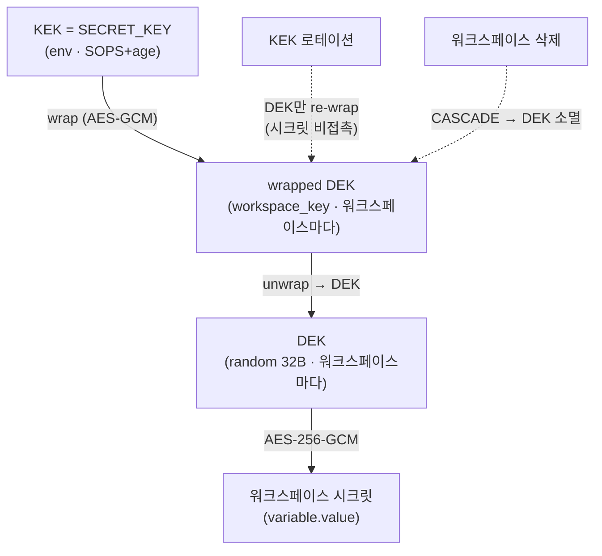
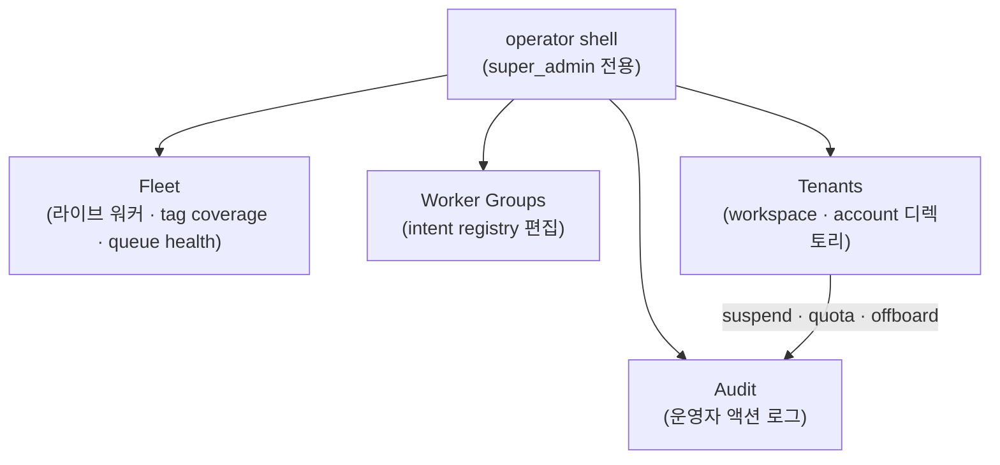
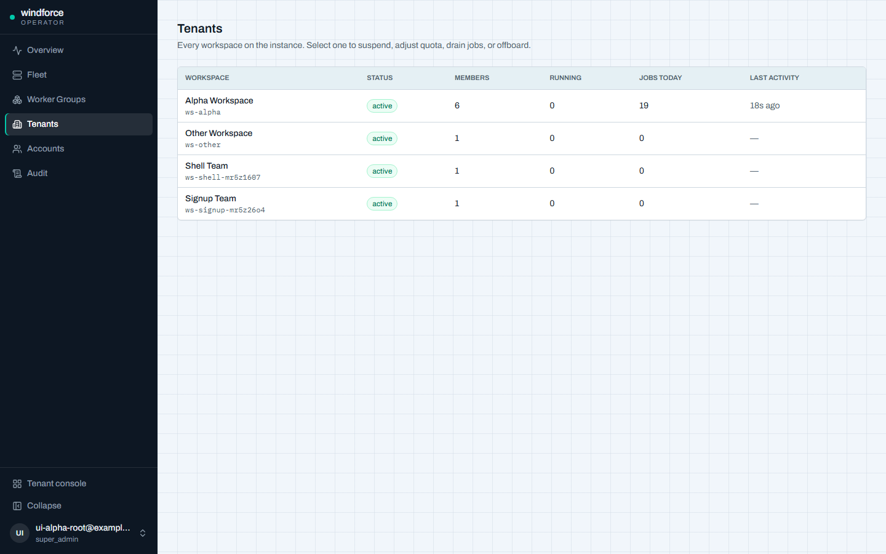
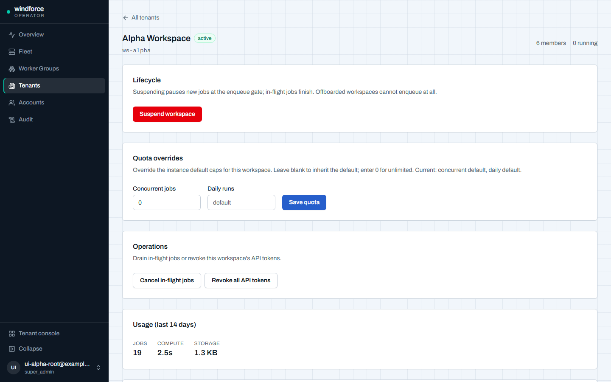
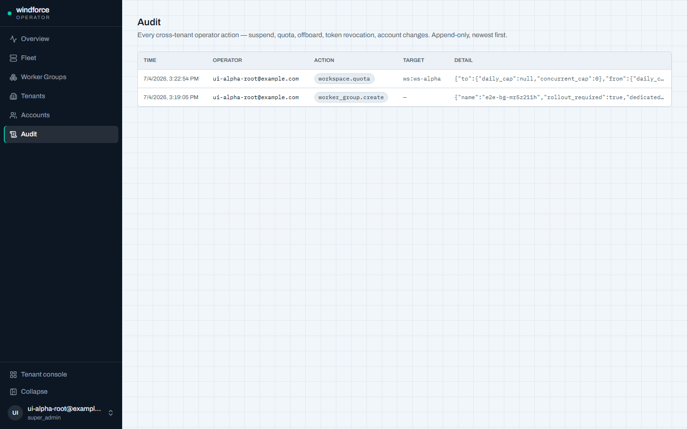

# 멀티테넌시·운영자 평면

windforce는 한 인스턴스 안에 여러 테넌트를 격리해 담는다. 이 페이지는 운영자 관점에서 테넌트 경계가 어떻게 그어지는지, 워크스페이스별 시크릿이 어떻게 암호화·폐기되는지, 사용량을 어떻게 측정하고 quota로 제한하는지, 그리고 instance 운영자가 어떤 콘솔로 테넌트를 관리하는지를 설명한다.

## 워크스페이스 = 테넌트 경계

windforce에서 **테넌트 경계는 워크스페이스(workspace)** 다. 스크립트·앱(Application Project)·액션·잡·시크릿·상태·리소스는 모두 한 워크스페이스에 속하며, 다른 워크스페이스에서 보이지 않는다.

워크스페이스를 만들면 같은 트랜잭션에서 세 가지가 함께 생긴다:

- 워크스페이스 행
- 워크스페이스 암호화 키(아래 envelope 암호화)
- 첫 워크스페이스 관리자(workspace admin) 멤버십

소유자(enabled workspace admin) 없는 워크스페이스는 유효한 상태가 아니다. 즉 모든 워크스페이스는 항상 최소 한 명의 관리자를 가진다.

워크스페이스 라우트(`/api/w/{workspace_id}/...`)는 라우트의 `workspace_id`를 권한 기준으로 삼는다. 요청 본문에 담긴 workspace 값은 권한 근거가 아니다. 서로 다른 워크스페이스에 묶인 토큰으로 다른 워크스페이스 라우트를 호출하면 403으로 거부된다.

## account vs membership

windforce는 **전역 로그인 계정(account)** 과 **워크스페이스 멤버십(membership)** 을 분리한다. 한 사람이 여러 워크스페이스에 속할 수 있고, instance 권한과 워크스페이스 권한은 별개이기 때문이다.

| 개념 | 무엇 | 어디에 산다 |
|---|---|---|
| `account` | 워크스페이스 바깥의 전역 로그인 identity(email·비밀번호/OIDC subject·`disabled`·`super_admin`) | 전역 |
| `workspace_member` | 한 account가 특정 워크스페이스 안에서 갖는 멤버십(`is_admin`·`disabled`·username) | 워크스페이스별 |

핵심 규칙:

- **워크스페이스 라우트는 account가 아니라 멤버십으로 인가한다.** 세션/API 토큰이 account를 증명해도, `/api/w/{ws}` 요청은 그 워크스페이스의 enabled member여야 통과한다. 멤버십이 없으면 403이다.
- 예외는 instance `super_admin` 하나뿐이다(아래 운영자 평면). super_admin이 워크스페이스에 예외 접근하면 워크스페이스-로컬 감사에 super_admin 접근임을 남긴다.
- **instance `super_admin`과 워크스페이스 관리자는 다르다.** 워크스페이스 관리자는 자기 워크스페이스의 앱·액션·배포·토큰·멤버 관리 권한이고, 전체 워크스페이스 목록·instance 워커 관측·instance 설정은 super_admin만 본다.

토큰은 종류가 셋이고 수명·저장·노출이 다르다.

- **세션 토큰(`session`)** — UI 브라우저용. HttpOnly·Secure·SameSite 쿠키로만 전달하고, localStorage에 저장하지 않는다.
- **API 토큰(`api`)** — 외부 API/CLI/automation용 bearer 토큰. 기본이 워크스페이스-바운드이고, 생성 응답에서 raw 값을 한 번만 보여준 뒤 DB에는 해시와 prefix만 남긴다.
- **잡 토큰(job token)** — 워커가 잡을 claim한 뒤 mint하는 stateless HMAC. DB 토큰 테이블에 행을 만들지 않으며 SDK callback 전용이다. 사용자/API 토큰으로 잡 SDK callback을 호출할 수 없다.

잡을 만들거나 배포할 때는 감사용으로 두 주체를 함께 기록한다: `created_by`(실제 인증 주체, 예 `u:alice@example.com`·`api:deploy-bot`·`system:git-sync`)와 `permissioned_as`(워크스페이스 안에서 권한을 적용할 principal).

## 워크스페이스별 envelope 암호화

워크스페이스 시크릿(`is_secret` 변수 값)은 **워크스페이스마다 독립인 데이터 키(DEK)** 로 AES-256-GCM 암호화된다. 그 DEK는 인스턴스 키(KEK)로 감싸(wrap) 저장한다. 이 2계층 구조(envelope)가 운영자에게 주는 것은 **싼 키 로테이션**과 **확실한 시크릿 폐기(crypto-shred)** 두 가지다.

핵심 성질:

- **DEK는 파생이 아니라 랜덤이다.** 워크스페이스 생성 시 32바이트 랜덤 키를 뽑으므로 워크스페이스 간 암호학적으로 독립이다. 한 워크스페이스 DEK가 노출돼도 다른 워크스페이스 시크릿을 위협하지 않는다.
- **KEK는 인스턴스 비밀 `SECRET_KEY`** 다. env로 주입하고 SOPS+age로 보호한다(별도 인프라 없음). `workspace_key.kek_version`이 어느 KEK로 wrap됐는지 추적한다.

### KEK 로테이션

`SECRET_KEY`가 유출돼 교체해야 하면, 각 워크스페이스의 wrapped DEK만 **구 KEK로 unwrap → 신 KEK로 re-wrap**하고 `kek_version`을 올린다. **시크릿 행은 전혀 건드리지 않는다** — 이게 envelope의 핵심 이득이다. 따라서 키 교체는 워크스페이스 수만큼의 re-wrap이지, 모든 시크릿 재암호화가 아니다.

로테이션 동안에는 구·신 KEK를 모두 보유하기 위해 `SECRET_KEY_PREVIOUS`를 설정한다. unwrap을 두 키로 모두 시도하므로 무중단이다. 진행 중 잡의 HMAC 토큰도 `SECRET_KEY`와 `SECRET_KEY_PREVIOUS` 양쪽으로 검증한다. 로테이션 grace가 끝나(모든 구 토큰 만료) `SECRET_KEY_PREVIOUS`를 제거하면 회전이 완료된다.

| 단계 | 동작 |
|---|---|
| 1 | 새 `SECRET_KEY`를 준비하고, 기존 키를 `SECRET_KEY_PREVIOUS`로 설정 |
| 2 | re-wrap 절차로 모든 워크스페이스의 DEK를 신 KEK로 다시 감싸고 `kek_version`을 올림 |
| 3 | grace 동안 양쪽 KEK로 unwrap·토큰 검증(무중단) |
| 4 | 구 토큰이 모두 만료되면 `SECRET_KEY_PREVIOUS` 제거 |

### crypto-shred 오프보딩

`workspace_key`는 `workspace`에 `ON DELETE CASCADE`로 묶여 있다. wrapped DEK가 시크릿을 푸는 **유일한** 경로이고 DEK는 랜덤이라 재파생이 불가능하므로, **워크스페이스 삭제 = DEK 소멸 = 그 워크스페이스 시크릿 영구 복호 불가**가 성립한다. 이것이 crypto-shredding이며, 데이터를 일일이 지우는 대신 키 하나를 폐기해 삭제를 보장하는 표준 방식이다(GDPR 삭제 요청의 암호학적 근거).

오프보딩은 두 단계다(아래 운영자 평면의 "오프보딩"과 같은 동작).

1. **soft-delete**(`status=deleted`) — 회수 가능한 상태로 먼저 둔다. 신규 잡 enqueue는 막힌다.
2. **crypto-shred** — workspace DEK를 파기한다. 비가역이므로 이중 확인(워크스페이스 키 타이핑)과 감사를 강제한다.

!!! warning "비가역"
    crypto-shred는 되돌릴 수 없다. shred된 워크스페이스를 `deleted`에서 `active`로 부활시키는 경로는 차단되어 있어, 키를 파기한 뒤 시크릿을 다시 읽을 수단은 없다.

!!! note "신뢰 경계"
    KEK는 여전히 단일 인스턴스 비밀이다. SOPS+age로 보호하지만, 인스턴스 운영자는 모든 DEK를 unwrap할 수 있다 — 즉 운영자는 모든 테넌트 시크릿을 풀 수 있는 신뢰 경계 안에 있다. 테넌트별 키(BYOK)는 envelope가 구조적으로 열어두지만 현재 범위 밖이다.

## 사용량 측정 + quota

windforce는 테넌트별 사용량을 측정하고, 한 테넌트가 자원을 독점하지 못하게 quota로 제한한다. 측정과 quota는 **같은 카운터**를 공유한다.

### 측정

잡 완료 시 완료 트랜잭션 안에서 일별 카운터를 additive upsert한다(`jobs+1`, `exec_ms += duration_ms`). 별도 롤업 잡이 없고, day 컬럼 자체가 일 단위 그레인이라 범위 조회는 그 날들을 합산한다. 저장량은 시점 조회(변수 값·잡 로그 바이트 합)다.

- **워크스페이스 사용량 API**: `GET /api/w/{ws}/usage?from=&to=` → 일별 `{day, jobs, exec_ms}` + `storage_bytes`.
- 콘솔의 워크스페이스 Settings에 사용량 요약(실행 수·실행 시간·저장량 표)이 나온다. 과금 UI가 아니라 측정 표다.

### quota

실행 quota는 **단일 enqueue 경로 진입 전 앞단 가드**로 집행된다. 큐 자체는 건드리지 않고, enqueue 전에 거른다. 따라서 api·webhook·schedule 등 모든 트리거가 같은 게이트를 상속한다.

| 한도 | 초과 시 | 키/범위 |
|---|---|---|
| 워크스페이스 동시 실행 잡 수(`QUOTA_MAX_RUNNING_JOBS`) | enqueue **422** | per-workspace |
| 워크스페이스 일일 실행 수(`QUOTA_DAILY_RUNS`, 오늘 카운터) | enqueue **422** | per-workspace |
| API rate(`QUOTA_API_RPS`) | **429** + `Retry-After` | `(workspace_id, token)` 인메모리 토큰버킷 |
| 저장량(`QUOTA_STORAGE_BYTES`) | write 거부 | per-workspace 시점값 |

- 동시 실행 quota는 앱(Application Project)의 `maxConcurrent`와는 다른 층이다. `maxConcurrent`는 한 앱이 자기 잡을 직렬화하는 per-app 게이트이고, quota는 per-tenant 공정성이다.
- 기본값은 **인스턴스 설정**이고 `0 = 무제한`이다. 위 `QUOTA_*` env로 넉넉한 기본값을 둔다.
- API rate limit은 인메모리 토큰버킷이라 server 복제본마다 독립 버킷이다(근사 공정성). 분산 환경에서 정확한 합산 한도는 현재 범위 밖이다.

### per-workspace override·suspend

운영자는 인스턴스 기본 quota를 **워크스페이스별로 override**할 수 있고, 테넌트를 **suspend**해 신규 잡을 막을 수 있다. 둘 다 운영자 평면의 테넌트 상세에서 다루며(아래), suspend는 quota와 같은 enqueue 앞단 게이트에 술어 하나를 더하는 방식이라 새 쓰기경로를 만들지 않는다.

## 운영자 평면

운영자 평면은 **테넌트 콘솔과 분리된 instance-scoped 표면**이다. 프런트 라우트는 `/admin/...`(테넌트 콘솔 `/w/{ws}/...` 밖), API는 `/api/admin/...`이고, **인증은 `super_admin` 전용**이다(API 토큰 `*` 스코프 + handler의 super_admin 검사). 워크스페이스 멤버십 미들웨어를 타지 않는다.

이 페이지는 멀티테넌시 운영(Tenants·Audit)에 집중한다. Fleet·Worker Groups(워커 함대·라우팅)는 운영자 평면의 다른 절반으로, 별도 워커 운영 문서가 다룬다.

### 테넌트 디렉토리

운영자 콘솔의 **Tenants**는 cross-tenant로 워크스페이스와 account를 본다.

- **워크스페이스 디렉토리**(`GET /api/admin/workspaces`) — 소유 account·멤버 수·plan/tier·`status`·usage vs quota·last activity.
- **account 디렉토리**(`GET /api/admin/accounts`) — 전역 account·이메일 검증 상태·super_admin 플래그·소속 워크스페이스·열린 초대.

워크스페이스를 열면 테넌트 상세에서 usage·quota·lifecycle을 한 화면에서 다룬다.

### 테넌트 운영 동작

테넌트 상세에서 운영자가 할 수 있는 동작(모두 super_admin·모두 감사):

| 동작 | API | 효과 |
|---|---|---|
| suspend/resume | `PATCH /api/admin/workspaces/{ws}`(`status`) | `active`↔`suspended`. suspended는 신규 잡 enqueue를 4xx로 거부, in-flight 잡은 완료 |
| quota override | `PATCH /api/admin/workspaces/{ws}`(quota) | 동시·일일 캡을 워크스페이스별로 설정/override |
| 잡 일괄 취소 | `POST /api/admin/workspaces/{ws}/cancel-jobs` | per-job Cancel로 진행 중 잡을 일괄 취소(불변식 유지) |
| 토큰 회수 | `POST /api/admin/workspaces/{ws}/revoke-tokens` | 워크스페이스 토큰 회수 |
| 오프보딩 | `DELETE /api/admin/workspaces/{ws}?confirm=<ws>&shred=` | soft-delete + 선택적 DEK crypto-shred(typed-confirm 가드) |
| account 토글 | `PATCH /api/admin/accounts/{id}` | super_admin/disabled 토글(self-lockout 가드) |

- suspend는 카탈로그 enqueue 코어에 status 게이트가 박혀 있어 api·webhook·schedule 모든 트리거가 상속한다. suspended/deleted 워크스페이스의 스케줄은 발화를 스킵하되 비활성화하지는 않아, resume하면 재개된다.
- 오프보딩의 `?shred=`는 비가역 DEK 파기(위 crypto-shred)다. `deleted`→`active` 부활을 차단해 shred 비가역성을 보존한다.
- account 토글에는 자기 자신을 super_admin에서 잠가버리지 못하도록 self-lockout 가드가 있다.

### 감사

모든 cross-tenant 운영자 변이는 **운영자 감사 로그**에 남는다. 이 로그는 운영자 `account_id`·대상 워크스페이스·action·before/after·타임스탬프를 append-only로 기록하며, 접근이 제한된다. 잡 실행 아이덴티티(`created_by`/`permissioned_as`)와는 **분리된 테이블**이다 — 그쪽은 잡 실행 권한, 이쪽은 운영자 행위 책임성이다.

기록되는 운영자 동작에는 suspend/resume·quota 변경·잡 일괄 취소·토큰 회수·오프보딩(shred 포함)·account 토글이 들어가며, 부분 실패도 감사된다.

## 더 보기

- [Kubernetes 배포](deployment.md) — 인스턴스 배포·운영의 출발점
- [핵심 개념](../getting-started/concepts.md) — Workspace·App·Action·Job
- 기술 심층 리포트(멀티테넌시와 보안 기반 · 워크스페이스별 envelope 암호화 · 사용량/quota): [docs/README.md](https://github.com/imprun/windforce/blob/main/docs/README.md)
- 엔지니어링 원문(결정의 "왜"와 전체 계약):
  - [auth/tenancy 계약](https://github.com/imprun/windforce/blob/main/docs/runtime/security-and-tenancy.md) · [ADR-0016 account↔membership 분리](https://github.com/imprun/windforce/blob/main/docs/decisions/decision-ledger.md)
  - [운영자 평면 명세](https://github.com/imprun/windforce/blob/main/docs/contracts/operator-plane.md) · [ADR-0035 테넌트 운영](https://github.com/imprun/windforce/blob/main/docs/decisions/decision-ledger.md)
  - [ADR-0029 워크스페이스 DEK envelope 암호화](https://github.com/imprun/windforce/blob/main/docs/decisions/decision-ledger.md) · [ADR-0030 사용량 측정·테넌트 quota](https://github.com/imprun/windforce/blob/main/docs/decisions/decision-ledger.md)
