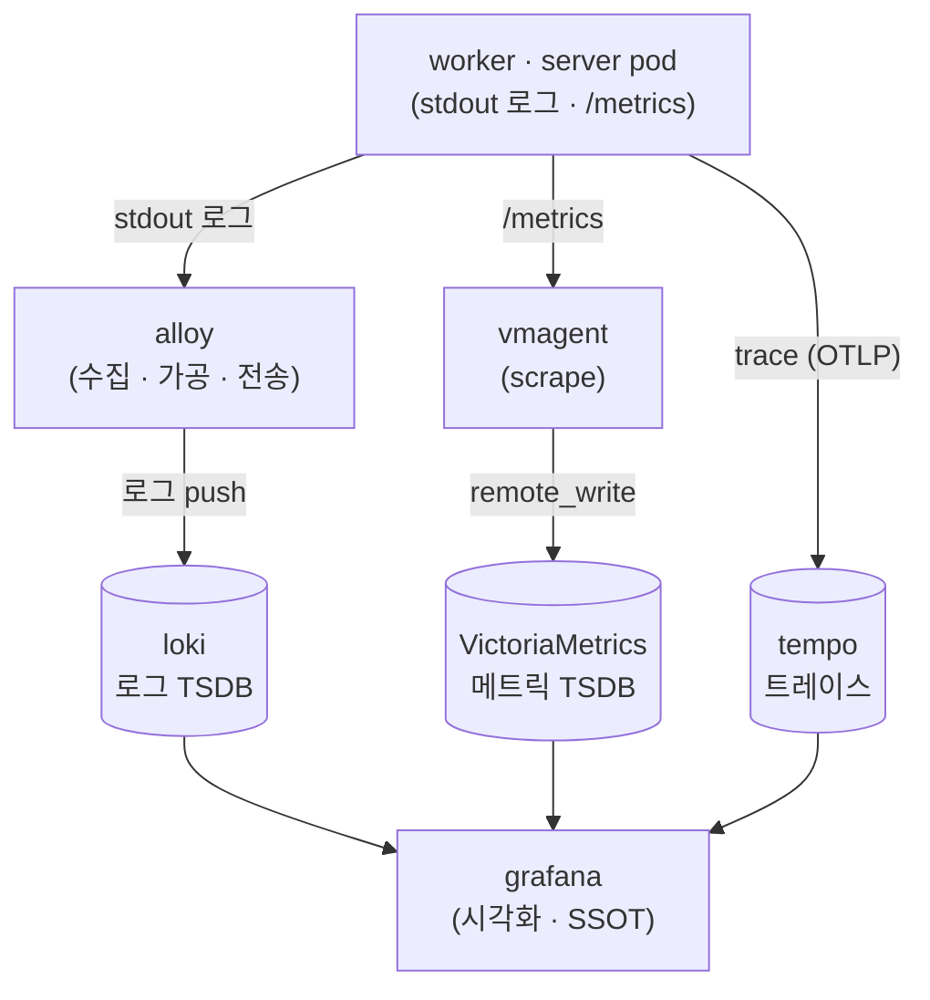

# 관측 (Observability)

이 페이지는 windforce를 운영할 때 "지금 시스템이 어떤가"를 어디서 보는지를 설명한다. 관측 스택의 구성, 운영자가 실제로 봐야 하는 핵심 신호(큐 health, worker 하트비트, tag coverage, 미스케줄 사유), 그리고 대시보드를 다룬다.

## 운영자의 단일 진실원(SSOT) = Grafana

운영자 모니터링의 **단일 진실원은 Grafana 대시보드**다. "시스템이 어떤가"를 컴포넌트별 CLI(`kubectl`·`flux`)를 돌며 짜맞추지 않고 Grafana 한 곳에서 본다 — 로그·메트릭·트레이스, 그리고 **배포(CD) 상태**까지 모은다. CLI는 즉답·디버깅용 보조 수단이지 정본이 아니다.

이 원칙의 실질적 따름결과는 두 가지다.

- 새 관측 신호를 추가하면 **대응 대시보드/알림이 Grafana에 있어야** "관측된다"고 본다. 메트릭만 내보내고 대시보드가 없으면 미완으로 친다.
- 컴포넌트마다 자체 UI를 새로 노출하기보다 **기존 Grafana에 메트릭을 연동**하는 쪽을 기본으로 한다 — 인증·노출 표면을 늘리지 않는다.

## 관측 스택: LGT + VictoriaMetrics

관측 스택은 `monitoring` 네임스페이스에 상주하며, 표준 LGTM 구성에서 메트릭 TSDB 자리를 VictoriaMetrics로 대체한 **"LGT + VM"** 형태다. helm 릴리스는 4개(`loki`·`tempo`·`vm-stack`·`alloy`)이고, 모니터링 컴포넌트는 **최신 안정 버전을 유지**한다(Grafana 13 계열).

| 컴포넌트 (helm 릴리스) | 역할 | 질의 언어 |
|---|---|---|
| **loki** | 로그 저장·질의 | LogQL |
| **tempo** | 트레이스 저장·질의 | TraceQL |
| **vm-stack** (VictoriaMetrics) | 메트릭 저장·질의 | PromQL/MetricsQL |
| **grafana** (G13) | 시각화 · **운영자 SSOT** | — |
| **grafana-image-renderer** | 대시보드/패널을 PNG로 서버측 렌더 | — |
| **alloy** | 로그·메트릭·트레이스 수집·전송 에이전트 | — |

수집기는 **Grafana Alloy**로 고정한다 — 단일 에이전트로 로그·메트릭·트레이스를 함께 다루는 OpenTelemetry Collector 배포판이다. alloy는 **수집·가공·전송만 하고 스스로 저장하지 않는다.** 그래서 메트릭 저장소로 **VictoriaMetrics가 별도로 필요**하다 — 둘은 대체 관계가 아니라 생산자 ↔ 저장소(보완) 관계다. grafana는 독립 릴리스가 아니라 `vm-stack` helm 릴리스에 묶여 있으므로, 메트릭 백엔드를 들어낼 때 `helm uninstall vm-stack`을 하면 grafana도 같이 죽는다는 점에 유의한다.



## 무엇을 봐야 하나

운영자가 실제로 주시하는 신호들이다. windforce가 desired(운영자가 원하는 구성)와 observed(실제 라이브 상태)를 분리해 관리하므로, 대부분의 신호는 **둘을 대조해 drift를 표면화**하는 형태다.

### 큐 health

PG 큐가 막히지 않는지를 보는 1차 신호다. 그룹·태그별로 본다.

- **pending / running depth** — 처리를 기다리는(`running=false`) 잡 수와 실행 중인 잡 수.
- **wait time** — 잡이 enqueue되어 claim되기까지 걸린 시간(p50·p95).
- **oldest-queued age** — 가장 오래 대기 중인 잡의 나이. 이것이 계속 늘면 그 태그를 처리할 워커가 부족하거나 없다는 뜻이다.

이 값들은 워커 그룹 autoscaling(KEDA)이 쓰는 신호와 **동일 소스**다 — scale-out 기준이 곧 backlog 경보 기준이다.

### flow 실행 (대기 flow는 backlog가 아니다)

flow는 여러 action을 순차로 잇고 사람 승인(HITL)에서 멈췄다 재개하는 워크플로우다. flow run은 다섯 상태를 거친다.

- **running** — 현재 한 step이 실행 중이다.
- **waiting_approval** — 사람의 승인을 기다리며 멈춰 있다.
- **completed** / **failed** / **canceled** — 종료 상태.

운영에서 헷갈리기 쉬운 핵심은 **`waiting_approval`(승인 대기) flow가 큐 depth를 늘리지 않는다**는 점이다. 대기 중인 flow는 워커가 집어 갈 잡(runnable 큐 row)을 0개 갖는다 — 진행 상태는 큐가 아니라 flow run 자체에 저장된다. 그래서 승인 대기 flow가 아무리 많이 쌓여도 위 **pending depth·oldest-queued age는 올라가지 않고**, 워커 autoscaling(KEDA)도 반응하지 않는다.

> 큐 backlog는 "처리할 워커가 부족하다"는 신호지만, 승인 대기 flow가 많은 것은 "사람의 승인을 기다리는 중"이라는 정상 상태다. 둘을 혼동하지 않는다 — 대기 flow가 쌓여도 워커를 늘릴 필요는 없다.

대기 flow를 영원히 방치하지 않도록, 승인 step은 **승인 마감 시각(`resume_deadline`)**을 가질 수 있다. 마감이 지나도 승인이 오지 않으면 별도의 sweeper가 그 run을 자동으로 **failed로 종료**한다(이 sweeper는 워커 하트비트를 감시하는 reaper와 분리돼 동작한다 — 대기 flow는 reaper의 시야 밖이기 때문이다). 승인 마감은 flow를 만들 때 step별로 정하며, **마감을 0으로 두면 무기한 대기**(자동 종료 없음)다.

### worker 하트비트 (Fleet view)

라이브 워커는 전역 관측 테이블 `worker_ping`이 본다(workspace에 묶이지 않는 인스턴스 단위 관측). Fleet view는 이 하트비트를 워커 그룹별로 롤업한다.

- 그룹별 **alive 워커 수와 마지막 ping** — ping window를 벗어난 워커는 묘비로 필터된다.
- 워커가 구독하는 태그(`WORKER_TAGS`), 현재 실행 중인 잡, 누적 실행 수(`jobs_executed`).
- pod **restart 횟수·OOMKilled** 여부, 그리고 롤아웃 진행 중의 **버전 skew**.

콘솔 Fleet 카드는 이 observed 상태를 desired(intent registry의 replica·enable 설정)와 대조해 **drift 배지**(`ok`·`missing`·`draining`·`unregistered`·`scaled`)를 표시한다. desired replica와 online 워커 수가 어긋나면(예: Flux가 아직 반영하지 않음) 여기서 드러난다.

> 정상적인 drain은 zombie가 아니다. 워커가 SIGTERM을 받으면 새 claim을 멈추고 실행 중 잡을 grace 시간까지 계속 돌리는데, **그동안 하트비트가 유지**되어 reaper가 오인하지 않는다. grace를 넘긴 잡만 ping이 끊겨 reaper의 zombie 회수 경로로 정상 복구된다.

### tag coverage

**잡이 영영 `queued` 상태로 새는 간극**을 잡아내는 인스턴스 전역 신호다. 카탈로그에 실제로 쓰이는 태그(액션·앱의 유효 태그)와 라이브 워커가 구독하는 태그(`WORKER_TAGS`)를 교차해서 본다.

- 어떤 태그를 가진 잡이 존재하는데 그 태그를 **구독하는 alive 워커가 0**이면, 그 태그는 **danger**로 표시된다. 그 태그의 잡은 누가 claim하지 않아 영원히 대기한다.
- 콘솔은 unserved 태그와 그 태그로 큐에 쌓인 잡 수를 함께 보여준다.

새 워커 그룹을 추가하거나 태그를 바꾼 직후, 또는 큐 oldest-queued age가 이유 없이 치솟을 때 가장 먼저 확인할 화면이다.

### 미스케줄(Pending) 사유

위 신호들은 모두 큐 하트비트(Tier A)에서 나온다 — "워커가 잡을 claim하고 있는가". 하지만 **워커 pod 자체가 노드에 안 떠서** 잡을 claim할 워커가 없을 수도 있다. 이 K8s 차원의 사실(노드·pod·라벨·스케줄러)은 선택적 **read-only observer**(Tier B)가 클러스터를 읽어 채운다.

observer를 켜면 콘솔이 함대 배치를 K8s 사실로 보여준다.

- 어느 워커 그룹이 **어느 노드에** 떠 있는지(pod의 node 배치·phase).
- pod가 **Pending이면 그 진짜 사유**(`PodScheduled=false` 메시지 = 실제 Unschedulable 사유). "노드 라벨/taint가 안 맞음", "용량 부족" 같은 스케줄러의 실제 이유가 그대로 노출된다.
- 노드 라벨·taint·allocatable 용량·Ready·cordon 상태, 그리고 discovery된 런타임 클래스·노드풀·배치 스케줄러 큐.

콘솔은 **Tier A(하트비트 사실)와 Tier B(스케줄러 사실)를 같은 신뢰도로 섞지 않는다.** observer가 설치되지 않았으면 배치 관련 컨트롤은 목 데이터 없이 "observer not installed"로 비활성된다. observer는 **읽기만 하는(`get`/`list`/`watch`) 별도 프로세스·별도 ServiceAccount**이고 기본 비활성(`observer.enabled=false`)이며, observer가 다운돼도 control plane과 잡 실행에는 영향이 없다(부가 평면).

> 세부 동작은 [Fleet 배치 observer 명세](https://github.com/imprun/windforce/blob/main/docs/contracts/operator-plane.md) 참고. 이 화면들은 콘솔의 운영자 셸(`/admin`, super_admin 전용)에서 본다 — 테넌트 콘솔 개요는 [콘솔 가이드](../guide/console.md)에 있고, 운영자 `/admin` 화면의 진입 경로는 그 페이지가 가리키는 원문 가이드를 참고한다.

### 배포(CD) 상태도 같은 곳에서

배포 파이프라인의 건강 상태도 운영자 SSOT인 Grafana에서 본다. GitOps 컨트롤러를 위한 별도 UI를 노출하지 않고, **컨트롤러 메트릭을 VictoriaMetrics로 스크랩**한다. Flux 컨트롤러가 `:8080`(`http-prom`)으로 내는 Prometheus 메트릭(`gotk_reconcile_condition` 등)을 `VMServiceScrape`로 수집하면 reconcile 성공/실패·suspend·마지막 적용 리비전이 메트릭이 된다. HelmRelease가 `Ready=False`로 정체하거나 `windforce` GitRepository가 새 릴리스 태그를 해소하지 못하면 대시보드에 뜨고 기존 알림 경로로 통지된다. 조작이 꼭 필요할 때만 `flux` CLI로 한다.

## 잡 데이터의 3계층 — 관측·디버그·과금은 다른 기록이다

대규모(하루 수십만~수백만 잡)에서 잡을 하나씩 추적하는 것은 1차 관측 렌즈가 아니다. windforce는 잡 데이터를 보관 기간·용도가 다른 세 기록으로 가른다:

| 기록 | 무엇 | 보관 | 용도 |
|---|---|---|---|
| **운영 잡 행** (`job`/`job_completed`) | 풀 페이로드(입력·결과·로그) | 짧게 — `JOB_RETENTION_DAYS`로 프룬 | 개별 디버그(콘솔 Jobs 드릴) |
| **과금 이벤트 원장** (`usage_event`) | 잡당 불변·페이로드 없는 한 줄(고객·앱·액션·outcome·실행 ms) | 길게 — retention과 **독립**, 프룬 대상 아님 | 고객별 사용량·**과금 증거·재계산**(고객 상세 Usage 탭·CSV export) |
| **집계** (Prometheus 메트릭·`workspace_usage` 카운터) | rate·error·latency·일별 카운터 | 시계열/파생 | 건강 관측(Grafana)·쿼터 |

핵심 불변식: 원장은 **완료 트랜잭션에서** 기록되므로 잡 행을 프룬해도 과금 사실은 절대 사라지지 않고, 페이로드를 담지 않아 고객 데이터를 장기 보관하지 않는다. 고객별 운영 메트릭을 Prometheus 라벨로 넣지 않는다(카디널리티) — 고객별 집계는 원장에서 계산한다.

## 대시보드는 코드로 관리한다

모니터링 스택은 외부로 분리하지 않고 **이 레포가 정본**이며 Flux GitOps로 관리한다. 대시보드도 코드다.

- `grafana_dashboard: "1"` 라벨이 붙은 configmap을 `deploy/clusters/imprun/monitoring/dashboards/`에 두면 Flux가 적용하고 grafana sidecar가 로드한다.
- 헬퍼 스크립트(레포 `scripts/`): `grafana-render.sh`(PNG 렌더) · `grafana-import.sh`(빠른 반복용 API import) · `grafana-dashboard-cm.sh`(JSON→configmap 래핑).

대시보드를 **PNG로 서버측 렌더**할 수 있다(`grafana-image-renderer`, 헤드리스 Chromium). 사람이 리뷰용 이미지를 받을 수도, 자동화가 브라우저 없이 대시보드를 인식할 수도 있다.

```bash
scripts/grafana-render.sh --list                       # 대시보드 uid 목록
scripts/grafana-render.sh k8s_views_global /tmp/x.png  # 대시보드 전체 → PNG
scripts/grafana-render.sh k8s_views_global /tmp/p.png --panel 12 --from now-6h --to now
```

`grafana-render.sh`는 admin 자격을 k8s 시크릿에서 **런타임에만** 읽어 port-forward로 렌더하고 자격을 저장·출력하지 않는다.

> **Grafana 13 데이터소스 함정(업그레이드 시 1회)**: 프로비저닝된 데이터소스가 다른 데이터소스를 `uid`로 참조(예: Tempo의 `serviceMap.datasourceUid`, Loki의 `derivedFields.datasourceUid`)할 때 그 uid를 가진 데이터소스가 없으면, G12까지는 경고였으나 **G13은 프로비저닝을 치명적 실패**시켜 grafana가 CrashLoop에 빠진다. 해결: 각 데이터소스에 **명시적 `uid`를 박고 모든 상호참조를 실제 uid로 맞춘다**(예: 메트릭 ds `uid: VictoriaMetrics`, Loki `uid: loki`, Tempo `uid: tempo`).

## 프론트엔드 에러 리포팅

콘솔(브라우저)에서 터진 에러를 운영자가 보게 하는 최소 루프다. 외부 에러 벤더를 도입하지 않고, 운영자가 이미 가진 Loki/Grafana 로그 파이프라인을 재사용한다.

- **수집 엔드포인트**: `POST /api/telemetry/errors`(인증 필요, 본문 16 KiB 캡). 콘솔은 React error boundary·`window.onerror`·`unhandledrejection` 세 경로에서 잡은 에러를 best-effort로 보낸다(실패 무시, 10초 내 동일 에러 dedupe).
- **개인정보 최소화**: 메시지·스택·현재 라우트·빌드 모드만 보낸다. **입력값·폼 상태·시크릿은 절대 포함하지 않는다.** 서버는 각 필드를 truncate하고 인증 principal(email)·workspace로 태깅한다.
- **운영자 확인 경로**: 서버가 한 줄짜리 구조화 로그를 남긴다(`frontend-error email="..." workspace="..." kind="..." url="..." message="..." stack="..."`). 수집 파이프라인이 연동되면 Grafana Logs(Loki)에서 LogQL `{...} |= "frontend-error"`로 조회한다(연동 전에는 server 로그/stdout에서 직접 확인한다).
- **피드백 채널**: 콘솔 계정 메뉴의 **Send feedback** 진입점은 `FEEDBACK_URL`(mailto: 또는 https)로 연결된다. `GET /api/config`의 `feedback_url`로 콘솔에 전달되며, 미설정이면 진입점을 숨긴다.

## 알아둘 운영 메모

- `monitoring` 네임스페이스는 기본 인프라(유지 대상)다. 위 helm 릴리스 4개를 최신 버전으로 유지한다. 차트 메이저 점프는 `helm upgrade --reset-then-reuse-values`로 올린다 — `--reuse-values`만으로는 새 차트가 요구하는 신규 키를 못 채워 템플릿이 깨진다.
- `alloy` config는 windforce가 정의한다(helm 릴리스 `alloy`, values의 `alloy.configMap.content`). 위 "관측 스택"의 수집 경로(로그 push·OTLP)는 windforce가 로그·메트릭·트레이스를 내보내기 시작하면서 채워 나가는 대상이다.

## 더 보기

- [Kubernetes 운영](deployment.md) — 워커·server·reaper·drain·autoscaling과 K8s 운영에 필요한 최소 관측값.
- [콘솔 가이드](../guide/console.md) — 테넌트 콘솔(Apps·Jobs·Workers·Settings) 개요. 운영자 셸(`/admin`)의 Fleet·tag coverage·queue health 상세는 그 페이지가 가리키는 원문 가이드를 참고한다.
- [핵심 개념](../getting-started/concepts.md) — Workspace·App·Action·Job과 큐 모델.
- 심층 원문(GitHub): [관측 스택 가이드](https://github.com/imprun/windforce/blob/main/docs/operations/operator-runbooks.md) · [Fleet 배치 observer 명세](https://github.com/imprun/windforce/blob/main/docs/contracts/operator-plane.md) · [Operator plane 명세](https://github.com/imprun/windforce/blob/main/docs/contracts/operator-plane.md)
