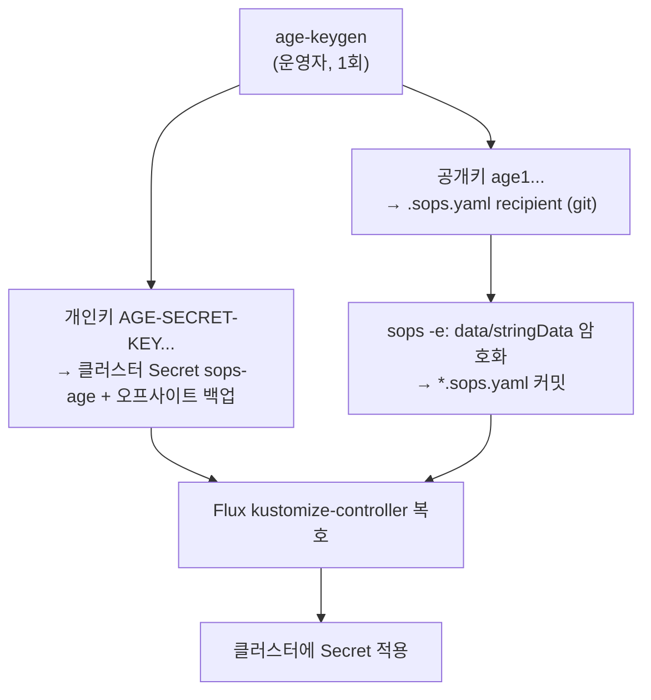

# 시크릿 관리 (SOPS + age)

클러스터 시크릿(DB 자격·`SECRET_KEY`·이미지 pull 토큰 등)을 **암호화한 채 git에 선언**하고 Flux가 클러스터에서 복호해 적용하는 방법을 다룬다. 평문 시크릿은 git에도 운영자 머신에도 영속시키지 않는다.

> 이 페이지는 **클러스터 시크릿**(인프라 자격·인스턴스 비밀) 관리다. 워크스페이스마다 잡 시크릿을 암호화하는 **DEK(데이터 키)**는 그 위에 얹힌 다른 층으로, 인스턴스 `SECRET_KEY`(KEK)가 워크스페이스 DEK를 wrap한다. 두 층의 연결과 `SECRET_KEY` 회전 절차는 아래 "인스턴스 `SECRET_KEY` 회전"에서 설명한다.

## 동작 개요

암호화는 **age** 키 한 쌍으로 한다. git에는 *공개키*로 암호화한 값만 들어가고, **개인키는 클러스터의 `sops-age` Secret(`flux-system` 네임스페이스)에만** 존재한다. Flux의 `kustomize-controller`가 그 개인키로 복호한 뒤 클러스터에 Secret을 적용한다.



핵심 성질:

- **git에는 암호문만.** 암호화된 `*.sops.yaml` 파일의 `data`/`stringData` 값만 `ENC[AES256_GCM,...]`로 봉인되고, `name`/`namespace`/`type` 등 메타데이터는 평문이라 diff와 리뷰가 그대로 읽힌다.
- **개인키는 클러스터 안에만.** age 개인키는 `sops-age` Secret과 운영자의 오프사이트 백업에만 존재한다. PR·자동화·문서 어디에도 넣지 않는다.
- **복호는 Flux가 자동으로.** 운영자가 매니페스트를 암호화해 커밋하면, Flux가 reconcile하면서 복호해 클러스터에 적용한다.

## 역할 분담

| 누가 | 무엇을 |
|---|---|
| 레포(git) | `.sops.yaml` 규칙 파일 + 암호화된 `*.sops.yaml` 매니페스트 |
| 운영자(out-of-band) | age 키 생성·개인키 백업·`sops-age` Secret 생성·Flux 복호 배선 활성·검증 |

**개인키는 자동화/PR/문서 어디에도 들어가지 않는다.** 키 생성·백업·클러스터 Secret 주입은 운영자가 클러스터에서 직접(out-of-band) 한다.

## 1. age 부트스트랩 (운영자, 1회)

```bash
# 1) 키 생성 — age.agekey에 개인키, 파일 주석에 공개키
age-keygen -o age.agekey
PUB=$(age-keygen -y age.agekey)          # age1... (공개키, recipient)
echo "$PUB"

# 2) 개인키 오프사이트 백업
#    분실 = git의 모든 시크릿 복호 불가(복구 불능). 비밀번호 관리자/오프라인 보관.
#    절대 git/이미지/CI 로그에 두지 않는다.

# 3) 클러스터에 복호용 Secret — 파일 키 이름은 반드시 *.agekey 로 끝나야 한다
kubectl -n flux-system create secret generic sops-age \
  --from-file=age.agekey=age.agekey

# 4) .sops.yaml 의 recipient 자리를 위 $PUB 값으로 교체해 커밋
```

> 개인키 분실은 복구 불능이다 — git의 모든 암호문을 영영 못 푼다. 2)의 오프사이트 백업이 유일한 보험이다.

### age 개인키 오프사이트 백업

```bash
# 1) 파일 내용을 비밀번호 관리자(보안 노트) 또는 오프라인 암호화 매체에 그대로 저장.
cat <age 개인키 파일>      # 운영자 머신에서만 — 로그/채팅에 붙이지 않는다
# 2) 검증: 백업 사본의 공개키가 .sops.yaml recipient와 같은지 확인.
age-keygen -y <백업파일>   # → .sops.yaml의 recipient 공개키와 일치해야 한다
```

공개키는 공개돼도 안전하므로 백업 검증 기준으로 쓴다. 이 백업은 *복호 키 사본*이며 DB 데이터 백업(PITR)과는 별개다.

## 2. Flux 복호 배선 활성 (운영자)

`sops-age` Secret이 **존재한 다음에만** Flux Kustomization에 복호 블록을 추가한다. 없는 Secret을 참조하면 해당 Kustomization 전체 reconcile이 실패해 플랫폼까지 멈출 수 있으므로 순서를 반드시 지킨다.

```yaml
# Flux Kustomization spec 에 추가
spec:
  decryption:
    provider: sops
    secretRef:
      name: sops-age
```

루트 Kustomization이 전 경로를 reconcile하는 구성이면 거기에 추가한다. `flux bootstrap`이 그 sync 파일을 재생성하므로, 재부트스트랩 시에는 `--decryption-provider=sops --decryption-secret=sops-age` 플래그로 떠서 블록이 유지되게 한다.

## 3. 시크릿 추가 (일상 워크플로)

1. k8s Secret 매니페스트를 `deploy/clusters/imprun/<…>/<name>.sops.yaml`로 평문 작성한다(`data`는 base64, 또는 `stringData`로 평문 값).
2. 제자리 암호화 — 루트 `.sops.yaml` 규칙이 자동 적용되어 `data`/`stringData`만 암호화된다.
   ```bash
   sops --encrypt --in-place deploy/clusters/imprun/<…>/<name>.sops.yaml
   ```
3. 커밋·push 한다. Flux가 복호해 적용한다.

> **평문 단계의 파일은 절대 커밋하지 않는다** — 암호화한 뒤에만 커밋한다. 평문이 커밋되면 git 히스토리에 남으니, 그 경우 해당 값을 폐기하고 회전해야 한다.

확인 방법: 암호화 후 파일을 열면 `data`/`stringData` 값이 `ENC[AES256_GCM,...]`이고 나머지는 평문이다.

## 4. 회전 (rotation)

세 가지 층의 회전이 있다. 셋은 서로 독립적이다.

| 대상 | 명령 | 언제 |
|---|---|---|
| 파일별 데이터 키 재암호화 | `sops --rotate --in-place <file>` | 정기 위생 |
| recipient(받는 쪽) 추가·제거 | `.sops.yaml`의 `age:` 수정 후 `sops updatekeys <file>` | 키 보유자 변경 |
| age 키 자체 교체 | 아래 절차 | age 키 유출·정기 교체 |

### age 키 자체 교체

git 시크릿을 *복호하는* age 키를 바꾼다.

1. 새 age 키 생성(`age-keygen`).
2. `.sops.yaml`의 recipient를 새 공개키로 교체한다.
3. 모든 `*.sops.yaml`에 `sops updatekeys`로 다시 봉인한다.
4. 클러스터 `sops-age` Secret을 새 개인키로 교체한다.
   ```bash
   kubectl -n flux-system create secret generic sops-age \
     --from-file=age.agekey=<새 개인키> --dry-run=client -o yaml | kubectl apply -f -
   ```
5. 새 개인키를 오프사이트 백업한다.

### 인스턴스 `SECRET_KEY` 회전

`SECRET_KEY`는 워크스페이스마다의 DEK를 wrap하는 **KEK**이자 잡(job) 토큰 서명 키다. envelope 구조라 회전이 **시크릿 재암호화 없이 DEK re-wrap만**으로 끝나고, grace window 동안 진행 중인 잡도 무중단이다.

1. **새 키 생성 + 이전 키 보존.** `windforce` SOPS 시크릿에서 `SECRET_KEY`를 새 값으로 바꾸고 **`SECRET_KEY_PREVIOUS`에 직전 값**을 넣는다(`sops <file>` 편집 → 커밋 → Flux 적용). 두 키가 떠 있는 동안 server·worker는 DEK를 둘 다로 unwrap 시도하고 잡 토큰도 둘 다로 검증한다 — 이 시점부터 무중단이다.
2. **DEK re-wrap.** 롤아웃이 새 env를 받은 뒤 `windforce rotate-kek`을 1회 실행한다(일회성 Job 또는 `kubectl exec`). 모든 워크스페이스 DEK를 이전 KEK → 현재 KEK로 다시 봉인한다(시크릿 비접촉, 멱등).
3. **grace 종료.** 가장 긴 잡 토큰 수명(`exp`)이 지나 모든 구 토큰이 만료되면 `SECRET_KEY_PREVIOUS`를 제거한다(시크릿 재편집 → 커밋). 회전 완료.

정기 회전이면 1→3을 순서대로 한다. 유출이면 1을 즉시 하고 2를 가능한 빨리, 3은 토큰 만료를 기다린다.

> envelope 구조의 이점: KEK 교체는 워크스페이스 수만큼의 re-wrap이고 시크릿 행은 일절 건드리지 않는다. 그래서 회전이 싸고 빠르며, `SECRET_KEY_PREVIOUS` grace로 무중단이다. 워크스페이스 삭제 시에는 그 워크스페이스의 wrapped DEK가 함께 소멸해 해당 시크릿이 영구 복호 불가가 된다(crypto-shredding). 설계 근거는 [ADR-0029](https://github.com/imprun/windforce/blob/main/docs/decisions/decision-ledger.md).

## 5. 기존 시크릿 이관

수동으로 만들어 둔 클러스터 시크릿은 SOPS 암호화 매니페스트로 이관한다. 이관 후에는 Flux가 git에서 복호해 공급한다.

```bash
# 현재 값을 떠 깨끗한 매니페스트로(런타임 메타·라벨 제거) — namespace는 유지한다.
kubectl -n <ns> get secret <name> -o yaml \
  | yq 'del(.metadata.creationTimestamp,.metadata.resourceVersion,.metadata.uid,
            .metadata.managedFields,.metadata.ownerReferences,.metadata.annotations,
            .metadata.labels,.metadata.generation,.status)' \
  > deploy/clusters/imprun/<…>/<name>.sops.yaml

sops --encrypt --in-place deploy/clusters/imprun/<…>/<name>.sops.yaml   # data/stringData만 암호화
# 검증(값이 전부 ENC[ 인지) → 커밋 → Flux 적용 확인 → 수동 생성분 폐기는 인수 확인 후에만
```

원칙: **이관이 끝나 GitOps가 시크릿을 적용하는 걸 확인한 뒤에만** 수동 절차를 폐기한다.

### SOPS 밖에 두는 것

일부러 평문/out-of-band로 두는 것들이 있다.

- **`sops-age`(flux-system)** — 복호 키 자신. SOPS로 암호화하면 닭-달걀(복호할 키를 복호해야 함)이라 운영자가 out-of-band로만 생성한다("1. age 부트스트랩 (운영자, 1회)" 참고).
- **`flux-system`(flux-system)** — Flux bootstrap이 만드는 git deploy 키. bootstrap이 소유한다.
- **컨트롤러가 런타임에 만드는 것** — DB 오퍼레이터·인증서 발급기·러너 컨트롤러가 생성하는 Secret은 git에 두지 않는다.

## 함정

- **개인키 분실 = 복구 불능.** git의 모든 암호문을 영영 못 푼다. "1. age 부트스트랩 (운영자, 1회)"의 오프사이트 백업이 유일한 보험이다.
- **`sops-age` Secret의 파일 키 이름은 `.agekey`로 끝나야** Flux가 인식한다.
- **복호 배선("2. Flux 복호 배선 활성 (운영자)")은 Secret 생성 후에만.** 순서를 어기면 라이브 reconcile이 깨진다.
- **암호화 전 평문 파일을 커밋하지 않는다.** 커밋되면 git 히스토리에 남는다 — 그 경우 값을 폐기·회전한다.
- **Windows에서 `sops -e`** — sops가 경로를 백슬래시로 정규화해 `.sops.yaml`의 `path_regex`(슬래시)와 안 맞으면 `no matching creation rules found`로 막힌다. 규칙의 경로 구분자를 `[\\/]`로 두면 양쪽을 받는다. (Flux 복호는 creation rules를 보지 않으므로 production엔 무관 — 로컬 암호화 편의용.)

## 더 보기

- [배포 (GitOps)](deployment.md) — 릴리스 태그 → 인클러스터 CI → Flux로 플랫폼을 클러스터에 반영하는 흐름.
- [SOPS + age 운영 런북 (원문)](https://github.com/imprun/windforce/blob/main/docs/operations/operator-runbooks.md) — 현재 SOPS로 관리되는 시크릿 목록·파일 위치 규칙 등 클러스터 고유 상세.
- [ADR-0029: 워크스페이스 DEK envelope 암호화](https://github.com/imprun/windforce/blob/main/docs/decisions/decision-ledger.md) — KEK/DEK 2계층·회전·crypto-shredding 결정 근거.
