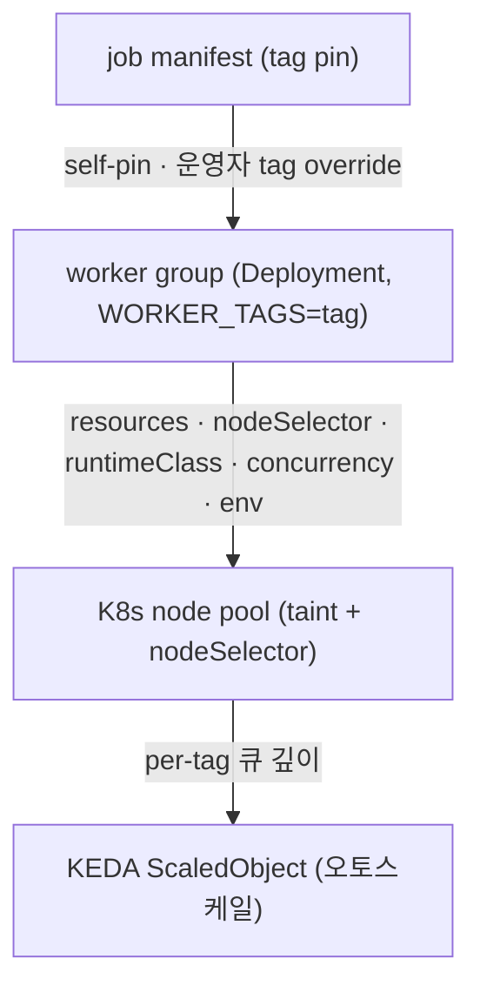
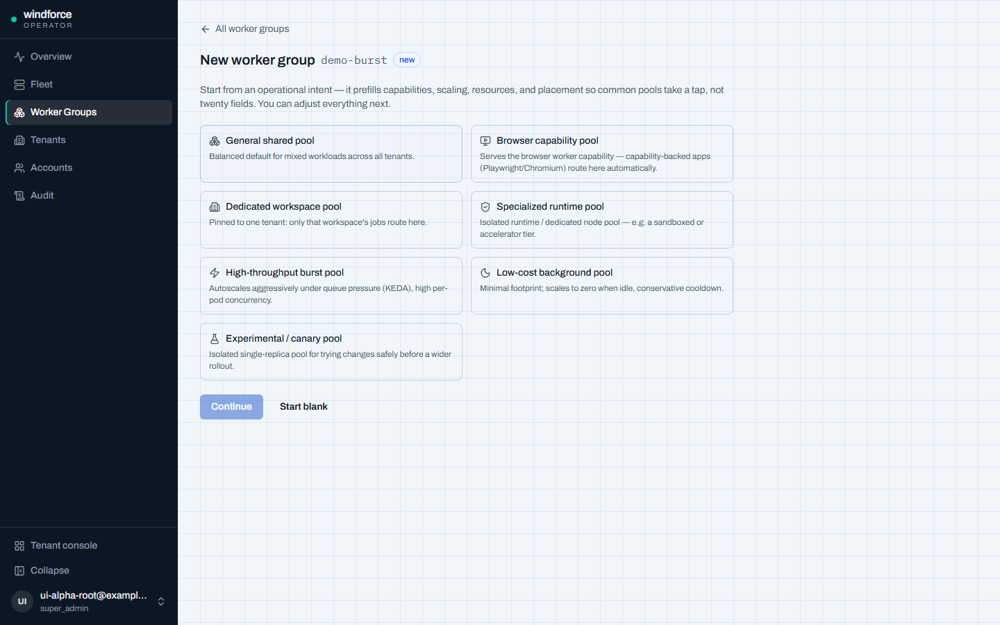
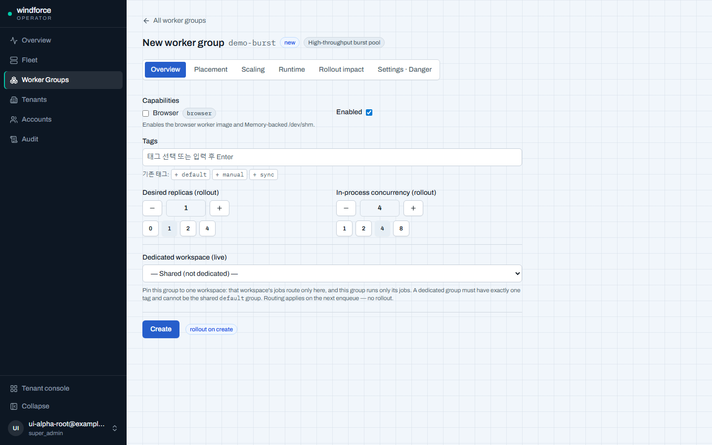
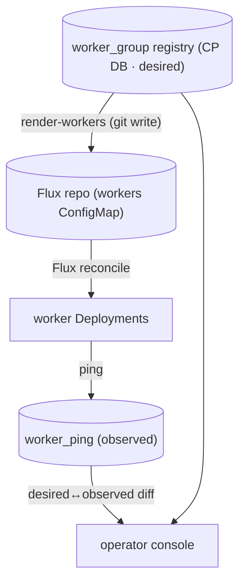
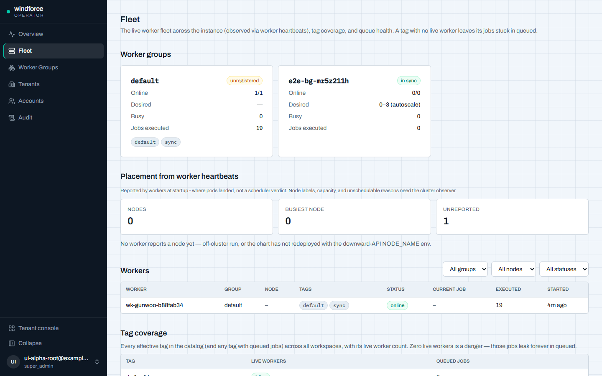
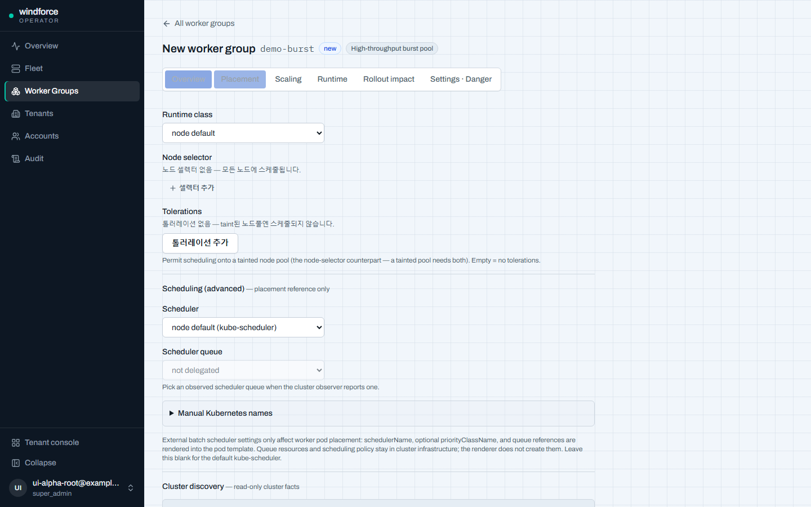

# 워커 그룹·스케일

운영자가 잡(job)을 어떤 종류의 워커에서, 몇 대로, 어떤 노드 위에서 실행할지를 정하는 방법을 설명한다. windforce는 잡의 **tag**(저자가 선언하는 안정적 계약)를 **워커 그룹**(클래스·자원·노드 배치를 가진 함대)에 매핑하고, 큐 깊이에 따라 KEDA로 자동 스케일하며, 이 모든 구성을 운영자 콘솔의 **워커 그룹 registry**에서 관리한다. 목표 규모는 단일 Postgres 위 약 1000개의 워커 pod다.

이 페이지는 운영자 관점의 "어떻게 쓰고 운영하나"를 다룬다. 결정의 근거가 필요하면 각 절 끝과 "더 보기"의 ADR 링크를 참고한다.

## 라우팅: tag → class → node pool

잡은 자기 manifest에 **tag**를 핀(pin)한다. 저자는 "내 잡엔 `browser`가 필요"처럼 tag만 선언하고, 그 tag가 실제로 어떤 이미지·노드풀·크기로 실행되는지(인프라 매핑)는 운영자가 tag 뒤에서 바꾼다. 즉 **tag가 저자와 운영자 사이의 안정적 계약**이고, 인프라 변경이 저자 코드에 새지 않는다.

라우팅은 세 단계로 합성된다.

- **워커 그룹**은 하나의 K8s Deployment다. `WORKER_TAGS`로 어떤 tag들을 구독할지 정하고, claim 시 `q.tag = ANY(worker_tags)`로 자기 잡만 골라 실행한다.
- 같은 tag를 구독하는 워커가 한 대도 없으면 그 tag의 잡은 영영 큐에 남는다(unserved). 콘솔의 **tag coverage** 화면이 이 간극을 danger로 잡아 준다(아래 "Fleet 관측" 참조).

### 노드 풀로 보내기 — taint와 nodeSelector 둘 다

특정 클래스를 전용 노드풀로 보내려면 두 가지를 함께 줘야 한다.

- **taint**(`dedicated=<class>:NoSchedule`)는 다른 pod를 그 노드에서 **밀어내기만** 한다.
- **nodeSelector**(`{pool, kubernetes.io/arch: arm64}`)가 워커 pod를 그 노드로 **유도**한다.
- 그 노드의 taint를 견디려면 워커 그룹에 대응하는 **toleration**도 필요하다.

taint만 주고 nodeSelector를 빠뜨리면 워커가 다른 노드로 흩어지고, nodeSelector·toleration만 주고 taint를 빠뜨리면 다른 pod가 그 노드를 침범한다. 세 가지(taint·nodeSelector·toleration)가 한 세트다.

## 워커 클래스

windforce는 좁은 클래스를 많이 두지 않는다(매칭 안 되는 잡이 큐에 갇히고 용량이 파편화된다). 대신 **넓은 클래스 몇 개**를 둔다.

| 클래스 | 쓰임 | 이미지·특이점 |
|---|---|---|
| `general` | 기본. 혼합 워크로드 | 기본 이미지, Burstable QoS로 밀집 |
| `cpu` | CPU-bound | compute 노드풀, Guaranteed 정수 코어, 코어당 1잡 |
| `mem` | 메모리 집약(OOMKill 리스크) | mem 노드풀, Guaranteed로 예측성 |
| `browser` | 헤드리스 브라우저(I/O-bound) | `-browser` 이미지(번들 Chromium) + Memory 기반 `/dev/shm` |

클래스를 고르면 렌더러가 그에 맞는 **이미지 suffix**와 (browser의 경우) **Memory 기반 `/dev/shm`**를 자동으로 파생한다. 예를 들어 `browser`를 고르면 `-browser` 이미지와 `/dev/shm`이 함께 따라오므로 절반만 구성된 상태가 생기지 않는다. `browser` 외의 클래스는 모두 동일한 통합 base 이미지를 쓴다(접미사 없음). `/dev/shm`은 클래스에서 파생되는 값이지 운영자가 직접 만지는 필드가 아니다(Chrome 기본 64Mi `/dev/shm`은 크래시를 유발한다).

### 클래스는 언어로 거르지 않는다 (polyglot)

워커 클래스는 **자원·가용성 축**일 뿐 언어 능력 축이 아니다. 통합 base 이미지가 TypeScript(Bun)·Python(CPython)·Go 런타임을 모두 담아 **어느 워커든 모든 잡 언어를 실행**한다 — 한 워커가 TS·Python·Go 잡을 가리지 않고 돌린다. 잡 라우팅은 **tag만** 보고 언어로 워커 그룹을 거르지 않는다. (이전에는 `python`·`go` 전용 이미지가 따로 있어 "한 워커가 모든 언어를 실행한다"는 말과 모순이었으나, 언어 런타임을 통합 base 이미지로 합쳐 그 모순이 해소됐다.)

다차원 요구(예: browser + 고메모리)는 **결합 클래스를 새로 만들지 않고** 합성 라벨(둘 다 요구)로 공유 풀에 매칭한다. 하드 파티션은 진짜 비대체 차원(arch, 특수 HW, 용량 격리)에만 둔다.

### concurrency 모드

- CPU-bound 잡(`cpu`)은 코어당 1잡(워커당 동시성 ≈ vCPU 수).
- I/O-bound 잡(`browser`·HTTP·SQL은 대기 위주)은 워커당 인프로세스 동시성을 높여 밀도를 얻는다.

워커당 동시 잡 수는 워커 그룹의 `in_process_concurrency`(env `WORKER_JOB_CONCURRENCY`)로 정한다.

## 워커 그룹 registry — 운영자 콘솔

워커 그룹의 구성은 control-plane DB의 **`worker_group` registry**가 정본(desired/intent)으로 소유한다. 운영자는 콘솔 `/admin/worker-groups`에서 그룹을 만들고 편집한다. 이 registry는 **원하는 구성**이고, **실제 함대**(라이브 워커)는 `worker_ping`이 관측한다 — 콘솔은 둘을 대조해 drift를 표면화한다.

registry가 담는 주요 필드:

- `name`(= Deployment 키) · `capabilities`(예: `browser`) · `tags`(구독 태그)
- `desired_replicas`(기준 replica, 오토스케일 floor)
- 자원 프로파일(`cpu_request`/`cpu_limit`/`mem_request`/`mem_limit` — requests==limits면 Guaranteed QoS)
- `runtime_class`(예: gVisor) · `node_selector` · `tolerations` · `env`
- `in_process_concurrency` · `autoscale_min`/`autoscale_max`(KEDA 바운드) · KEDA 튜닝(`target_queue_depth`/`polling_interval`/`cooldown_period`)
- `drain_timeout_s` · `enabled`
- `dedicated_workspace_id`(테넌트 전용 — 아래 참조)
- `scheduling_profile`(capacity-aware pod 스케줄러 위임 — reference-only)

### preset으로 만들기

새 그룹은 **preset 우선**으로 만든다. 운영 의도를 나타내는 ChoiceCard(general shared·browser capability·dedicated workspace·specialized runtime·high-throughput burst·low-cost background·experimental canary) 중 하나를 고르면 capability·스케일·자원·배치가 미리 채워진다. 빈 폼(Start blank)에서 시작할 수도 있다.

### 탭으로 편집하기

기존 그룹은 탭 IA로 편집한다 — Overview · Placement · Scaling · Runtime · Rollout impact · Settings · Danger. 검증 에러가 있는 탭에는 표식이 붙는다. 자유 텍스트 입력 대신 Select·stepper·구조화된 행 입력을 쓴다(예: tolerations는 구조화 행, scheduling_profile은 Placement 탭의 Scheduling(advanced)).

기존 그룹에 preset을 적용하려면 **Apply preset…**으로 명시적으로 적용하며, 변경되는 필드를 diff로 보여 준 뒤 적용한다(무음 덮어쓰기 없음).

### 즉시 반영 vs 롤아웃 필요

registry 편집은 반영 비용이 두 부류로 갈린다. 콘솔은 저장 전에 **rollout impact diff**(Rollout impact 탭 + 저장 버튼 옆 배지)로 둘을 구분해 보여 준다.

| 변경 | 반영 |
|---|---|
| `dedicated_workspace_id`(테넌트 라우팅) | **즉시**(다음 enqueue부터, 롤아웃 없음) |
| `capabilities`·이미지·자원·`runtime_class`·`node_selector`·`tolerations`·`tags`·`env`·`desired_replicas`·`drain_timeout_s`·`in_process_concurrency`·`autoscale_min/max`·KEDA 튜닝·`scheduling_profile` | **롤아웃 필요**(pod template 변경) |

테넌트 재라우팅(`dedicated_workspace_id`)을 제외한 거의 모든 필드는 pod template을 바꾸므로 롤아웃을 유발한다. pod template은 in-place로 못 바꾼다.

### 어떻게 클러스터에 닿나 — GitOps 렌더

**control plane은 K8s API를 직접 변이하지 않는다.** registry 편집은 다음 단방향 경로로 머티리얼라이즈된다.

- `windforce render-workers` 서브커맨드가 registry를 읽어 HelmRelease `workers:` values를 렌더하고, 렌더러 소유 ConfigMap(`workers-configmap.yaml`)으로 감싸 Flux deploy repo에 커밋한다. 이후는 Flux가 git → 클러스터로 reconcile한다.
- 렌더러 출력은 결정적(그룹·키 정렬)이라 registry가 안 바뀌면 byte-동일 → no-op 커밋을 스킵한다.
- registry 편집을 ConfigMap에 자동 반영하는 주기 실행(K8s CronJob)은 deploy repo **write 자격증명**이 있어야 동작한다. 그 자격증명을 프로비저닝하기 전까지 registry 편집은 intent-only이고(Fleet drift로 가시화) ConfigMap은 수동 렌더로 갱신한다.

## KEDA 오토스케일

워커 그룹은 per-tag 큐 깊이에 따라 KEDA `ScaledObject`로 자동 스케일한다. registry에서 `autoscale_min`/`autoscale_max`를 설정하면(둘 다 설정하거나 둘 다 비우는 all-or-none) 그 그룹에 ScaledObject가 렌더된다.

핵심 동작:

- **장수 풀을 스케일한다**(ScaledObject), 잡당 pod를 띄우지 않는다. claim 루프(claim→run→complete→claim)가 풀에 자연스럽게 매핑되고 워커를 warm하게 유지해 콜드 스타트를 피한다.
- 깊이 신호는 **아직 claim되지 않은 잡**(`running=false`)만 센다. in-flight 잡을 세면 이중 계산으로 scale-in이 막힌다.
- **scale-in은 부드럽게** — stabilization 600s, 120초마다 pod 1개씩, `selectPolicy: Min`. scale-to-zero(1→0)에는 `cooldownPeriod`가 적용된다.
- 비싼 클래스(예: `browser`)는 `autoscale_min`을 1로 둬(warm floor) 콜드 스타트를 피한다.
- KEDA가 DB에 붙을 때는 `windforce` 시크릿의 `DATABASE_URL`을 `TriggerAuthentication`으로 쓴다.

### scale-in이 바쁜 워커를 죽여도 안전하다

오토스케일이 잡을 처리 중인 워커를 죽일 수 있다는 점은 쿠버네티스 레벨에서 best-effort일 뿐이라, **정확성을 거기 의존하지 않는다.** windforce는 큐 스파인 자체가 안전망을 갖는다.

- claim CTE가 `running=true, ping=now()`를 원자적으로 설정하고, 워커가 heartbeat를 보낸다.
- **reaper**가 `ping IS NULL OR ping < threshold`인 잡을 되살린다(at-least-once). heartbeat 10s · reclaim 60–90s로 잡 길이와 무관하게 빠르게 복구한다.
- 잡 실행은 idempotent하고 완료는 단일 트랜잭션이라 재실행이 안전하다.

그래서 scale-in이 잡을 죽여도 reaper가 받아 다시 큐에 넣는다 — 오토스케일은 절대 정확성을 떠받치지 않는다.

KEDA 오토스케일은 기본 비활성(`keda.enabled: false`)이며 활성화는 한 줄(`keda.enabled: true`)이다.

## 배치 — capacity-aware pod 스케줄러 위임(reference-only)

테넌트별 용량 레인·pod 우선순위를 보장하려면 기본 K8s 스케줄러 대신 **capacity-aware pod 스케줄러**에 워커 pod의 **배치·용량**을 위임할 수 있다. registry의 `scheduling_profile`(nullable jsonb)이 이를 표현한다.

핵심 경계:

- **배치 스케줄러는 잡 스케줄러가 아니다.** windforce의 잡 정확성 정본은 어디까지나 PG 큐(claim/heartbeat/reaper)다. 외부 스케줄러는 장수 워커 Deployment의 **pod 배치·용량**에만 관여한다. 액션 잡마다 전용 pod를 만들거나 gang scheduling을 하지 않는다.
- `scheduling_profile`이 담는 것: `scheduler_name`·`priority_class_name`·`scheduler_queue`. `null`이면 기본 스케줄러(위임 안 함).
- **렌더러는 reference-only**다 — pod template에 `schedulerName` + (optional) `priorityClassName` + 스케줄러 큐 **이름 참조 annotation**만 emit한다. **스케줄러 큐 정책 CR은 만들지 않는다**(control plane이 K8s를 안 만지는 경계 보존).
- 따라서 `reclaimable`·`deserved`·`guarantee`·`weight` 같은 **큐 용량 정책은 registry 밖**이다 — 운영자가 별도 인프라 매니페스트/Flux로 소유한다. registry에 넣으면 "전용 그룹이 보호된다"는 거짓 보증이 될 수 있어 일부러 막았다.
- 참조한 큐가 없으면 pod가 Pending이 되고, 기존 **Fleet drift / tag coverage**가 "라이브 워커 0"을 danger로 잡는다(nodeSelector 풀이 없을 때와 같은 진단 경로).

### 두 priority 축을 혼동하지 않는다

| 축 | 무엇을 정렬하나 | 메커니즘 | 선점성 |
|---|---|---|---|
| **PG 잡 priority** | 떠 있는 워커가 *다음에 어떤 잡을 claim*하나 | `priority_band` + aging | 비선점(running 잡은 항상 완료) |
| **K8s pod priority** | *워커 pod가 몇 대 스케줄·유지*되나 | `priorityClassName`·스케줄러 큐 | 선점/reclaim 가능 |

"높은 우선순위 잡"과 "높은 우선순위 pod"는 다른 메커니즘이다.

`scheduling_profile`은 전부 pod spec이라 편집은 롤아웃을 유발한다. `scheduler_name`은 특정 스케줄러 제품에 묶이지 않는 임의 값이다(스케줄러 중립).

## 테넌트 전용 워커 그룹

특정 워크스페이스를 전용 워커 풀에 묶어 (a) 공유 풀의 부하·이웃과 격리하고(QoS), (b) 그 풀이 다른 테넌트 코드를 절대 실행하지 않게(보안·규제) 할 수 있다. windforce는 이를 **새 claim 의미가 아니라 태그 라우팅으로** 구현한다 — claim 스파인은 그대로다.

쓰는 법:

- 워커 그룹의 `dedicated_workspace_id`를 대상 워크스페이스로 설정한다. 워크스페이스당 전용 그룹은 **최대 1개**다.
- 전용 그룹은 **대표 태그 1개**를 갖고, 그게 그 워크스페이스의 전용 태그가 된다.
- 이후 그 워크스페이스가 enqueue하는 **모든 잡의 tag가 전용 태그로 강제**된다(strict whole-workspace). 운영 재라우팅(requeue)도 이 전용 태그를 벗어나지 않는다.

격리는 라우팅에서 자연 발생한다 — 전용 그룹 워커만 그 태그를 구독하므로 (a) 그 워크스페이스 잡은 전용 그룹에서만 claim되고, (b) 그 태그를 그 워크스페이스 잡만 달고 있어 그 그룹은 그 워크스페이스 잡만 실행한다. 추가 claim 로직 없이 양방향 격리가 성립한다.

`dedicated_workspace_id`는 enqueue-time 라우팅이라 **즉시 반영**(다음 enqueue부터)되는 유일한 라이브 레버다 — 롤아웃이 필요 없다. 전용 그룹의 태그를 다른 그룹이 구독하면 격리가 깨지므로, 콘솔이 전용 태그의 단일 구독을 강제하고 공유 `default` 그룹은 전용화할 수 없다. 전용 그룹에 라이브 워커가 0이면 그 워크스페이스 잡이 영영 큐에 새므로, Fleet tag coverage·drift가 그 danger를 표면화한다.

전용 테넌트 레인은 spot/선점에서 잡 재실행이 늘 수 있으니, non-reclaimable 큐 + PodDisruptionBudget을 권장한다.

## Fleet 배치 관측

운영자는 함대 배치를 봐야 한다 — "어느 그룹이 어느 노드에 떴나, 한 노드에 몰렸나, 왜 Pending인가". 그런데 control plane은 K8s API를 직접 읽지 않으므로(GitOps 단방향 경계), 배치 가시화를 **2-tier 데이터 소싱**으로 푼다. 콘솔과 operator API는 항상 PG만 읽는다.

### Tier A — 워커 self-report

워커가 자기 `NODE_NAME`(downward API의 `spec.nodeName`)을 ping에 실어 `worker_ping.node_name`으로 보고한다. **CP→K8s 호출이 0**이고, 이것만으로 다음을 얻는다.

- 관측된 노드 배치(파드↔노드)·노드 분포 요약·단일 노드 집중 경고
- 그룹 × 노드 placement 매트릭스(drill-down)
- 워커 표의 Node 컬럼, group/node/status 필터

`node_name`은 nullable best-effort다(로컬·direct·비-K8s 실행에선 null). 노드 정보는 **super_admin 전용**이다(workspace-scoped 뷰로 노드명을 누출하지 않는다).

Tier A는 또 그룹별 **`placement_needs_attention`** 힌트를 낸다 — enabled이고 desired>0인데 online 워커가 0이고 배치 제약(node selector·toleration·runtime class·스케줄링 프로파일)을 가진 그룹. 다만 이건 *주의가 필요할 수 있다*는 힌트일 뿐이다. 원인은 Flux 지연·이미지 pull 실패·crashloop·scale-to-zero·무 큐압 등 다양해서, **진짜 Unschedulable/pending 사유**는 Tier B가 있어야 안다.

### Tier B — read-only cluster observer

진짜 노드 라벨·용량, selector↔label schedulability, Pending 사유, discovery(노드 라벨·런타임 클래스·스케줄러 큐)는 K8s를 *읽어야* 안다. 이를 위해 **control plane 밖 별도 read-only observer**(`windforce observe` 프로세스)가 K8s를 읽어 PG의 observed/discovery 테이블에 적재하고, 콘솔은 PG만 읽는다.

- observer는 K8s를 **읽기만** 한다(`get`/`list`/`watch`). 절대 쓰지 않는다.
- CP(server/worker)와 **분리된 별도 프로세스·별도 ServiceAccount**다(trust boundary·RBAC·failure mode를 CP에서 분리).
- 주기적으로(`OBSERVER_INTERVAL_S`, 기본 30s) 클러스터를 LIST해 전체 스냅샷을 한 트랜잭션으로 교체한다. 클러스터 밖에서 띄우면 no-op이라 로컬·dev-stack에선 아무 일도 안 한다.

observer가 풀어 주는 것:

- Fleet 카드가 Tier A 힌트 대신 **실제 Unschedulable/pending 사유**를 표시
- 노드 라벨·용량
- Placement 탭의 **discovery 피커**(실제 node label·runtime class·scheduler queue) — 운영자가 존재하지 않는 라벨·큐를 고르는 일을 막는다

### source tier를 섞지 않는다

모든 placement/status 필드는 출처 tier를 구분한다 — Tier A(heartbeat: `worker_ping` self-report·queue-health·tag-coverage·registry 대조) vs Tier B(observer 유래 K8s node/pod/discovery). `/api/admin/fleet` 응답이 observer status(설치 여부·신선도)를 노출해 콘솔이 heartbeat 사실과 스케줄러 사실을 같은 신뢰도로 섞지 않게 한다.

observer가 설치되지 않았으면 콘솔은 discovery 피커를 **mock 없이** "observer not installed"로 비활성한다. observer는 기본 비활성(`observer.enabled=false`)이고, 켜면 read-only ClusterRole·ServiceAccount·observer Deployment(HTTP 서버 없음, 1 replica)가 추가된다.

### capability coverage — capability별 라우팅 진단

저자는 raw tag 대신 **worker capability**(현재 `browser` 하나)를 manifest에 선언할 수 있다. capability는 카탈로그 사실로 보존됐다가 enqueue 시점에 예약 라우팅 tag로 환원된다 — claim SQL은 여전히 tag 기반이라 클레임 경로는 그대로다. capability를 쓰면 저자는 인프라 tag를 외우지 않아도 되고, 운영자는 어떤 worker group이 그 capability를 제공하는지만 관리하면 된다.

Fleet의 **capability coverage** 표가 capability별로 한 줄을 보여준다 — 예약 route tag, desired registry route의 존재 여부, 그 tag를 구독하는 라이브 워커 수, 큐에 쌓인 잡 수. 그리고 가장 심각한 상태 하나로 환원한다.

| state | 의미 |
|---|---|
| `ok` | 라우팅 가능 — desired route가 있고 라이브 워커가 서빙 중(또는 그 capability를 요구하는 앱이 없음) |
| `no_desired_route` | capability를 요구하는 앱이 있는데 그 capability를 제공하는 enabled worker group이 없다 — enqueue가 fail-closed |
| `no_live_workers` | desired route는 있으나 그 tag를 구독하는 라이브 워커가 0 — 잡이 큐에 샌다 |
| `stuck_queue` | 라이브 워커가 있는데도 잡이 큐에 쌓여 있다 |
| `conflict` | capability를 요구하는 앱이 tag override도 함께 걸었거나, capability를 만족 못 하는 전용 그룹에 묶여 있다 — enqueue가 거절(409)한다 |

`no_desired_route`(레지스트리에 route 없음)와 `no_live_workers`(route는 있으나 관측 워커 0)를 구분해, 위 desired↔observed 분리를 그대로 따른다. `worker_group.capabilities`는 desired registry fact이고, `worker_ping.tags`는 observed liveness fact다.

## 규모 — 약 1000 pod / 4000 동시 잡

잡이 분~시간 단위라 1000 pod × 워커당 동시성 4(= 4000 동시 잡)여도 **claim rate는 초당 수십 건**에 그친다. 처리량은 병목이 아니다. 진짜 위험은 MVCC·연결 fan-in·공정성 recount이고, 이를 단계별(싼 것부터, 신호 기반)로 다룬다.

이미 적용된 핵심 메커니즘:

- **claim을 빨리 commit하고 잡 실행은 트랜잭션 밖에서** 한다. `running=true, ping=now()`를 즉시 commit해 긴 스냅샷이 dead tuple을 쌓지 않게 한다(분~시간 잡을 claim 트랜잭션에 쥐면 큐가 죽는다).
- **PgBouncer(transaction 모드)** 풀러로 1000 pod의 연결을 흡수한다(워커만 풀을 통과, 서버/마이그레이션은 직결). atomic claim은 `FOR UPDATE`가 한 트랜잭션이라 transaction 모드에서 안전하다. 활성화는 helm `database.poolerHost` 한 줄(기본 비활성).
- **큐 테이블 autovacuum 튜닝**(naptime·scale_factor 낮춤).
- **단일 batch-claim 폴러** — 워커가 N개 독립 폴러 대신 빈 슬롯 수만큼 한 쿼리로 claim하고 N 슬롯에 디스패치한다(폴러 4000→1000).
- **빈 폴 backoff + jitter** — 빈 큐면 0.5s부터 5s까지 지수 backoff + ±30% jitter. 슬롯이 다 차면 폴을 멈춰(park) busy 워커의 claim 부하를 0으로 만든다.

KEDA의 깊이 쿼리는 `COUNT(*)`가 무거워지면 counter/summary 또는 `reltuples` 추정으로 옮길 수 있다. 큐 테이블 파티셔닝·push dispatcher·off-Postgres는 이 워크로드 규모에선 불필요하다(초당 수십 claim은 off-Postgres 임계에 한참 못 미친다).

## 멀티테넌트 공정성

워커 클래스는 *클래스 간* 자원 격리지 *같은 클래스 큐의 테넌트 간* 공정성이 아니다. 한 워크스페이스의 대량 백로그가 풀을 독점하지 못하게 **claim 시점에 공정성**을 넣는다.

- **per-(workspace, tag) 동시성 cap** — claim 시 cap을 넘긴 워크스페이스를 set-exclusion으로 빼고 나머지를 정렬해 claim한다(cap-then-claim). SKIP-LOCKED와 안전하게 공존한다.
- **priority + aging** — 잡은 `priority_band`로 정렬되고, 오래 대기한 잡은 주기적 백그라운드 UPDATE로 band를 한 단계씩 승급한다(starvation 방지). 건강한 큐에선 매칭이 0이라 무동작이다.

## 운영 메모

- **drain**: 워커가 SIGTERM을 받으면 claim을 멈추고 in-flight 잡을 완료(heartbeat 유지)한 뒤 exit 0한다. `terminationGracePeriodSeconds`는 넉넉하되 bounded(예: 1800s)로 둔다. 다만 **장수 잡은 grace로 보호되지 않으니**(Cluster Autoscaler 600s 강제 kill, spot reclaim) 안전망은 항상 reaper다 — grace는 불필요한 재실행을 줄이는 최적화일 뿐이다. drain 중 scale-to-zero를 막으려면 `cooldownPeriod ≥ terminationGracePeriodSeconds`로 둔다.
- **동적 설정 한계**: tag→노드풀/크기 재매핑, `in_process_concurrency`, autoscale 바운드는 모두 pod template 변경이라 현재는 롤아웃이 필요하다(in-place 핫리로드는 미구현 계획).
- **비용**: 유휴 비싼 클래스는 scale-to-zero(+warm floor)로 줄인다. **spot/preemptible은 idempotent·requeue-safe 클래스만** 쓴다(reclaim 창이 잡 drain 시간보다 짧으면 SIGKILL → reaper가 받지만 재실행이 는다). 장수·비-idempotent 클래스는 on-demand + PodDisruptionBudget으로 둔다.

## 더 보기

- [배포·운영](deployment.md) — Kubernetes 배포, GitOps, CI/CD
- [핵심 개념](../getting-started/concepts.md) — Workspace·App·Action·Job·tag
- 기술 심층 리포트(운영과 스케일 · 큐깊이 오토스케일링 · 배치 라이프사이클 desired→rendered→observed): [docs/README.md](https://github.com/imprun/windforce/blob/main/docs/README.md)
- 워커 그룹핑 정책 정본(클래스 택소노미·KEDA·공정성·규모): [operations-and-scale.md](https://github.com/imprun/windforce/blob/main/docs/operations/operations-and-scale.md)
- 운영자 평면 계약(Fleet IA·`/api/admin` 계약·registry 스키마): [operator-plane.md](https://github.com/imprun/windforce/blob/main/docs/contracts/operator-plane.md)
- Fleet 배치 observer(Tier B 컴포넌트): [operator-plane.md](https://github.com/imprun/windforce/blob/main/docs/contracts/operator-plane.md)
- 결정 기록(왜): [ADR-0034 registry·GitOps 렌더](https://github.com/imprun/windforce/blob/main/docs/decisions/decision-ledger.md) · [ADR-0041 테넌트 전용 그룹](https://github.com/imprun/windforce/blob/main/docs/decisions/decision-ledger.md) · [ADR-0046 registry 표현력](https://github.com/imprun/windforce/blob/main/docs/decisions/decision-ledger.md) · [ADR-0047 배치 위임](https://github.com/imprun/windforce/blob/main/docs/decisions/decision-ledger.md) · [ADR-0048 2-tier 배치 관측](https://github.com/imprun/windforce/blob/main/docs/decisions/decision-ledger.md)
