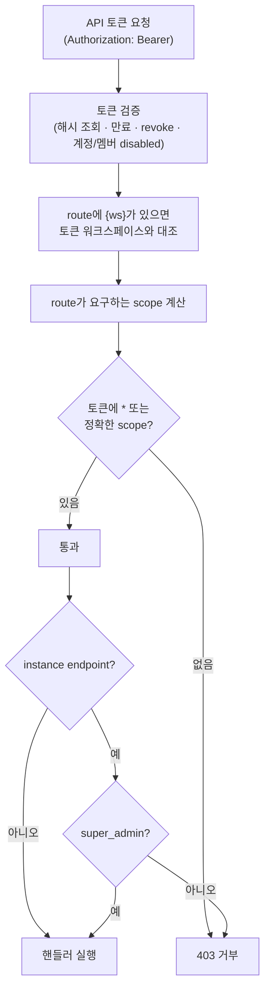
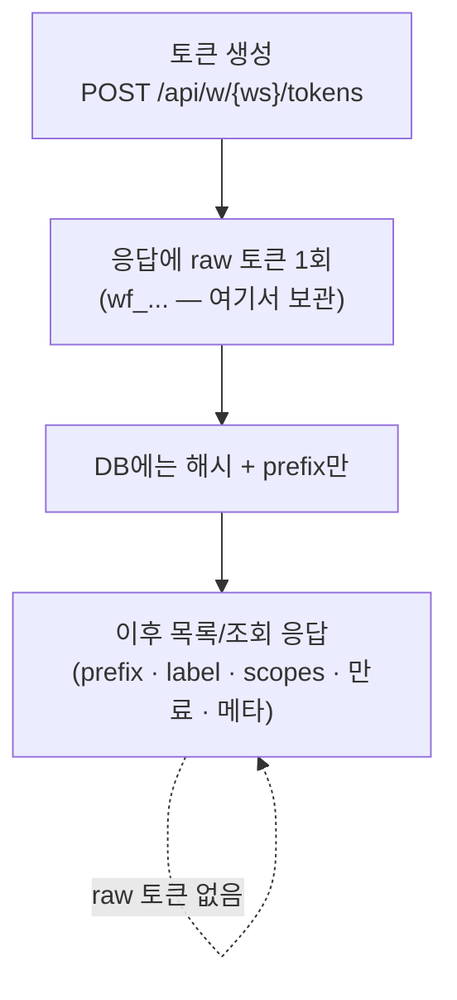

# API 토큰 scope

이 페이지는 외부 API·CLI·자동화에서 windforce를 호출할 때 쓰는 **API 토큰**을 다룬다. 토큰이 어떤 종류로 나뉘는지, scope가 어떤 route를 여는지, 토큰을 어떻게 만들고 어떤 응답이 돌아오는지를 설명한다. 최소권한으로 자격을 발급하는 것이 목표다.

## 토큰 종류

windforce가 쓰는 자격(credential)은 종류가 다섯이고, 인증 방식·수명·노출이 모두 다르다. 이들을 서로 섞어 쓰지 않는다.

| 종류 | 용도 | 인증 방식 | 인가 근거 |
|---|---|---|---|
| 세션 쿠키(`session`) | UI 브라우저 로그인 | HttpOnly·Secure 쿠키 | route 워크스페이스의 enabled 멤버십 |
| **API 토큰(`api`)** | 운영자·CI·자체 자동화 | `Authorization: Bearer wf_...` | 토큰의 워크스페이스 바인딩 + scope(+ admin·super_admin 플래그) |
| **고객 키(customer key)** | **외부 고객**에게 건네는 크리덴셜 | `Authorization: Bearer wf_...` | 고객 바인딩 + **deny-by-default 고객 게이트** — scope가 아니라 grant(입력 설정)가 권한 |
| 잡 토큰(job token) | 워커가 잡 SDK callback에 쓰는 stateless HMAC | 내부 전용 | 잡 단위 — 워크스페이스 API를 호출할 수 없다 |
| 공개 잡 조회 토큰 | 공개 잡 조회 | 별도 토큰 | authenticated 워크스페이스 자격이 아니다 |

이 페이지가 다루는 것은 **API 토큰**이다. 세션 쿠키는 사람이 UI에서 쓰는 자격이고, 잡 토큰·공개 조회 토큰은 windforce가 내부에서 만들어 쓰는 자격이라 사용자가 발급하지 않는다.

**고객 키는 API 토큰의 고객 바인딩 변형**이지만 통제 모델이 다르다: Settings가 아니라 **[Customers 화면](../guide/customers.md)에서 발급**하고(label·만료만 — scope 선택 없음), 무엇을 할 수 있는지는 scope가 아니라 **grant**(그 고객에게 만든 입력 설정 행)가 정한다. grant된 액션 호출 + 자기 잡 읽기만 가능하고 나머지 표면은 전부 403이다 — `*` scope를 줘도 이 게이트를 넘을 수 없다. Settings → API tokens 목록에도 섞이지 않는다.

API 토큰의 성질:

- **워크스페이스에 묶인다.** 한 토큰은 한 워크스페이스의 자격이다. 다른 워크스페이스의 `/api/w/{ws}/...` route를 그 토큰으로 부르면 403으로 거부된다.
- **scope로 권한을 좁힌다.** 토큰이 가진 scope가 그 토큰이 열 수 있는 route를 정한다(아래 "route-level scope 계약").
- **raw 값은 한 번만 보인다.** 생성 응답에서 raw 토큰을 한 번 보여준 뒤, DB에는 해시와 prefix만 남는다(아래 "토큰 응답 형태").

## route-level scope 계약

scope 문자열은 `도메인:동사` 형식이다(예: `jobs:read`, `apps:write`). 토큰이 어떤 route를 부를 수 있는지는 **route가 요구하는 scope**와 **토큰이 가진 scope**를 대조해 정한다.

핵심 규칙 세 가지:

- **`*` = 워크스페이스 전체 접근.** 모든 워크스페이스 API route를 연다. "full access"는 빈 배열이 아니라 명시적 `*`로 표현한다.
- **빈 scope = 전부 거부(deny-by-default).** scope를 하나도 안 가진 토큰은 어떤 route도 못 연다.
- **scope를 명시하지 않은 워크스페이스 route는 기본적으로 `*`를 요구한다.** 새 route가 실수로 좁은 토큰에 열리지 않게 막는 fail-closed 규칙이다.

요청이 들어오면 다음 순서로 검사한다.



**instance endpoint**(워크스페이스 경계를 넘는 운영자용 route — 예: 전체 워크스페이스 목록, instance 워커 관측, 운영자 평면 `/api/admin/*`)는 토큰에 `*`가 있어야 하고, 추가로 핸들러에서 `super_admin`까지 통과해야 한다. 이들은 route에 `{ws}`가 없어 워크스페이스 멤버십을 타지 않는다.

## scope 목록

아래는 현재 명세에 있는 scope 전부다. 읽기(`:read`)·쓰기(`:write`)는 도메인별로 나뉘며, 좁은 토큰을 만들 때 이 목록에서 골라 조합한다.

| Scope | 여는 것 |
|---|---|
| `*` | 모든 워크스페이스 API. instance endpoint는 추가로 `super_admin` 필요 |
| `workspace:read` | 내 정보 조회, 워크스페이스 조회 |
| `workspace:write` | 워크스페이스 설정 변경 |
| `members:read` | 멤버·초대 목록 조회 |
| `members:write` | 멤버 추가/변경/삭제, 초대 생성/삭제 |
| `tokens:read` | 토큰 목록 조회 |
| `tokens:write` | 토큰 생성·폐기 |
| `git_sources:read` | git 소스 목록 조회 |
| `git_sources:write` | git 소스 생성, 원격 도달성·브랜치 검증(probe), sync |
| `apps:read` | 앱·액션·히스토리 조회 |
| `apps:write` | 운영 tag override, queued 잡 재라우팅(requeue) |
| `drafts:read` | 드래프트·소스 조회 |
| `drafts:write` | 드래프트 저장·삭제 |
| `deployments:read` | 배포 조회 |
| `deployments:write` | 앱 배포(deploy) |
| `variables:read` | 변수 조회 |
| `variables:write` | 변수 생성·삭제 |
| `resources:read` | 리소스 조회 |
| `resources:write` | 리소스 생성 |
| `jobs:read` | 잡 목록·요약·상태·결과·로그 조회 |
| `jobs:run` | 잡 실행(run · run-and-wait · cancel) |
| `flows:read` | flow 목록·flow run 목록/상세 조회 |
| `flows:run` | flow run 시작 |
| `flows:resume` | flow 승인 스텝 approve/reject |
| `webhooks:invoke` | 외부 공개 webhook 발화 **전용**(잡·flow webhook 공통) |
| `workers:read` | 태그별 라이브 워커 수, 서빙 워커 이름·group·ping 조회 |
| `schedules:read` | 스케줄 조회 |
| `schedules:write` | 스케줄 생성·변경·삭제 |
| `consumers:read` | 고객과 그 입력 설정 조회 |
| `consumers:write` | 고객 관리·입력 설정·고객 키 발급 |

### webhook 토큰은 별도 자격이다

`webhooks:invoke`는 외부 공개 webhook 엔드포인트(`POST /api/w/{ws}/jobs/webhook/{app}/{action}`)만 여는 **전용** scope다. 일반 잡 실행 권한과 의도적으로 분리돼 있다.

- 일반 `jobs:run` 토큰으로는 외부 webhook을 **부를 수 없다**(`jobs:run` fallback 없음).
- `webhooks:invoke`만 가진 토큰은 webhook 발화 외에는 **아무것도 못 한다**.

그래서 외부 시스템에 박아두는 자격으로 `webhooks:invoke`만 가진 토큰을 발급하면, 노출되더라도 피해 범위가 그 webhook 하나로 좁다. (`*` 토큰은 여전히 webhook을 부를 수 있다.) webhook 트리거 자체의 동작은 [트리거 가이드](../guide/triggers.md)를 참고한다.

### scope를 요구하지 않는 route

일부 route는 route-level API 토큰 scope를 요구하지 않는다.

| Route | 이유 |
|---|---|
| `GET /api/tokens/scopes` | 토큰 생성 화면이 선택지를 그리는 discovery endpoint |
| `POST /api/auth/logout` | 현재 자격 폐기 utility |

이 밖에 `POST /api/auth/login`(인증 전 endpoint), `GET /healthz`(health check), `GET /api/config`(익명 허용 public client config)는 애초에 인증·scope 검사 밖이다.

> 잡 SDK callback 표면(`GET/POST /api/w/{ws}/state`)에는 좁은 `state:*` scope를 공개하지 않는다. API 토큰으로 호출하려면 `*`가 필요하고, 정상 워커 경로는 잡 토큰을 쓴다.

## 토큰 생성

토큰은 두 경로로 만든다. 콘솔(또는 `POST /api/w/{ws}/tokens` API)과 CLI다. 어느 쪽이든 **워크스페이스에 바인딩**되고, **scope를 지정해 권한을 좁힌다**.

### scope 선택

- scope를 명시하지 않으면 의미가 "full access"가 아니라 경로마다 다르다 — API로 만들 때는 빈 scope = 전부 거부이고, CLI `create-token`은 부트스트랩 편의를 위해 **명시적 `*` 토큰**을 만든다.
- 좁은 토큰은 필요한 scope를 반복 지정해 만든다. 예를 들어 잡을 실행하고 결과를 읽는 자동화라면 `jobs:run` + `jobs:read`만 준다.

```bash
# 잡 실행 + 결과 조회만 하는 좁은 토큰(CLI)
windforce create-token <workspace> <email> --scope jobs:run --scope jobs:read

# 외부 webhook 발화만 하는 토큰 — 외부 시스템에 박는 최소권한 자격
windforce create-token <workspace> <email> --scope webhooks:invoke
```

UI 토큰 생성 화면이 보여주는 scope 선택지는 `GET /api/tokens/scopes` discovery endpoint에서 채워진다. 그래서 새 scope가 추가돼도 화면이 자동으로 따라간다.

### 토큰 사용

만든 토큰은 `Authorization: Bearer` 헤더로 보낸다.

```bash
curl -X POST \
  https://<host>/api/w/my-workspace/jobs/run/greet/hello \
  -H "Authorization: Bearer wf_..." \
  -H "Content-Type: application/json" \
  -d '{"name":"Ada"}'
```

토큰의 scope에 그 route가 요구하는 scope(또는 `*`)가 없으면 403이 돌아온다.

## 토큰 응답 형태

windforce는 secret material을 반복 노출하지 않는다. 토큰 응답은 이 원칙을 따른다.

- **생성 응답만** raw 토큰을 **한 번** 반환한다. 이때 받아서 안전한 곳에 보관해야 하고, 이후에는 다시 볼 수 없다.
- **목록·조회 응답**은 `token_prefix`, label, scopes, 만료, 생성/폐기 메타데이터만 반환한다. raw 토큰은 들어 있지 않다.
- **폐기·삭제 응답**도 raw 토큰을 반환하지 않는다.
- DB에는 토큰 **해시와 prefix만** 저장한다. raw 토큰·해시·잡 토큰 secret·워크스페이스 키·git 자격은 목록/히스토리/상태/카탈로그 응답 어디에도 넣지 않는다.



그래서 토큰을 잃어버리면 다시 꺼낼 수 없고, 폐기 후 새로 발급해야 한다. 토큰 폐기·생성에는 `tokens:write` scope가 필요하다.

## 더 보기

- [트리거 (run · webhook · schedule)](../guide/triggers.md) — 토큰으로 실제 잡을 호출하는 세 경로와 webhook 인증·헤더 동작.
- [멀티테넌시·운영자 평면](../operating/multitenancy.md) — 워크스페이스 = 테넌트 경계, account vs membership, 운영자 평면의 `super_admin` 자격.
- [핵심 개념](../getting-started/concepts.md) — Workspace·App·Action·Job.
- 엔지니어링 원문(전체 계약·결정의 "왜"):
  - [API 토큰 scope 계약](https://github.com/imprun/windforce/blob/main/docs/contracts/api-contract.md) — route별 scope 매핑·enforcement 순서·새 route 추가 checklist.
  - [ADR-0028 외부 webhook 인증·헤더](https://github.com/imprun/windforce/blob/main/docs/decisions/decision-ledger.md) — `webhooks:invoke`를 별도 자격으로 둔 근거.
